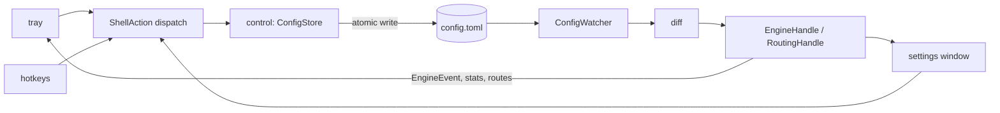

# App Shell (P4)

> P4 — tray icon, global hotkeys, settings UI, config hot-reload surface, autostart, single-instance. Exit criteria: full user control surface; launches at logon; one instance enforced (spec §13).

## Decisions Log

<!-- Add new at bottom. Never remove. -->

| Date | Decision | Reasoning | Alternatives Considered |
|------|----------|-----------|------------------------|
| 2026-07-18 | Blueprint scope = P4: tray + hotkeys + settings UI + autostart + single-instance + hot-reload surface (F9–F11). Builds on approved P0–P3 designs. | Spec §13 phase order; audio + routing designs approved. | P5 DSP. |
| 2026-07-18 | UI toolkit = egui/eframe. **Resolves spec §15.1.** | Spec's own recommendation: fastest iteration, pure Rust, immediate mode fits live faders/meters; non-native look acceptable for tray utility. | slint (native look, licensing consideration); Tauri (heavier, conflicts N1 idle footprint). |
| 2026-07-18 | Shell Win32 needs (named mutex, autostart registry, instance signal) via wrapper crates (single-instance/auto-launch style) — app never imports windows-rs. Constraint kept as written. | Bright-line rule stays greppable; audio-path testability rationale untouched; app is Windows-only binary anyway. Revisit with recorded decision if a crate lacks instance-signaling. | Relaxing constraint wording to COM/WASAPI-only (reviewer judgment creep); wrappers in win-audio (wrong cohesion). |
| 2026-07-18 | UI config writes via `toml_edit`, temp-file + rename atomic; ConfigStore suppresses watcher echo of own writes. | Users hand-edit config (hot-reload is a feature) — comments/ordering must survive UI edits; atomicity prevents watcher reading half-written file. | serde re-serialize (destroys comments/ordering). |
| 2026-07-18 | All shell mutations funnel through ConfigStore → file → watcher → diff → engine. UI/tray/hotkeys never mutate engine directly; reads only. | Config = single source of truth (spec §6.5/§11.1); one mutation path = one validation point; external and UI edits identical downstream. | Direct EngineHandle commands from UI with async config write-back (two sources of truth, drift risk). |
| 2026-07-18 | **Revision of previous decision** (L3 backtrack): param edits get a fast path — immediate `MixerCommand` via EngineHandle + debounced config write of same value. Structural/rules edits remain funnel-only. | `notify` round-trip lags fader drags audibly (100s of ms) — core UX of the app. Idempotent double-apply; config still source of truth. Spec §6.5 explicitly allows UI sending commands. | Funnel-only (strict invariant, laggy faders); command-only with write-back (two sources of truth). |
| 2026-07-18 | Config schema additions: top-level `muted: bool` (effective master = muted ? 0 : master) and `[app] autostart: bool`. | Mute must preserve master gain value; autostart user-controllable per F11. | Mute as master=0 overwrite (loses user's gain setting). |
| 2026-07-18 | Config edits are semantic (`ConfigEdit` enum), never raw text; GroupId = snapshot order with `group_id_for` resolution. | Semantic edits keep toml_edit surgical (comment preservation) and give one validation point; positional GroupId avoids a parallel id registry. | Raw-text patching (fragile); persistent group UUIDs (schema churn, no need at this scale). |
| 2026-07-18 | Design approved at Level 4. Status set to approved — ready for implementation. | All four levels approved and persisted; drift check vs spec complete. | — |
| 2026-07-18 | **Revision (cross-blueprint review):** app-side `EventPump` owns the single `take_events` receiver and fans out — notification channel to tray, state updates to `UiState`, `update_topology` call to routing after structural-rebuild events. `spawn_tray` now takes a pump-fed `Receiver<EngineEvent>`, not the engine's. | `Receiver` is single-consumer; tray and UI both need events. Fan-out is an app concern — engine stays consumer-agnostic. | Broadcast channel in engine; tray-only events (UI blind to degraded/fallback state). |
| 2026-07-18 | **Revision (cross-blueprint review):** mute is **global** — silences all groups including `follow_master = false` ones. Implemented as output-stage kill flag; master gain and group gains untouched. `MixerCommand::SetMuted` semantics updated; recorded as spec §11.2 elaboration. | A mute hotkey that leaves audio playing reads as a bug; global expectation wins. Kill-flag keeps gains restorable. | Master-scope mute (spec-pure, surprising); per-group mute flags (config churn for one hotkey). |
| 2026-07-18 | **Revision (cross-blueprint review):** `InstanceGuard::acquire` returns `InstanceOutcome::Primary(guard, Receiver<SurfaceSignal>)` or `Secondary` (signal already sent, caller exits). Fills the missing listener half of flow G. | Flow G had no L4 counterpart — first instance had no contract for receiving the surface signal. | Polling a lock file (latency, jank); OS window message (needs direct Win32 in app — violates wrapper-crate decision). |
| 2026-07-18 | **Revision (cross-blueprint review):** debounce/hand-edit race is last-writer-wins, documented as a known v1 limitation. | Sub-second window, single-user desktop file — merge machinery disproportionate. Revisit only on real reports. | Hash-check + rebase of pending semantic edits (safer, more write-path machinery). |

## Design: Level 1 -- Capabilities

Approved 2026-07-18.

1. **Always-on tray presence** — icon from logon; quick menu (master mute, settings, quit); engine notices as tray notifications.
2. **Settings window** — per-group faders + master, follow-master toggle, per-group output picker, live routed-apps list, add/remove group (mockup: "Create New Audio Source").
3. **Global hotkeys** — config-defined, system-wide.
4. **Config round-trip** — UI edits persist to TOML; external edits appear live in UI; invalid edits never break running audio.
5. **Lifecycle** — autostart at logon (per-user), single instance (second launch surfaces first), clean shutdown.

Out of scope: DSP UI (P5), installer/signing pipeline, driver management beyond degraded prompt.

## Design: Level 2 -- Components

Approved 2026-07-18.

| Component | Home / layer | Single responsibility |
|---|---|---|
| Lifecycle host | `app/main.rs` (shell) | Single-instance guard, surface-first-instance signal, autostart registration, startup wiring (engine → routing → watcher → tray → UI), ordered shutdown |
| Tray surface | `app/tray.rs` (shell) | Icon + menu (mute master, settings, quit); `EngineEvent` → tray notifications |
| Hotkey service | `app/hotkeys.rs` (shell) | Config-defined global hotkeys → `ShellAction` |
| Settings window | `app/ui.rs` (shell, egui/eframe) | Render config draft + live routed-apps; faders, output pickers, group add/remove; edits → ConfigStore |
| ConfigStore | `control/store.rs` (application) | Single write path: validate → comment-preserving `toml_edit` → atomic write (temp+rename); suppress watcher echo of own writes |

`ShellAction` enum (app-internal) unifies tray/hotkey/UI intents; all mutations funnel ConfigStore → file → ConfigWatcher → diff → engine/routing. UI reads engine state only (stats, routes, events) — never mutates engine directly.



## Design: Level 3 -- Interactions

Approved 2026-07-18.

**A — Startup:** single-instance guard (fail → signal first instance, exit) → autostart registration per config → load config → engine → routing → watcher → tray + hotkeys → tray-resident. Shutdown reverse.

**B — Param edit (fader/master/mute/follow):** fast path — `ShellAction` → `MixerCommand` via EngineHandle immediately + debounced comment-preserving config write. Same value both paths, idempotent; config remains source of truth. (Revises L2 funnel-only decision — see Decisions Log.)

**C — Structural edit (output change, add/remove group):** funnel-only — ConfigStore write → watcher → `Structural` → rebuild + routing update.

**D — External file edit:** watcher validates → apply + UI refresh from snapshot channel; invalid → keep prior snapshot + tray notification with error.

**E — Hotkey:** `mute_master` toggles `muted` flag (schema addition; effective master = muted ? 0 : master, gain value preserved). Same path as B.

**F — Engine notices:** tray drains `EngineEvent`s → notifications (fallback, degraded-once, driver missing prompt).

**G — Second launch:** instance signal → first instance surfaces settings window.

## Design: Level 4 -- Contracts

Approved 2026-07-18. Deltas on approved P0–P3 contracts; signatures only.

### `audio-core`

```rust
pub enum MixerCommand { /* P0–P2 variants… */ SetMuted(bool) }   // effective master = muted ? 0 : master
```

### `control`

```rust
pub struct ConfigSnapshot { /* … */ pub muted: bool, pub app: AppConfig }
pub struct AppConfig { pub autostart: bool, pub hotkeys: HotkeyMap }
pub struct HotkeyMap { pub mute_master: Option<HotkeyChord> }

pub fn group_id_for(snapshot: &ConfigSnapshot, name: &str) -> Option<GroupId>;  // GroupId = snapshot order

// control/store.rs
pub enum ConfigEdit {
    SetGroupGain(String, Gain), SetMaster(Gain), SetMuted(bool), SetFollowMaster(String, bool),
    SetGroupOutput(String, String), AddGroup(GroupConfig), RemoveGroup(String), SetRules(String, Vec<String>),
}
pub enum StoreError { Io(String), Validation(ConfigError) }

pub struct ConfigStore;
impl ConfigStore {
    pub fn open(path: &Path) -> Result<ConfigStore, StoreError>;
    pub fn apply(&mut self, edits: &[ConfigEdit]) -> Result<ConfigSnapshot, StoreError>;  // toml_edit, temp+rename
    pub fn is_echo(&self, snapshot: &ConfigSnapshot) -> bool;                             // own-write suppression
}
```

### `engine`

```rust
impl RoutingHandle { pub fn current_routes(&self) -> Vec<(GroupId, Vec<SessionInfo>)>; }
```

### `app` (internal)

```rust
pub enum ShellAction { EditParams(Vec<ConfigEdit>), EditStructure(Vec<ConfigEdit>), ShowSettings, Quit }
pub enum ShellError { Instance(String), Autostart(String), Hotkey(String) }

pub struct InstanceGuard;
impl InstanceGuard {
    pub fn acquire(app_id: &str) -> Result<Option<InstanceGuard>, ShellError>;  // None → other instance signaled, exit
}
pub fn set_autostart(enabled: bool) -> Result<(), ShellError>;
pub fn spawn_tray(actions: Sender<ShellAction>, notices: Receiver<EngineEvent>) -> TrayHandle;
pub fn spawn_hotkeys(map: &HotkeyMap, actions: Sender<ShellAction>) -> Result<HotkeyHandle, ShellError>;

pub struct UiState { pub snapshot: ConfigSnapshot, pub routes: Vec<(GroupId, Vec<SessionInfo>)>,
                     pub stats: EngineStats, pub routing_degraded: bool }
```

Dispatcher: `EditParams` → `MixerCommand`s via `group_id_for` → `apply_params` immediately + debounced `ConfigStore::apply`; `EditStructure` → `ConfigStore::apply` only (engine follows via watcher). Lifecycle via wrapper crates — no direct windows-rs in app.

## Open Questions

None — §15.1 toolkit resolved to egui (see Decisions Log).

## Constraints

Inherited (binding): UI never calls `win-audio` directly (spec §6.5); UI mutates config + sends commands only; COM in win-audio only; RT constraints unchanged (shell is control-plane).

P4-specific (spec §6.5, §11.1, F9–F11):
- Config is the single source of truth — UI edits write config; engine consumes validated snapshots; invalid edits rejected, previous snapshot retained.
- Single instance via named mutex; second launch surfaces existing instance.
- Autostart = per-user registration (no elevation).
- Signed binary (Authenticode) — N6, packaging concern noted, not designed here.

## Design Revisions (2026-07-18 cross-blueprint review)

```rust
// app — event fan-out (owns EngineHandle::take_events receiver)
pub struct EventPump;
impl EventPump {
    /// Fans out: tray notifications, UiState updates, routing.update_topology on structural events.
    pub fn spawn(events: Receiver<EngineEvent>, tray: Sender<EngineEvent>,
                 ui: Arc<Mutex<UiState>>, routing: RoutingHandle) -> PumpHandle;
}
pub fn spawn_tray(actions: Sender<ShellAction>, notices: Receiver<EngineEvent>) -> TrayHandle; // pump-fed

// app — instance signal listener (completes flow G)
pub enum InstanceOutcome { Primary(InstanceGuard, Receiver<SurfaceSignal>), Secondary }
impl InstanceGuard { pub fn acquire(app_id: &str) -> Result<InstanceOutcome, ShellError>; }
pub struct SurfaceSignal;

// audio-core — mute semantics: SetMuted(true) = output-stage kill for ALL groups
// (follow_master irrelevant to mute); gains untouched, restore on SetMuted(false).
```

Known limitation (documented): UI debounce window vs concurrent hand-edit of config.toml is last-writer-wins.

## Design Summary

- **Components/layers:** lifecycle host, tray surface, hotkey service, settings window (egui/eframe) — all `app` (shell); `ConfigStore` in `control/store.rs` (application).
- **Key contracts:** `ConfigEdit` semantic edit enum + `ConfigStore::{apply, is_echo}`; `ShellAction` dispatch with dual-path rule (params fast path via `apply_params` + debounced write; structure funnel-only); `MixerCommand::SetMuted`; `RoutingHandle::current_routes`; `InstanceGuard`/`set_autostart` via wrapper crates; `UiState` read model.
- **Architectural constraints:** UI never calls win-audio; no direct windows-rs in app (wrapper crates); config = source of truth (fast path is preview of same value); comment-preserving atomic writes; RT path untouched.
- **Domain decisions:** `muted` flag preserves master gain; `HotkeyChord` validated value object; GroupId positional from snapshot order.
- **Resolved during design:** §15.1 toolkit = egui; Win32-in-app via wrapper crates; toml_edit write strategy; L2 funnel-only revised to param fast path (L3 backtrack, logged); mute/autostart schema additions.
- Drift check vs `Splitstream-Engineering-Spec.md` complete — see spec `## Links`.

## Key Files

| Path | Role |
|---|---|
| Splitstream-Engineering-Spec.md | Requirement spec (§6.5, §11, §15.1, F9–F11) |
| .lattice/context/engine-core.md | Approved P0–P1 (EngineHandle, ConfigSnapshot, ConfigWatcher, diff) |
| .lattice/context/drift-and-recovery.md | Approved P2 (EngineEvent channel, EngineStats) |
| .lattice/context/session-routing.md | Approved P3 (RoutingHandle, ConfigDelta::Rules, RoutingDegraded) |
