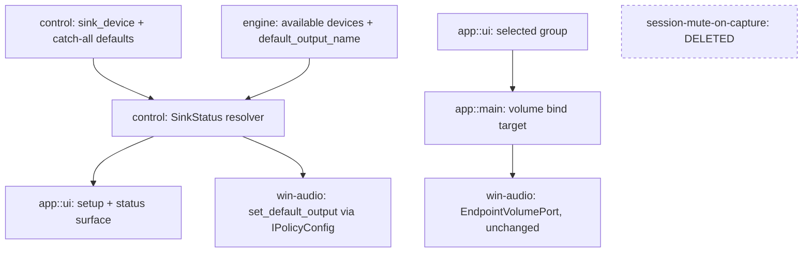

# Double-Audio Prevention (replaces session-mute-on-capture)

> `PROCESS_LOOPBACK` taps a process's audio; it does not redirect or silence
> the original stream, so a routed app stays audible through Windows' default
> device alongside Splitstream's processed copy.
> [session-mute-on-capture](session-mute-on-capture.md) solved that by muting
> the source session — which **also silences the tap**, measured 2026-07-25.
> Double-audio prevention and per-process capture are currently mutually
> exclusive. This feature finds a mechanism that isn't.

## Grounding (2026-07-25, pre-Level-1)

### MT1 — session mute kills the tap (MEASURED, conclusive)

`open_and_read_a_real_process` against a playing game (pid 40596), before and
after muting that app in the Windows Volume Mixer:

| State | Samples over 2s | Peak |
|---|---|---|
| Unmuted | 188160 | 0.0814 |
| Session muted | 189120 | **0.0** |

Sample counts near-identical — the stream keeps flowing at full cadence, the
frames are just zeroed. **The tap sits after session-level processing.**
Anything applied at the session level (mute, and by the same reasoning
`SetMasterVolume(0)`, not separately measured) lands before the tap and
silences it. `session-mute-on-capture`'s entire mechanism is therefore void,
not merely buggy.

Note the diagnostic that made this measurable: the original `#[ignore]` test
read once immediately after `Start()` and reported 0 samples regardless of
state — it raced WASAPI's first buffer period. It now polls for 2s and reports
peak amplitude, not just a sample count. A sample count alone would have shown
188160 vs 189120 and looked *healthy* in both runs.

### A second, independent bug was masking this one

`open_process_capture(pid, include_tree)` maps to WASAPI's `ProcessLoopbackMode`,
a **binary include/exclude selector**, not an additive flag:

- `true` -> `PROCESS_LOOPBACK_MODE_INCLUDE_TARGET_PROCESS_TREE` — only `pid`
  and its children. What per-app routing needs.
- `false` -> `PROCESS_LOOPBACK_MODE_EXCLUDE_TARGET_PROCESS_TREE` — everything
  on the system *except* `pid` and its tree.

Every call site passed `false` from introduction until 2026-07-25. Each group
was capturing every *other* app, which presented as a mixer bug (a paused app's
fader showing the playing app's signal, one group's slider affecting another,
the shared output clipping because the same audio summed twice). Fixed at
`runtime.rs:810` plus two hardware tests; trait doc corrected. Only once that
was fixed did the capture isolate correctly enough for MT1's silence to be
visible at all.

### Correction to the prior pivot's stated rationale

process-loopback-capture (2026-07-21) recorded per-app redirect
(`SetPersistedDefaultAudioEndpoint`/`IPolicyConfig`) as "proved unstable on
real hardware." Re-derived this session, that claim does **not** carry the
weight it appears to:

- Its own decision log says *"root cause not fully isolated before the pivot
  decision — user explicitly chose to stop debugging."* It is an abandoned
  investigation, not a diagnosis.
- Two of its three symptoms (bus `EndpointId` churn between reconciles,
  topology mapping intermittently vanishing) were **virtual-cable-side**. That
  cable no longer exists, so those failure modes cannot recur.
- The third — "per-app override silently failed to stick" — is exactly the
  symptom a wrong vtable produces, and this repo's own operational learnings
  record that its `IPolicyConfig` sketch showed **2 methods where the real
  interface needs 12 vtable slots**.
- EarTrumpet and SoundSwitch both ship this interface to large user bases.

So redirect's real cost is that it is **undocumented** (re-verified July 2026 —
still absent from Microsoft's docs, still reverse-engineered in both reference
implementations), not that it is known-broken. Treat the earlier instability as
unattributed.

### The actual constraint on redirect

Redirect needs somewhere to point. The pre-pivot design sent each app to *its
group's virtual cable endpoint*; post-pivot no virtual endpoints exist, and
both BYOD virtual cable and an own-signed driver were previously rejected. A
redirect-based mechanism therefore has to answer "silent sink = what?" before
it is a design at all.

### MT8 — endpoint redirect preserves the tap (MEASURED, conclusive)

**Does per-app endpoint redirect preserve the `PROCESS_LOOPBACK` tap? YES.**

Measured 2026-07-25 against the same playing game, Splitstream not running (so
no session mute could confound the result). Redirect performed by hand via
Settings -> System -> Sound -> Volume mixer -> app -> Output device, pointed at
an endpoint the user cannot hear:

| State | Samples over 2s | Peak | Audible in headphones? |
|---|---|---|---|
| Normal output device | 188160 | 0.0134 | yes |
| Redirected to unheard endpoint | 188160 | 0.0250 | **no** |

Both peaks are live signal (a game's level varies moment to moment — neither is
MT1's hard `0.0`), while the audible path went silent. The user separately
confirmed the audio actually disappeared from the headphones, which is what
distinguishes a genuine pass from a redirect that silently failed to apply —
those are indistinguishable from the sample numbers alone, and "per-app
override silently failed to stick" is precisely the one intrinsic symptom the
2026-07-21 pivot reported.

**The asymmetry this feature is built on:**

| Mechanism | Original stream | `PROCESS_LOOPBACK` tap |
|---|---|---|
| `ISimpleAudioVolume::SetMute` (MT1) | silenced | **silenced** |
| Per-app endpoint redirect (MT8) | silenced where the user listens | **survives** |

`PROCESS_LOOPBACK` activates against the pseudo-device
`VIRTUAL_AUDIO_DEVICE_PROCESS_LOOPBACK` rather than a real endpoint, so it is
genuinely process-scoped. Redirect is therefore the mechanism family this
design must be built from.

**Secondary finding with real design consequence:** the redirect was achieved
entirely through a shipped Windows UI, with no code and no COM. Automating it
via the undocumented `IAudioPolicyConfigFactory` is an *optimization of an
already-working manual path*, not a prerequisite for the feature to exist.

### Reference implementation — how SteelSeries Sonar actually works

Verified 2026-07-26 against SteelSeries' own support documentation, because
Sonar is the product Splitstream is replacing and its UI model is nearly
identical — so the place the two differ is exactly where the answer lives.

Sonar creates **one Virtual Audio Device per mixer channel** (Game, Chat,
Media, Aux, Master) — *"each one handling a specific audio stream so you can
manage game audio, chat, voice and more independently."* It then sets
**Sonar-Game as Windows' default output and Sonar-Chat as the default
*communications* device**, exploiting Windows' separate `eMultimedia` /
`eCommunications` roles so that Discord/Teams-class apps self-select the chat
channel with **zero per-app configuration**. Media/Aux need explicit
assignment; the dominant case does not.

**Sonar has no double-audio problem because it never taps anything.** An app
renders into Sonar's virtual device and *nowhere else*; Sonar receives the only
copy and forwards it. Windows mixes each endpoint independently, so per-channel
separation is performed by the OS for free.

### The framing this exposes — tap vs transport

| | Transport (Sonar) | Tap (Splitstream today) |
|---|---|---|
| App's audio goes | into the virtual device, only there | to a real device, *and* is copied |
| Separation by | which endpoint the app uses | PID, via `PROCESS_LOOPBACK` |
| Original stream | is the routed stream | still playing, must be suppressed |
| Double-audio | cannot occur | inherent |

**"How do we suppress the original?" is a question the tap model invents.**
This repo's own operational learnings predicted it on 2026-07-22: *"A redirect
silences the original path inherently (it moved); a tap/capture does not.
Nothing in process-loopback-capture's Level 1 named 'silence the original'
because under the old model it wasn't a feature, it was a side effect of how
redirect worked."* That learning is now load-bearing rather than retrospective.

### Conclusion — one sink, not N endpoints

Copying Sonar's N-endpoint model would be a **regression** for Splitstream.
Endpoint-splitting *is* Sonar's separation mechanism; Splitstream already has a
strictly better one. `PROCESS_LOOPBACK` gives per-PID separation, unlimited
groups, and rule-based assignment driven by the existing drag-and-drop UI —
Sonar's users assign apps in Windows' settings, Splitstream's drag chips
between groups. Adopting endpoint-splitting would discard that advantage and
cap the group count at however many devices ship.

The actual requirement is **one** unheard endpoint, set as the Windows default.
Then no app renders anywhere audible, and double-audio evaporates in the
current architecture — the same structural fix as Sonar's, with one device
instead of five and every existing component preserved:

| | Sonar | Splitstream (this design) |
|---|---|---|
| Endpoints needed | N, one per channel | **1** |
| Separation | which endpoint | PID (`PROCESS_LOOPBACK`, unchanged) |
| App assignment | Windows per-app settings | **rules engine + drag/drop, unchanged** |
| Group count | capped by devices shipped | unlimited |
| Driver scope, if ever built | multi-endpoint | single endpoint |

Note this also retires the per-app redirect question entirely: with the default
pointed at the sink, **no per-app endpoint assignment is needed at all**, so
`IAudioPolicyConfigFactory` drops out of the design. MT8 remains valuable as
the proof that endpoint placement does not disturb the tap.

### Sink choice — VB-CABLE (user decision, 2026-07-26)

VB-CABLE as the single default sink. Works today, no driver, no undocumented
COM, universal (including single-output laptops where designating spare
hardware fails). One user-facing setup step: set it as the Windows default.

An own single-endpoint virtual driver ("Splitstream Audio") remains the later
upgrade — it replaces *only* the sink, behind the same seam, and is far smaller
than Sonar's multi-device driver. Nothing else in the design changes when it
arrives.

### Open question — MT9 (blocking Level 2, not Level 1)

**Does the sink endpoint's own volume/mute affect what `PROCESS_LOOPBACK`
captures?** MT1 proved *session*-level volume does. Endpoint volume is applied
at a different stage (post-mix, per-device) and `PROCESS_LOOPBACK` taps
per-process ahead of that, so it very likely does **not** — but that is
inference, and this design now depends on it twice over:

1. If endpoint volume *does* pass through to the tap, lowering the sink's
   volume attenuates captured audio, and the group-gain mirror below would
   apply a second attenuation on top — a squared response.
2. If it does *not*, the sink's volume slider is inert with respect to audio
   and is therefore a **free control surface** Splitstream can read as a plain
   number, which is exactly what the volume-key capability wants.

Procedure: with the sink as default and an app rendering into it, run
`open_and_read_a_real_process` against that pid at sink volume 100%, then at
~30%, and compare peaks. Unchanged peak -> inert (case 2). Proportionally
lower peak -> case 1.

## Design: Level 1 -- Capabilities

**Approved 2026-07-26.**

1. **A routed app is heard only through Splitstream.** Apps render into the
   sink, which nobody listens to; only Splitstream's processed copy (gain, DSP,
   group output) reaches a real device. There is no duplicate to suppress —
   the problem is removed structurally rather than counteracted.
2. **Nothing is silently lost.** An app matched by no rule still reaches the
   user via the catch-all group. "Not routed" must never resolve to
   "inaudible" — with the default pointed at a sink, silence is the failure
   mode that replaces double-audio, and it is a worse one.
3. **Setup is guided and verified, never assumed.** Splitstream detects whether
   the sink is present and is the current default, and walks the user through
   making it so. It never silently depends on configuration the user did not
   knowingly make.
4. **Normal audio returns when Splitstream isn't running.** A clean exit
   restores the previous default device, so quitting does not leave the machine
   mute. (Unclean exit: documented escape hatch, same clean-shutdown-only
   posture as the feature this replaces.)
5. **The keyboard volume keys control the selected group.** Hardware volume
   keys and the Windows OSD adjust whichever group is selected in the UI —
   select group 1, the keys move group 1's fader; select group 2, they move
   group 2's. Mirrors Sonar's per-channel keyboard control without needing
   Sonar's per-channel devices.
6. **Honest when it can't.** Sink missing, sink not default, capture failing —
   each is surfaced with its reason. Every failure in this area to date has
   been invisible; that is the defect class this capability exists to close.

Out of scope: per-app assignment to specific endpoints (the rules engine covers
it); multi-endpoint Sonar-style channels; restoring the default device after an
unclean crash.

**Revised at Level 2 (2026-07-26):** the original out-of-scope list also
excluded "automating the default-device switch via undocumented COM (guided in
v1)". That is incompatible with capability 4 — Windows exposes no documented
way to set the default playback device, so "clean exit restores the previous
default" is unachievable without it. Resolved in favour of capability 4:
automation is **in** scope. See Decisions Log.

## Design: Level 2 -- Components

**Approved 2026-07-26.**

This design **removes more than it adds** — the largest component is a deletion.

| # | Component | Layer | Change | Owns |
|---|---|---|---|---|
| 1 | `SessionPort::set_muted`, `WasapiSessions::set_muted`, `routing`'s mute diff + shutdown sweep, `MockSessionPort` mute hooks | ports / win-audio / engine::routing / mock | **deleted** | Nothing. Pure removal of the mechanism MT1 disproved. `SessionPort` reverts to `enumerate`/`take_events` |
| 2 | `SinkStatus` resolver | `control` — pure | NEW (small) | Derives setup state from (configured sink name, available device names, current default name) -> `NotConfigured`/`Missing`/`NotDefault`/`Active`. The single value capabilities 3 and 6 both read |
| 3 | `[app] sink_device` config key | `control` | modified | Which endpoint is the sink. Same shape as the existing `volume_bind` app-table key |
| 4 | Sink setup + status surface | `app::ui` | modified | Renders `SinkStatus`; guides install / set-default; explains why audio is silent or doubled |
| 5 | Volume-bind target follows selection | `app::main` (`bound_target`/`compute_suspended`) + `app::ui` | modified | Keys drive the *selected* group. `VolumeTarget::{Master, Group}` and the mirror path already exist — this changes what *selects* the target, not the transport |
| 6 | Catch-all guarantee | `control` (first-run defaults) + `app::ui` | modified | Ensures a `*` group exists; warns when none does (capability 2 — silence is now the failure mode) |
| 7 | `AudioSystem::set_default_output` | `engine::ports` + `win-audio` | NEW | Setting and restoring the Windows default endpoint (`IPolicyConfig::SetDefaultEndpoint`) — the one undocumented surface in this design |

**Unchanged — the entire audio path**: `audio-core`, `PROCESS_LOOPBACK`
capture, mixer, DSP, spatial, drift, render, the rules engine, drag-and-drop
assignment. The reframing means none of it moves.



**DDD:** no domain change. `SinkStatus` is a derived value object over config
plus device reality, not an aggregate or entity.

**Observation plumbing is already complete** and needs no new components:
`AudioSystem::default_output()`, `EngineEvent::DefaultDeviceChanged` ->
`ShellAction::DefaultDeviceChanged` -> `handle_default_device_changed()`,
`default_output_name` tracked live (main.rs:284, refreshed 547), and
`UiState.available_devices`. Sink detection is a pure function over data the
shell already holds.

## Design: Level 3 -- Interactions

**Approved 2026-07-26.**

**Flow A — setup resolution.** `SinkStatus` = f(configured sink name, available
device names, current default name) -> `NotConfigured` / `Missing` /
`NotDefault` / `Active`. Recomputed whenever any input changes: config edit,
`DeviceEvent::Added`/`Removed`, `DefaultDeviceChanged`. All three already reach
the dispatcher — no new subscription.

**Flow B — taking the default (opt-in once, then automatic).**

1. `NotDefault` -> UI offers "make Splitstream's sink the default output".
2. On accept: write the current default's name to `[app] previous_default`
   **only if that key is empty**, set `[app] manage_default = true`, then
   `set_default_output(sink)`.
3. Thereafter every start re-asserts the sink while `manage_default` is true.

The *only-if-empty* rule is what makes this crash-safe (Flow D). Opt-in rather
than automatic-on-first-run is deliberate: Sonar takes the default unasked and
maintains a support article fielding the resulting complaints.

**Flow C — restore on quit.** Clean shutdown: if `previous_default` is set,
`set_default_output(previous)`, then clear the key. Slots into the existing
shutdown sequence (main.rs:1182-1189).

**Flow D — crash recovery.** A start that finds `previous_default` already
populated knows it inherited the default from an unclean exit; it leaves the
value intact (Flow B rule 2) so the next clean quit still restores the true
pre-Splitstream device. Closes the gap at the cost of one config key —
deliberately **not** inheriting session-mute-on-capture's clean-shutdown-only
scope call, because the failure mode here is a fully silent machine rather than
one muted app.

**Flow E — default changed externally.** Two cases. Echo of Splitstream's own
`set_default_output` -> suppressed, same shape as `store.is_echo`
(main.rs:565). Genuine user or OS change -> recompute `SinkStatus`; if it moved
off the sink, status becomes `NotDefault` and capability 6 explains that apps
will play directly again. **Splitstream does not re-assert.** Fighting the user
— or another audio tool doing the same thing — would ping-pong and is hostile.

**Flow F — sink disappears mid-session.** `DeviceEvent::Removed` matching the
sink -> `Missing`. Windows selects its own new default; Splitstream surfaces
the state and does not re-take. `previous_default` is left untouched.
drift-and-recovery is unaffected — the sink is never a group *output*.

**Flow G — selection-driven volume binding.**

1. UI tracks a selected group.
2. `bound_target()` returns `VolumeTarget::Group(selected)` rather than reading
   config.
3. Volume key -> sink's endpoint volume changes -> `EndpointVolumePort` event
   -> mirrored into that group's gain (existing inbound path).
4. Moving the selected group's fader pushes outward to endpoint volume so the
   OSD agrees (existing `push_target_volume_if_bound`).
5. **Selection change re-syncs** — push the newly-selected group's gain outward
   immediately, or the first key press after switching jumps that group to the
   previously-selected group's level.

`compute_suspended` becomes effectively always-false: it exists to suspend when
the bound group's output *is* the default, and no group outputs to the sink.
Gated by MT9 — if the sink's endpoint volume passes through to the tap, this
flow attenuates twice and the design must pin the sink at 100% and source key
input differently. Flow shape unchanged; only compensation differs.

**Flow H — already-running apps.** Windows migrates shared-mode streams opened
against the default endpoint when the default changes; apps that opened a
specific device explicitly do not migrate and stay audible. MT10.

**Flow I — deletion (no runtime flow).** `reconcile` loses its mute/unmute
diff, `coordinator_loop` its shutdown unmute sweep, `CoordinatorCtx.session`
reverts to enumerate/events only. Recorded so the removal stays traceable.

**Standing safety rule, already enforced:** self-exclusion at `routing.rs:237`
(`if *pid == self_pid`) prevents a `*` catch-all from capturing Splitstream's
own render output. Pre-existing, but load-bearing now that a catch-all becomes
mandatory (capability 2) — a feedback loop would otherwise be one config edit
away.

## Design: Level 4 -- Contracts

**Approved 2026-07-26.**

```rust
// -- 1. control::sink -- setup state (NEW module, pure) -------------------

/// Whether the configured sink is present and actually in effect. The single
/// value capabilities 3 and 6 both render.
#[derive(Debug, Clone, PartialEq)]
pub enum SinkStatus {
    /// No `[app] sink_device` -- first run, or the user cleared it.
    NotConfigured,
    /// Configured but absent from the device list (not installed, removed).
    Missing { configured: String },
    /// Present, but Windows' default is something else -- apps still play
    /// directly, so double-audio is live. Carries the current default so the
    /// UI can name what to change.
    NotDefault { sink: String, current_default: Option<String> },
    /// Present and is the current default. Normal operation.
    Active { sink: String },
}

/// Pure -- no device access, no config I/O. Device names compared exactly as
/// Windows reports them, same basis as `default_output_name` today.
pub fn resolve_sink_status(
    configured_sink: Option<&str>,
    available_devices: &[String],
    current_default: Option<&str>,
) -> SinkStatus;

// -- 2. control::config -- `[app]` table gains three keys -----------------

struct AppConfig {
    // ...existing: volume_bind, autostart, active_profile, theme, accent, excluded...
    /// Endpoint apps are parked on (VB-CABLE in v1).
    sink_device: Option<String>,
    /// User opted in to Splitstream owning the default device (L3 flow B).
    manage_default: bool,
    /// The default in effect before Splitstream took it. Written only-if-empty
    /// (flow B rule 2), cleared on clean restore (flow C). A value surviving a
    /// restart means the previous exit was unclean (flow D).
    previous_default: Option<String>,
}

// -- 3. control::store -- four new edits, all EditPath::Param -------------

SetSinkDevice(Option<String>),
SetManageDefault(bool),
SetPreviousDefault(Option<String>),
/// `[app] volume_bind` becomes UI-settable (capability 5). Previously
/// read-only from hand-edited TOML -- the key persists, only the affordance is
/// new, so selection survives restarts with no new state.
SetVolumeBind(Option<String>),

// -- 4. engine::ports::AudioSystem (revised) ------------------------------

/// Sets the Windows default render endpoint for **all three roles**
/// (`eConsole`, `eMultimedia`, `eCommunications`). Leaving communications
/// behind would let Discord-class apps keep rendering to the real device and
/// double there -- the exact bug this feature removes.
///
/// Default body errors so `MockSystem` and future backends need no change
/// unless they opt in (`open_default_endpoint_volume` precedent). This is a
/// *capability* method, not a constraint-reporting one, so a default body is
/// correct here -- contrast `RenderPort::free_frames` (audio-flow-control
/// decision 3), which must have none.
fn set_default_output(&self, id: &EndpointId) -> Result<(), PortError> {
    let _ = id;
    Err(PortError::Backend("set_default_output not supported".into()))
}

// -- 5. win-audio::policy -- NEW FILE -------------------------------------

/// `IPolicyConfigWin7` -- the one undocumented surface in this design.
/// IID F8679F50-850A-41CF-9C72-430F290290C8.
///
/// **12 own vtable slots**, verified 2026-07-26 against EarTrumpet's
/// `Interop/MMDeviceAPI/IPolicyConfig.cs`. `implementation-notes.md:331`
/// declares 2 and places `SetDefaultEndpoint` first -- calling that invokes
/// `Unused1`. A skipped slot shifts every later method: memory corruption,
/// not an error code. That note is corrected in this same change.
#[interface("f8679f50-850a-41cf-9c72-430f290290c8")]
unsafe trait IPolicyConfigWin7: IUnknown {
    unsafe fn _unused1(&self) -> HRESULT;   // slots 1-8: unused, MUST be declared
    unsafe fn _unused2(&self) -> HRESULT;
    unsafe fn _unused3(&self) -> HRESULT;
    unsafe fn _unused4(&self) -> HRESULT;
    unsafe fn _unused5(&self) -> HRESULT;
    unsafe fn _unused6(&self) -> HRESULT;
    unsafe fn _unused7(&self) -> HRESULT;
    unsafe fn _unused8(&self) -> HRESULT;
    unsafe fn _get_property_value(&self) -> HRESULT;                        // 9
    unsafe fn _set_property_value(&self) -> HRESULT;                        // 10
    unsafe fn set_default_endpoint(&self, id: PCWSTR, role: i32) -> HRESULT; // 11
    unsafe fn _set_endpoint_visibility(&self) -> HRESULT;                   // 12
}

/// `CPolicyConfigClient`. **Verify at implementation time** -- this file's IID
/// was read from EarTrumpet's source; the CLSID was not in that file.
const CPOLICY_CONFIG_CLIENT: GUID = /* 870af99c-171d-4f9e-af0d-e63df40c2bc9 */;

/// One call per role. Best-effort: a failing HRESULT becomes
/// `PortError::Backend` -- never a panic, never a retry.
pub fn set_default_endpoint_all_roles(device_id: &str) -> Result<(), PortError>;

// -- 6. engine::ports::mock (revised) -------------------------------------

impl MockSystem {
    /// Opts in to `set_default_output`, updating its own `default_output()`
    /// so flows B/C/D round-trip without hardware.
    pub fn default_output_calls(&self) -> Vec<EndpointId>;
    pub fn fail_set_default_output(&self);
}

// -- 7. Deletions ---------------------------------------------------------

// engine::ports:        SessionPort::set_muted            -- removed
// win-audio::sessions:  WasapiSessions::set_muted         -- removed
// engine::routing:      reconcile's mute/unmute diff      -- removed
//                       coordinator_loop's unmute sweep   -- removed
//                       reconcile's `session` param       -- removed (unused after)
// engine::ports::mock:  MockSessionPort::{set_muted, muted_pids, fail_mute} -- removed
// `SessionPort` reverts to `enumerate` + `take_events`.
```

**App layer (no new state):** each group column gains a "volume keys"
selection affordance emitting `SetVolumeBind(Some(name))`; the sink setup
surface renders `SinkStatus` with the matching call to action. Flow G step 5
rides the existing outbound push -- the `SetVolumeBind` arm additionally pushes
the newly-bound group's *current* gain outward so the OSD and the next key
press start from that group's level. `compute_suspended` is unchanged in code
and becomes effectively always-false.

### Test contracts

| Test | Flow / capability |
|---|---|
| `resolve_sink_status_reports_not_configured_when_no_sink_is_set` | A / cap 3 |
| `resolve_sink_status_reports_missing_when_the_sink_is_absent` | A / cap 6 |
| `resolve_sink_status_reports_not_default_and_names_the_current_default` | A / cap 6 |
| `resolve_sink_status_reports_active_when_the_sink_is_the_default` | A |
| `taking_the_default_records_the_previous_one` | B |
| `taking_the_default_twice_does_not_overwrite_the_recorded_previous` | B rule 2 / D |
| `clean_quit_restores_the_previous_default_and_clears_the_key` | C |
| `a_start_finding_previous_default_already_set_leaves_it_intact` | D -- crash recovery |
| `an_external_default_change_is_surfaced_and_never_re_asserted` | E |
| `our_own_default_change_is_suppressed_as_an_echo` | E |
| `sink_removal_mid_session_reports_missing_without_re_taking` | F |
| `selecting_a_group_pushes_its_current_gain_outward` | G step 5 |
| `set_default_output_failure_is_surfaced_not_panicked` | cap 6 |
| `edit_path_classifies_every_new_edit` | exhaustiveness (existing contract) |
| `set_default_endpoint_is_vtable_slot_11` | `#[ignore]`, real hardware -- the corruption class |

## Design Summary

**Drift check vs `Splitstream-Engineering-Spec.md`: complete.** No
`## Technical Constraints` section exists (not that kind of spec), so the
comparison was against body claims. **Eight divergences, all recorded** — five
overrides (§9.3 session-mute removal, §10 error table, §2.2/§9.5 virtual-device
dependency, §12's undocumented-COM claim) and three additions (§9.6 new, §11.3
schema keys, §15.2 un-mooted). Body text edited in each named section *plus* a
`## Links` entry — not the Links entry alone, per the 2026-07-22 learning that
a changelog note is not the change.

**Components and layer assignments**

| Component | Layer | Change |
|---|---|---|
| session-mute-on-capture (port method, WASAPI impl, routing lifecycle, mocks) | ports / win-audio / engine::routing / mock | **deleted** |
| `SinkStatus` + `resolve_sink_status` | `control` — pure | NEW |
| `[app] sink_device` / `manage_default` / `previous_default` | `control` — config | modified |
| `SetSinkDevice` / `SetManageDefault` / `SetPreviousDefault` / `SetVolumeBind` | `control` — store, all `EditPath::Param` | modified |
| `AudioSystem::set_default_output` | `engine::ports` | NEW (default body) |
| `win-audio::policy` (`IPolicyConfigWin7`) | `win-audio` — infrastructure | NEW file |
| Sink setup + status surface; per-group volume-keys affordance | `app::ui` | modified |
| `MockSystem::set_default_output` + test hooks | `engine::ports::mock` | modified |

**Key contracts** — `resolve_sink_status(configured, available, current_default)
-> SinkStatus` is the single derived value capabilities 3 and 6 both render.
`AudioSystem::set_default_output(&EndpointId)` is the one new port method,
defaulted-erroring per the `open_default_endpoint_volume` precedent (a
*capability*, not a constraint — contrast `RenderPort::free_frames`).
`IPolicyConfigWin7` has 12 own vtable slots with `SetDefaultEndpoint` at 11.

**Architectural constraints honoured** — `win-audio` remains the only crate
touching COM; `engine` depends on `win-audio` traits, never the reverse; the
UI never calls `win-audio` directly (it goes through `ConfigEdit` and the
dispatcher); RT no-alloc/no-block untouched (nothing here runs on an audio
thread); `audio-core` untouched. The entire audio path — capture, mixer, DSP,
spatial, drift, render, rules engine, drag-and-drop — is unchanged.

**Domain model** — no change. `SinkStatus` is a derived value object over
config plus device reality, not an aggregate or entity.

**Open questions resolved during design** — whether the tap survives endpoint
movement (MT8: yes, measured); whether a sink is structurally required (yes for
any *processed* group — a tap does not consume the original, and only silence
or movement can remove a stream from earshot); how many sinks (one — per-PID
capture already separates, so Sonar's N-endpoint model would cap groups and
discard rule-based assignment); whether per-app redirect is needed (no — it
dissolves once the default points at the sink, taking
`IAudioPolicyConfigFactory` with it); whether capability 4 could be met without
undocumented COM (no — resolved in its favour, logged as an explicit Level 2
revision); crash recovery scope (persisted this time, one config key, because
the failure mode is a silent machine rather than one muted app).

**Known accepted costs** — a user-installed sink is a setup prerequisite; the
machine is audible only through Splitstream while it owns the default; one
undocumented COM surface returns, narrowly; unrouted apps depend on a `*`
catch-all existing.

## Decisions Log

<!-- Add new at bottom. Never remove. -->

| Date | Decision | Reasoning | Alternatives Considered |
|------|----------|-----------|------------------------|
| 2026-07-25 | Context doc created as a **new feature** rather than reopening `session-mute-on-capture`. | That doc is `status: complete` and its design is sound *given its premise*; the premise is what MT1 falsified. Reopening it would rewrite an accurate historical record. This doc supersedes it and links back. | Reopening session-mute-on-capture and revising in place. |
| 2026-07-25 | Level 1 blocked on MT8 rather than drafted speculatively. | The two outcomes yield materially different capability lists (a preventable double vs. an unpreventable one), not merely different mechanisms. Drafting both wastes a level; drafting one guesses. | Draft Level 1 against the optimistic branch and revise if MT8 fails. |
| 2026-07-25 | Prior pivot's "redirect is unstable" claim recorded as **unattributed**, not as a binding constraint. | Its own log documents an abandoned investigation; two of three symptoms belonged to the now-deleted virtual cable; the third matches this repo's own known wrong-vtable bug. Carrying it forward as fact would rule out a whole solution family on unproven grounds. | Treating the pivot's conclusion as binding (would eliminate redirect without evidence). |
| 2026-07-26 | **Reframed from "suppress the original stream" to "give apps nowhere audible to render."** The double-audio problem is an artifact of the tap architecture, not a requirement of the product. | Studying the replacement target (Sonar) showed it has no such problem because it never taps — apps render into its virtual devices and nowhere else. The question the previous day was spent on ("how do we silence the original?") is one the tap model invents. Directly predicted by this repo's own 2026-07-22 learning about auditing what the old primitive gave for free. | Continuing down per-app redirect + sink (solves the same thing with more machinery and an undocumented API). |
| 2026-07-26 | **One sink, not Sonar's N endpoints.** Windows default -> a single unheard endpoint; separation stays on `PROCESS_LOOPBACK`. | Endpoint-splitting *is* Sonar's separation mechanism; Splitstream already has a better one. Per-PID capture gives unlimited groups and rule-based drag/drop assignment — Sonar's users assign apps in Windows settings instead. Adopting N endpoints would discard Splitstream's actual advantage and cap group count at devices shipped. | Mirroring Sonar's per-channel virtual devices (rejected: regression); mimicking it with VB-CABLE A+B / C+D (~5 channels across three installs — capped, messy, and buys a worse separation model than the one already built). |
| 2026-07-26 | **`IAudioPolicyConfigFactory` / per-app redirect drops out of the design entirely.** | With the default pointed at the sink, every app already renders there — no per-app endpoint assignment is needed at all. The undocumented-COM dependency disappears as a *consequence* of the reframing, not as a compromise. MT8 remains valuable as proof that endpoint placement doesn't disturb the tap. | Per-app redirect (needed only under the discarded framing). |
| 2026-07-26 | **VB-CABLE is the sink for v1.** User decision. | Works today, no driver, no undocumented COM, universal — including single-output laptops, where "designate a spare endpoint" fails outright. One setup step. | User-designated spare endpoint (not universal); own virtual driver (deferred — see below). |
| 2026-07-26 | **Own single-endpoint virtual driver deferred, not rejected — P6 reopened as a later upgrade behind the same seam.** | The sink is one variable; the driver replaces only that, leaving capture/mixing/DSP/routing/render untouched. Two facts reprice the original P6 decision: Microsoft Trusted Signing is ~$120/yr vs $215-409 for a traditional EV cert, *and* EAC/BattlEye both refuse to launch with driver signature enforcement disabled — so the "unsigned build for willing users" fallback is unavailable to precisely this product's gaming audience. Building the product against a cable first means nothing is wasted when signing becomes affordable. | Committing to the driver now (blocks working audio on a funding/cert question); keeping P6 permanently closed (forecloses the seamless path). |
| 2026-07-26 | **REVISION of Level 1's out-of-scope list, surfaced at Level 2:** automating the default-device switch via undocumented COM moves from out-of-scope to in-scope; `AudioSystem::set_default_output` (component 7) is added. | Level 1 approved capability 4 ("clean exit restores the previous default device") *and* excluded automating the default switch. Those are mutually exclusive: Windows exposes no documented way to set the default playback device — only `IPolicyConfig::SetDefaultEndpoint`. User resolved in favour of capability 4. Logged as an explicit revision rather than silently reconciled, per this repo's standing rule that a later level invalidating an earlier decision must say so. | Guided-only v1 with the method stubbed behind a default-body error (the `open_default_endpoint_volume` precedent) — rejected: leaves the machine on the sink after every quit and after any crash. Dropping capability 4 — rejected: silence-after-quit is the worst failure mode this design introduces. |
| 2026-07-26 | **`IPolicyConfig`'s vtable will be re-derived from EarTrumpet's source at Level 4, not taken from `implementation-notes.md:331`.** | That in-repo sketch declares 2 methods; the real interface needs 12 own vtable slots, and a skipped slot shifts every later method — memory corruption, not an error code. This repo has already been burned on exactly this sketch once, and the note carries its own "⚠ VERIFY" marker that was not honoured last time. The note is to be corrected in the same change. Only `SetDefaultEndpoint` is needed; `SetEndpointVisibility` (endpoint hiding) is not part of this design. | Trusting the existing note (the documented cause of a prior failure). |
| 2026-07-26 | **Design approved at Level 4. Status set to `approved` — ready for implementation.** | All four level sections persisted. Drift check against `Splitstream-Engineering-Spec.md` complete: 5 overrides + 3 additions, body text edited in every named section plus a `## Links` entry (user confirmed). Two open items carried into implementation (MT9, MT10), neither blocking — both refine compensation/setup detail, not contracts. | — |
| 2026-07-26 | **Volume keys drive the *selected* group, not a statically configured one** (capability 5). | Sonar gets per-channel keyboard control by having per-channel devices; with one sink Splitstream needs the binding to follow UI selection instead. Existing machinery already fits: `VolumeTarget::{Master, Group(String)}` and the whole mirror path exist (external-controls), so this is a change of *what selects the target*, not new transport. Bonus: `compute_suspended` (main.rs:363) suspends the mirror when the bound group's output device is the default — with the default now always the sink and no group outputting to it, that condition goes dead and the mirror becomes always-live. The architecture retires an existing wart. | A fixed configured group (today's behavior — one group gets keys, others need the UI). |

## Constraints

Inherited (binding): `win-audio` is the only crate touching `windows-rs`/COM;
`engine` depends on `win-audio` traits, never the reverse; RT no-alloc/no-block
on mixer/capture threads; UI never calls `win-audio` directly.

Feature-specific (from grounding): no session-level volume or mute control may
be used to silence a captured app — MT1 proves it silences the capture.

## Open Questions

- **MT9** (blocking Level 2) — does the sink endpoint's own volume/mute pass
  through to `PROCESS_LOOPBACK`? Determines whether the sink's volume slider is
  an inert free control surface (capability 5 reads it as a plain number) or a
  real attenuation the group-gain mirror would square. Procedure in Grounding.
- **Unrouted-app silence** (Level 1 capability 2) — with the default pointed at
  the sink, an app matching no rule is *inaudible*, not merely unprocessed.
  The `*` catch-all is the intended answer, but first-run must guarantee one
  exists and the UI must make its absence obvious. Interacts with the
  2026-07-25 finding that a `*` catch-all makes Master's unassigned pool
  permanently empty — re-walk that seam before Level 2 closes.
- **Default-device restore on unclean exit** — clean-shutdown-only is the
  proposed posture (inherited from session-mute-on-capture), but the failure
  mode is worse here: a crash leaves the machine's default pointed at a sink,
  i.e. fully silent, versus merely one app muted. Revisit whether persisted
  recovery is warranted this time rather than inheriting the old scope call.

## Superseded

- **MT8 — resolved 2026-07-26.** Per-app endpoint redirect preserves the tap
  (measured, see Grounding). Retained as proof that endpoint placement doesn't
  disturb `PROCESS_LOOPBACK`; the per-app redirect *mechanism* it was
  investigating is no longer part of the design.
- **Silent-sink target selection — resolved 2026-07-26** as VB-CABLE set as the
  Windows default (see Decisions Log). The question as originally posed
  ("where do we redirect each app?") dissolved with the tap-vs-transport
  reframing.
