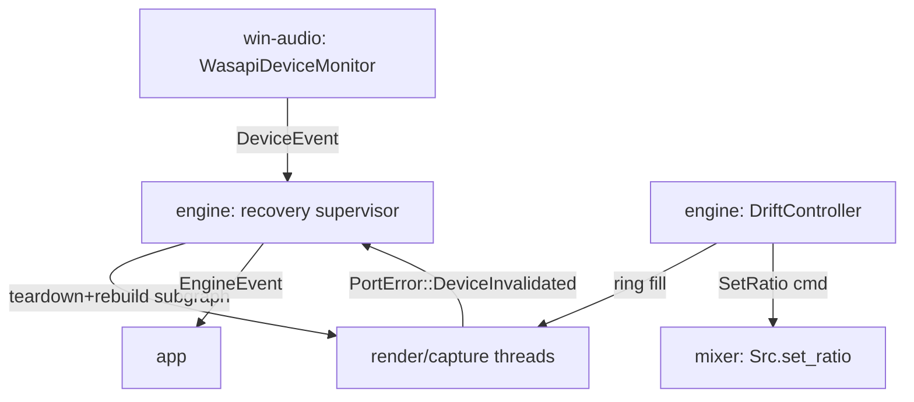

# Drift and Recovery (P2)

> P2 robustness — clock/drift compensation loop, device format-change and hotplug recovery, multi-output stability. Exit criteria: 8-hour soak with no drift-induced dropouts; survives unplugging a device (spec §13).

## Decisions Log

<!-- Add new at bottom. Never remove. -->

| Date | Decision | Reasoning | Alternatives Considered |
|------|----------|-----------|------------------------|
| 2026-07-18 | Blueprint scope = P2: clock/drift loop, format-change + hotplug recovery, multi-output resilience. Builds on approved `engine-core` design. | Spec §3.2/§7.3: hardest subsystem, difference between 10-minute and 10-hour router. Engine-core (P0–P1) approved — P2 is next phase. | P3 session routing; P4 shell (spec: no UI before P1 solid). |
| 2026-07-18 | Drift control input = ring-fill feedback only (PI loop). No IAudioClock positions in P2 contracts. | Fill error is the quantity the loop must hold; self-correcting; no port-surface growth; fully simulatable. Revisit only if 8h soak shows slow convergence. | Fill + IAudioClock feedforward (faster convergence, but bigger port + COM surface before evidence of need). |
| 2026-07-18 | DriftController lives in `engine/clock.rs` (spec-aligned), not audio-core. | Engine is already cross-platform testable via mocked ports; loop simulatable with synthetic fill curves. No cross-crate type churn. | Pure control-law struct in audio-core (purity win, but no added testability). |
| 2026-07-18 | Auto-restore: when a fallen-back group's configured device reappears, supervisor restores routing automatically and emits `Recovered`. | Config is source of truth; replug-headset UX matches tray-app expectations. Spec §10 silent on restore — recorded as design elaboration, not override. | Manual-only restore (predictable, but system diverges from config indefinitely). |
| 2026-07-18 | Drift ratio is per-output (`SetOutputRatio`), fanned to all SRCs feeding that output; DriftController pure `tick(fills) -> Vec<MixerCommand>`. | Fill is measured per output ring — one control loop per output. Pure function enables synthetic-curve unit tests for the hardest subsystem. | Per-(group,output) ratios (more state, same fill signal — no benefit). |
| 2026-07-18 | Device events surface as `AudioSystem::subscribe_device_events()` returning std channel; fallback target via `default_output()`. | Extends existing facade — no new port trait; COM notification lifetime stays inside win-audio. | Separate DeviceMonitorPort trait (second port abstraction with single consumer). |
| 2026-07-18 | Design approved at Level 4. Status set to approved — ready for implementation. | All four levels approved and persisted; drift check vs spec complete. | — |
| 2026-07-18 | **Revision (cross-blueprint review):** `EngineHandle::events()` replaced by `take_events(&mut self) -> Receiver<EngineEvent>` — callable once; app-side event pump owns the receiver and fans out (tray, UI). | `Receiver` is single-consumer; returning it from `&self` repeatedly is unimplementable, and P4 has two consumers (tray + UiState). | Broadcast channel in engine (extra dependency; fan-out is an app concern); multiple engine-side channels (engine shouldn't know its consumers). |
| 2026-07-18 | **Revision (cross-blueprint review):** DriftController input becomes `FillSample { fill, active }` per output; while `active == false` (no group pushed frames recently) the controller freezes its integrator and holds the last ratio. | Silent buses produce no input; without the guard the PI integrator winds up on silence and pegs the ratio at clamp (finding coupled to engine-core timer-pacing revision). | Ratio reset to 1.0 on idle (step on resume — audible); no guard (ratio pegs). |
| 2026-07-18 | **Revision (cross-blueprint review):** device-removal fallback re-points affected groups at the already-running `OutputId` for the fallback device when one exists; a new output subgraph is created only if none exists. | Mixer natively supports groups sharing an output; duplicate render streams on one endpoint waste a thread + period each. | Always spawning a second render stream (legal but wasteful). |

## Design: Level 1 -- Capabilities

Approved 2026-07-18.

1. **Hours-long stability** — audio runs 8+ hours with zero drift-induced dropouts; rings never slowly starve or overflow.
2. **Survives unplugging** — removing an in-use output device never kills the engine; affected groups fall back to default device with user notice; other groups uninterrupted.
3. **New devices usable live** — plugged-in device becomes selectable routing target without restart.
4. **Automatic format-change recovery** — endpoint format changes rebuild affected stream and resume audio, no app restart.
5. **Observable health** — ring fill, applied drift ratio, xrun counts behind debug flag.

Out of scope: DSP, session auto-routing, UI beyond tray-notice hook, own driver.

## Design: Level 2 -- Components

Approved 2026-07-18. Extensions to engine-core crates; no new crates.

| Component | Home / layer | Single responsibility |
|---|---|---|
| Variable-ratio Src | `audio-core` (domain) | `Src::set_ratio(f64)` + internal ratio slewing — smooth glide, never a step |
| DriftController | `engine/clock.rs` (application) | Per-output loop: ring-fill error → smoothed corrective ratio → mixer SRC. Pure math, simulatable |
| Device event port + monitor | trait `engine::ports`, impl `win-audio` (infra) | `IMMNotificationClient` wrapper → typed DeviceEvent channel |
| Recovery supervisor | `engine/runtime.rs` (application) | Fault + device events → rebuild stream (format change), fallback re-route (removal), register new targets |
| EngineEvent channel + stats | `engine` → `app` boundary | Notices (DeviceLost/FallbackApplied/Recovered/DeviceAvailable); EngineStats gains applied ratio per output |



DDD: `ResampleRatio` value object (clamped near 1.0); DeviceEvent/EngineEvent as domain-ish events at boundaries; controller state owned by DriftController.

## Design: Level 3 -- Interactions

Approved 2026-07-18.

**A — Drift loop (~10 Hz, engine control thread):** RT threads publish ring fill via atomics → DriftController PI tick per output: error = fill − 50% target → ratio clamped ±0.5% → `MixerCommand::SetOutputRatio` on command ring → mixer applies, Src slews (never steps) → applied ratio + xruns into EngineStats; app logs behind debug flag.

**B — Device removed:** WasapiDeviceMonitor (COM cb) → `DeviceEvent::Removed`; render thread → `Fault(DeviceInvalidated)` + exit. Supervisor dedups by endpoint id → teardown output subgraph → resolve current default endpoint → rebuild on fallback → `EngineEvent::FallbackApplied{groups, from, to}`. Other outputs untouched.

**C — Device added:** `DeviceEvent::Added` → refresh endpoint set → `EngineEvent::DeviceAvailable`; if returning device is one a fallen-back group is configured for → auto-restore + `Recovered`.

**D — Format change:** stream fails `DeviceInvalidated` → supervisor re-opens via port, new mix format, rebuilds SRC + rings (supervisor thread, allocation OK), restart → `EngineEvent::Recovered`.

**E — Degraded:** no fallback device available → group parked silent, `EngineEvent::DeviceLost`, retry on next Added. Engine never exits on device faults.

## Design: Level 4 -- Contracts

Approved 2026-07-18. Deltas on approved engine-core contracts; signatures only.

### `audio-core`

```rust
pub struct ResampleRatio(f64);                       // finite, clamped 0.9..=1.1 at construction
impl ResampleRatio { pub fn new(v: f64) -> Result<ResampleRatio, DomainError>; }

impl Src {
    pub fn set_ratio(&mut self, target: ResampleRatio);  // slews internally — never steps
}

pub enum MixerCommand {
    SetGroupGain(GroupId, Gain), SetMaster(Gain), SetFollowMaster(GroupId, bool),
    SetOutputRatio(OutputId, ResampleRatio),         // new: fans out to every SRC feeding that output
}
```

### `engine/clock.rs` — DriftController (pure)

```rust
pub struct DriftConfig { pub target_fill: f32, pub kp: f64, pub ki: f64,
                         pub max_correction: f64 /* 0.005 */, pub tick: Duration /* ~100 ms */ }
pub struct DriftController { /* per-output PI state */ }
impl DriftController {
    pub fn new(outputs: &[OutputId], cfg: DriftConfig) -> DriftController;
    pub fn tick(&mut self, fills: &[(OutputId, f32)]) -> Vec<MixerCommand>;  // pure, simulatable
}
```

### `engine::ports` additions (win-audio implements)

```rust
pub enum DeviceEvent { Added(Endpoint), Removed(EndpointId), DefaultChanged(EndpointId), StateChanged(EndpointId) }

pub trait AudioSystem: Send + Sync {
    // ...engine-core methods unchanged...
    fn default_output(&self) -> Result<Endpoint, PortError>;
    fn subscribe_device_events(&self) -> Result<Receiver<DeviceEvent>, PortError>;  // IMMNotificationClient behind std channel
}
```

### `engine`

```rust
pub enum EngineEvent {
    FallbackApplied { groups: Vec<GroupId>, from: EndpointId, to: EndpointId },
    Recovered       { groups: Vec<GroupId>, on: EndpointId },
    DeviceAvailable(Endpoint),
    DeviceLost      { groups: Vec<GroupId> },
}
impl EngineHandle { pub fn events(&self) -> Receiver<EngineEvent>; }
pub struct EngineStats { pub xruns: u64, pub ring_fill: Vec<(OutputId, f32)>,
                         pub applied_ratio: Vec<(OutputId, f64)>, pub group_faults: Vec<GroupId> }
```

Internal, not contract: RT fill published via atomics; supervisor dedups Removed/Invalidated per endpoint; rebuild allocation on supervisor thread only.

## Open Questions

None yet.

## Constraints

Inherited from `engine-core` (all still binding): COM in win-audio only; no exclusive mode; RT threads never alloc/lock/block/log; SPSC rings only; f32 internal; render side is pull clock.

P2-specific (spec §7.3, §10):
- Drift corrections small and smoothed — never step the resample ratio abruptly (audible).
- Telemetry (ring fill, applied ratio, xrun counts) behind debug flag from day one.
- Supervisor owns teardown/rebuild; single device fault never takes down whole engine.
- Device removed → re-route affected groups to fallback (default device) + surface notice.
- Format change (`AUDCLNT_E_DEVICE_INVALIDATED`) → rebuild affected stream with new mix format + rebuild SRC, no app restart.

## Design Revisions (2026-07-18 cross-blueprint review)

```rust
// engine — events: single-consume handoff, app pump fans out
impl EngineHandle { pub fn take_events(&mut self) -> Receiver<EngineEvent>; }   // replaces events(&self)

// engine/clock.rs — idle guard
pub struct FillSample { pub fill: f32, pub active: bool }
impl DriftController {
    pub fn tick(&mut self, fills: &[(OutputId, FillSample)]) -> Vec<MixerCommand>;  // inactive → integrator frozen, ratio held
}

// supervisor — fallback: reuse existing OutputId for the fallback device if running; new subgraph only if none.
```

## Design Summary

- **Components/layers:** variable-ratio `Src` + `ResampleRatio` (`audio-core`, domain); `DriftController` (`engine/clock.rs`, application, pure); device-event monitor (port method on `AudioSystem`, impl `win-audio`); recovery supervisor (`engine/runtime.rs`); `EngineEvent` channel + extended `EngineStats` (engine→app boundary).
- **Key contracts:** `Src::set_ratio` (slewed), `MixerCommand::SetOutputRatio`, `DriftController::tick(fills) -> Vec<MixerCommand>`, `AudioSystem::{default_output, subscribe_device_events}`, `DeviceEvent`, `EngineEvent`, `EngineHandle::events()`.
- **Architectural constraints:** corrections smoothed, never stepped; RT threads publish fill via atomics only; rebuild allocation confined to supervisor thread; single device fault never exits engine; telemetry behind debug flag from day one.
- **Domain decisions:** `ResampleRatio` value object; fill-only PI control (no IAudioClock in P2); per-output ratio fan-out.
- **Resolved during design:** drift input = fill-only; DriftController home = engine; auto-restore on device return; device events via facade method not new trait.
- Drift check vs `Splitstream-Engineering-Spec.md` complete — see spec `## Links`.

## Key Files

| Path | Role |
|---|---|
| Splitstream-Engineering-Spec.md | Requirement/engineering spec (§3.2, §7.3, §10, N3) |
| .lattice/context/engine-core.md | Approved P0–P1 design this feature extends (ports, EngineHandle, Src, supervisor) |
