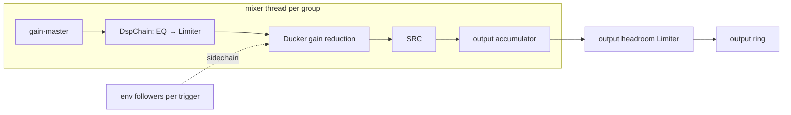

# DSP Pipeline (P5)

> P5 — per-group DSP stages (EQ, ducking, limiter) and per-output headroom management. Exit criteria: DSP stages audibly correct; no clipping when groups share an output (spec §13).

## Decisions Log

<!-- Add new at bottom. Never remove. -->

| Date | Decision | Reasoning | Alternatives Considered |
|------|----------|-----------|------------------------|
| 2026-07-18 | Blueprint scope = P5: `DspStage` trait pipeline (EQ, ducking, limiter) in the group processing chain + per-output headroom/limiting. Builds on approved P0–P4 designs. | Spec §13 phase order; last undesigned phase (P6 own-driver deferred by spec). | P6 driver track (explicitly deferred, separate signing gate). |
| 2026-07-18 | Ducker is a mixer-level cross-group processor, not a `DspStage`. Envelope followers on trigger groups feed smoothed gain reduction applied after each target's chain. | Sidechain routing spans groups — mixer topology concern. Keeps DspStage trait single-group pure (`buf + fmt` only). | `process(buf, fmt, sidechain)` on every stage (unused param on non-ducking stages; mixer wires levels anyway). |
| 2026-07-18 | Ducking configured on the **target** group: `[[group.dsp]] type="duck", trigger="<group>", amount_db, threshold_db, attack_ms, release_ms`. **Resolves open question.** | Matches spec's `[[group.dsp]]` placement; a group's block shows everything affecting it. | Trigger-side `targets=[...]` list (behavior defined in someone else's block). |
| 2026-07-18 | DSP param tweak / bypass = MixerCommand on pre-allocated stage; add/remove stage = `Structural` rebuild. | RT no-alloc constraint: new stage allocates → supervisor thread. Bypass flag pre-allocated → live toggle stays glitch-free. | Live chain mutation on RT thread (violates N2). |
| 2026-07-18 | **Revision of previous decision** (L3): stage add/remove stays `Structural`-classified but implemented as RT-safe chain swap — supervisor pre-builds `DspChain`, swap command moves pointer, old chain dropped off-thread via return channel. No stream teardown. | Glitch-free stage changes at modest complexity; classic RT swap pattern; alloc/dealloc both off RT thread. | Group subgraph teardown+rebuild (audible gap on an interactive action); RT-thread mutation (violates N2). |
| 2026-07-18 | Duck sidechain reads post-chain (post-EQ/limiter) trigger signal; envelopes for all triggers computed before any target processed within a block. | Sidechain should reflect what's audible; fixed intra-block order guarantees determinism, prevents feedback. | Pre-chain signal (reacts to EQ'd-away content); cross-block lag (adds a block of duck latency). |
| 2026-07-18 | `Mixer::apply` returns `Option<Box<DspChain>>` — retired chain handed back to caller for off-RT drop; `ConfigDelta` gains explicit `DspChains` variant. | Alloc and dealloc both stay off RT thread with a plain return value — no extra channel type in the domain contract (transport-free learning). | Retire channel injected into Mixer::new (transport type in domain contract); implicit reuse of Structural (supervisor would need to re-diff). |
| 2026-07-18 | Design approved at Level 4. Status set to approved — ready for implementation. | All four levels approved and persisted; drift check vs spec complete. | — |
| 2026-07-18 | **Revision (cross-blueprint review):** DSP commands are epoch-checked (engine-core `Epoch`). Epoch bumps on structural rebuild **and** on each `SwapChain` apply; `SetDspParam`/`SetDspBypass` carrying a stale epoch are dropped by the mixer. | In-flight `SetDspParam { stage: usize }` racing a chain swap would index the wrong/missing stage. Epoch check makes the race harmless; UI re-sends against fresh state. | Stage ids instead of indices (registry overhead); locking around swap (violates RT no-lock). |
| 2026-07-20 | **Implementation deviation:** `ConfigDelta` gains `dsp_chains: Option<Vec<(GroupId, Vec<DspSpec>)>>` as a field on the existing struct, not a `DspChains` enum variant as the L4 contract text literally shows. | The contract text predates session-routing's 2026-07-20 revision, which already turned `ConfigDelta` from enum to struct so one config save can carry gain + rules changes simultaneously without one silently dropping the other. Adding an enum variant back would re-break that. | Reintroducing the enum shape (rejected — regresses the simultaneous-edit fix). |
| 2026-07-20 | Per-stage `bypassed: bool` persists to TOML (`DspStageConfig { spec, bypassed }`, written by `control::store`); `engine::start()`/`apply_rebuild()` re-applies any `bypassed: true` via `queue_initial_dsp_bypass` right after building the graph, since a fresh `DspChain` always constructs un-bypassed. | Explicit user choice (asked directly): matches the existing precedent that group-level mute survives a restart: a bypass toggle is a mix decision, not session-only state. | Runtime-only bypass, not persisted (rejected — user's choice reverts every relaunch). |
| 2026-07-20 | `Mixer::push_group` does gain + `DspChain` only; a new `Mixer::mix_tick()`, called once per tick after every group's `push_group`, does duck → matrix → SRC → sum → per-output headroom limiter. | L3's ordering constraint (every duck trigger's envelope computed before any target's duck gain is applied, within one block) is impossible to satisfy from the old single-pass-per-group `push_group` shape — this ordering is load-bearing, not a style choice. | None viable — considered and rejected an alternative of using the *previous* tick's envelope (one-tick-delayed sidechain) to avoid the split, but the approved L3 text explicitly requires same-block ordering. |
| 2026-07-20 | `SwapChain`'s epoch bump happens on the mixer thread (`drain_commands`), as a side effect of `mixer.apply` returning `Some`, not when the caller constructs/sends the command. | Matches the already-logged 2026-07-18 revision literally ("epoch bumps ... on each SwapChain apply"); keeps `EngineHandle::apply_dsp_chains` a thin wrapper around the existing `apply_params` — no separate epoch-bumping call needed on the sender side. | Bumping epoch in `apply_dsp_chains` before sending (rejected — doesn't match the documented revision and races the actual mixer-side swap). |
| 2026-07-20 | **Review finding, fixed:** `EnvFollower`, `DuckTargetGain`, and `BypassRamp` each originally advanced their one-pole smoother once per *interleaved sample* (or, for `EqBand`'s coefficient recompute, once per 32-frame sub-block) instead of once per *frame* — made duck/bypass timing scale with channel count and EQ param ramps 32x slower than documented. Fixed to advance once per frame, matching `push_group`'s own established pattern. | Caught via `/lattice:review`, confirmed by a channel-count-comparison regression test before fixing. | — |
| 2026-07-20 | **Review finding, fixed:** `control::store`'s `dsp`/`bands`/`duck` TOML mutation helpers used `.expect()` assuming an array-of-tables/table on-disk shape; a hand-written inline-array/table shape (equally valid, accepted by `parse()`) panicked the app on the first live edit. Fixed to return `StoreError::Validation` instead. | Caught via `/lattice:review`, confirmed by direct reproduction against a hand-written inline-shape config file before fixing. | — |

## Design: Level 1 -- Capabilities

Approved 2026-07-18.

1. **Per-group parametric EQ** — configurable bands (freq, gain, Q) per group.
2. **Ducking** — trigger groups lower others while carrying signal; smooth attack/release, no pumping.
3. **Per-group limiter** — optional ceiling per group.
4. **No clipping on shared outputs** — automatic output-stage headroom/limiting when groups sum.
5. **Live, click-free DSP editing** — stages toggled/tweaked while audio runs; smoothed; config-driven via `[[group.dsp]]`.

Out of scope: VST/plugin hosting, spectrum visualization, per-app DSP.

## Design: Level 2 -- Components

Approved 2026-07-18.

| Component | Home / layer | Single responsibility |
|---|---|---|
| DspChain + `DspStage` trait | `audio-core/dsp.rs` (domain) | Ordered per-group stages, pre-allocated, per-stage bypass; runs after gain, before SRC |
| ParametricEq | `audio-core/dsp.rs` (domain) | Biquad cascade; coefficient smoothing on param change |
| Ducker | `audio-core/mixer.rs` level (domain) | Cross-group sidechain: trigger envelope followers → smoothed gain reduction on targets |
| Limiter | `audio-core/dsp.rs` (domain) | One algorithm, two placements: optional per-group stage + always-on per-output headroom limiter |
| DSP config/command integration | `control` + `audio-core` | `[[group.dsp]]` → `DspSpec`; MixerCommand DSP variants; delta classification |



Change classification: param tweak / bypass toggle = command on pre-allocated stage; add/remove stage = `Structural` rebuild (allocation on supervisor thread).

## Design: Level 3 -- Interactions

Approved 2026-07-18.

**A — Mixer tick order:** drain rings → per group gain·(master,mute) → DspChain (EQ → limiter, bypass-aware) → all trigger envelopes update (post-chain signal) → duck gain reduction on targets (one-block sidechain, no feedback) → SRC → sum accumulators → per-output always-on headroom limiter → rings. Limiter engagement bumps telemetry.

**B — Live param tweak:** DSP `ConfigEdit` → P4 fast path: `MixerCommand::SetDspParam` (smoothed) + debounced config write.

**C — Bypass toggle:** `SetDspBypass` → wet/dry ramp ~10 ms.

**D — Add/remove stage:** funnel-classified `Structural`; implemented as RT-safe chain swap — supervisor pre-builds new `DspChain` → swap command (pointer move) → old chain returned on channel, dropped off-thread. Glitch-free; streams never restart. (Refines earlier decision — see log.)

**E — Validation:** duck cycles + unknown trigger names rejected; previous snapshot retained.

**F — Telemetry:** limiter engagement + duck depth in `EngineStats` (debug flag).

## Design: Level 4 -- Contracts

Approved 2026-07-18. Deltas on approved P0–P4 contracts; signatures only.

### `audio-core` — dsp

```rust
pub trait DspStage: Send {
    fn process(&mut self, buf: &mut [f32], fmt: Format);
    fn set_param(&mut self, param: DspParam);        // smoothed internally
    fn set_bypass(&mut self, bypassed: bool);        // ~10 ms wet/dry ramp
    fn reset(&mut self);
}

pub struct EqBandSpec { pub freq_hz: f32, pub gain_db: f32, pub q: f32 }
pub enum DspParam { EqBand { band: usize, spec: EqBandSpec }, LimiterCeilingDb(f32) }

pub enum DspSpec { Eq { bands: Vec<EqBandSpec> }, Limiter { ceiling_db: f32 } }
pub struct DuckSpec { pub trigger: GroupId, pub amount_db: f32, pub threshold_db: f32,
                      pub attack_ms: f32, pub release_ms: f32 }

pub struct ParametricEq; // DspStage; new(bands, fmt, max_block)
pub struct Limiter;      // DspStage; new(ceiling_db, fmt, max_block); also per-output always-on

pub struct DspChain;
impl DspChain {
    pub fn new(specs: &[DspSpec], fmt: Format, max_block_frames: usize) -> Result<DspChain, DomainError>;
    pub fn process(&mut self, buf: &mut [f32], fmt: Format);
}
```

### `audio-core` — mixer

```rust
pub struct GroupSpec { /* P0–P1 fields… */ pub dsp: Vec<DspSpec>, pub duck: Option<DuckSpec> }

pub enum MixerCommand { /* P0–P4 variants… */
    SetDspParam  { group: GroupId, stage: usize, param: DspParam },
    SetDspBypass { group: GroupId, stage: usize, bypassed: bool },
    SetDuck      { group: GroupId, duck: Option<DuckSpec> },
    SwapChain    { group: GroupId, chain: Box<DspChain> },
}

impl Mixer {
    pub fn apply(&mut self, cmd: MixerCommand) -> Option<Box<DspChain>>;  // retired chain on SwapChain
}
```

### `engine`

```rust
pub struct EngineStats { /* P2 fields… */
    pub limiter_engaged: Vec<(OutputId, u64)>,
    pub duck_depth_db:  Vec<(GroupId, f32)>,
}
// supervisor: DspChains delta → DspChain::new off-thread → SwapChain → receive retired → drop
```

### `control`

```rust
pub struct GroupConfig { /* … */ pub dsp: Vec<DspStageConfig> }
// validation: duck cycles, unknown triggers, EQ band ranges → ConfigError::Invalid

pub enum ConfigEdit { /* P4 variants… */
    SetEqBand(String, usize, EqBandSpec), SetLimiterCeiling(String, f32),
    SetDuck(String, Option<DuckSpecConfig>), SetDspBypass(String, usize, bool),
    AddDspStage(String, DspStageConfig), RemoveDspStage(String, usize),
}

pub enum ConfigDelta { Params(Vec<MixerCommand>), Rules(Vec<GroupRules>),
                       DspChains(Vec<(GroupId, Vec<DspSpec>)>), Structural, Unchanged }
```

## Open Questions

None — ducking topology resolved (see Decisions Log).

## Constraints

Inherited (binding): all DSP pure in `audio-core` (no OS, CI-testable, spec §6.1); RT threads never alloc/lock/block — all DSP state pre-allocated at graph build; f32 interleaved internal; param changes via lock-free command ring only; smoothed transitions (no zipper noise — same principle as P2 ratio slewing).

P5-specific (spec §6.1, §8, §13):
- `DspStage` trait: `process(&mut self, buf: &mut [f32], fmt: Format)` — concrete: `Biquad`/`ParametricEq`, `Ducker`, `Limiter` (spec §6.1).
- DSP runs per group after gain, before SRC (spec §8 step 3).
- Per-output headroom: summing multiple groups must not clip — limiter at output accumulator (spec §8 step 5).
- Config schema already defines `[[group.dsp]]` blocks (spec §11.3).

## Design Revisions (2026-07-18 cross-blueprint review)

- DSP commands ride the engine-core `Epoch` mechanism: epoch bumps on structural rebuild and on each `SwapChain` apply; stale `SetDspParam`/`SetDspBypass` dropped by mixer. No contract shape change beyond the shared `Envelope { epoch, cmd }` wire format defined in engine-core revisions.
- Mute (revised global in app-shell) applies at output stage — downstream of DSP chains and duck; DSP state keeps running while muted (envelopes stay warm, unmute is instant and click-free).

## Design Summary

- **Components/layers:** `DspStage` trait + `DspChain`, `ParametricEq`, `Limiter` (all `audio-core` domain); Ducker as mixer-level cross-group processor; per-output always-on headroom limiter; config/command integration in `control`.
- **Key contracts:** `DspStage::{process, set_param, set_bypass, reset}`; `DspSpec`/`DuckSpec`/`EqBandSpec` value objects; `MixerCommand::{SetDspParam, SetDspBypass, SetDuck, SwapChain}`; `Mixer::apply -> Option<Box<DspChain>>` (retired-chain return); `ConfigDelta::DspChains`; `EngineStats::{limiter_engaged, duck_depth_db}`.
- **Architectural constraints:** all DSP pure/pre-allocated; smoothed params + wet/dry bypass ramps (no clicks); chain alloc/drop off RT thread (swap pattern); duck envelopes before targets within a block; duck cycles rejected at validation.
- **Domain decisions:** duck config target-side in `[[group.dsp]]`; post-chain sidechain signal; stage tweak = command, chain shape change = pre-built swap.
- **Resolved during design:** ducking topology (open question); Ducker shape (mixer-level); teardown-vs-swap for stage changes (revision logged).
- Drift check vs `Splitstream-Engineering-Spec.md` complete — see spec `## Links`.

## Key Files

| Path | Role |
|---|---|
| Splitstream-Engineering-Spec.md | Requirement spec (§6.1, §8, §11.3, P5) |
| .lattice/context/engine-core.md | Approved P0–P1 (Mixer contract DSP slots into; MixerCommand ring) |
| .lattice/context/app-shell.md | Approved P4 (ConfigEdit path for live DSP param changes) |
| crates/audio-core/src/dsp.rs | `DspStage` trait, `Biquad`/`ParametricEq`, `Limiter`, `DspChain` (domain, pure) |
| crates/audio-core/src/smoothing.rs | Shared one-pole `Smoothed`, extracted from `mixer.rs` to avoid duplicating it into `dsp.rs` |
| crates/audio-core/src/mixer.rs | `EnvFollower`, `DuckTargetGain`, two-phase `push_group`/`mix_tick` split, new `MixerCommand` variants, `Mixer::apply` retire-return |
| crates/audio-core/src/sample.rs | `DuckSpec`, `GroupSpec.dsp`/`.duck`, `DomainError::InvalidEqBand`/`DanglingDuckTrigger` |
| crates/engine/src/graph.rs | `DuckSpecConfig`, `DspStageConfig`, `GroupConfig.dsp`/`.duck`, trigger-name resolution in `resolve()` |
| crates/engine/src/runtime.rs | `EngineHandle::apply_dsp_chains`, epoch-bump-on-swap in `drain_commands`, `Persistent::retired` drained by the supervisor, `EngineStats::{limiter_engaged, duck_depth_db}`, `queue_initial_dsp_bypass` |
| crates/control/src/config.rs | `[[group.dsp]]`/duck TOML parsing, `validate_duck_config` (cycles + unknown triggers), `ConfigDelta.dsp_chains`, three-way `diff()` branching (chain rebuild vs bypass vs duck param) |
| crates/control/src/store.rs | New `ConfigEdit` variants, TOML-writing helpers for dsp stages/duck (fallible, not `.expect()`-panicking) |
| crates/app/src/main.rs | `ShellAction::EditDspChains`, `edits_to_mixer_commands` fast-path mapping for EQ/limiter/duck/bypass edits |
| crates/app/src/ui.rs | Settings-panel EQ/limiter/duck controls (`dsp_controls`, `duck_controls`) |
