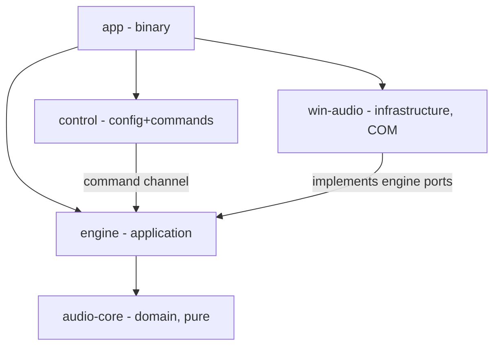

# Engine Core (P0–P1)

> Audio engine core for Splitstream phases P0–P1: endpoint enumeration, loopback capture of bus endpoints, mixing with per-group gain, per-group output routing, and shared-mode render to physical devices.

## Decisions Log

<!-- Add new at bottom. Never remove. -->

| Date | Decision | Reasoning | Alternatives Considered |
|------|----------|-----------|------------------------|
| 2026-07-18 | Blueprint scope = P0–P1 engine core (enumeration, capture, mixer, routing, render). UI, DSP, drift loop, session routing deferred to later phases. | Spec §13: P0–P1 are "prove the model" milestones; no UI before P1 audio is solid. Hardest architectural decisions live here. | Whole-system blueprint (too shallow, duplicates spec); P0 only (defers mixer/graph decisions that shape everything). |
| 2026-07-18 | Port traits (capture/render/enumerate) live in `engine`, implemented by `win-audio`. **Design override of spec §6.2** (spec had traits in win-audio). | win-audio carries windows-rs; engine importing its traits would not compile on Linux, breaking N5/§6 cross-platform testability. Rust idiom: interface at consumer. | cfg-gating windows-rs inside win-audio (fragile); separate ports crate (5th crate for 3 traits, no second consumer). |
| 2026-07-18 | Keep `control` as its own crate per spec layout. | P4 tray UI will need config/command types without depending on engine. | Folding control into engine modules (simpler now, split later). |
| 2026-07-18 | Fixed-ratio SRC in P1 for format mismatches only; variable drift ratio deferred to P2. | F3 requires SRC when bus and output formats differ; drift loop is P2 per §13. | Requiring matching formats in P0–P1 (fails on common 44.1/48 kHz mismatch). |
| 2026-07-18 | Live-control split: param changes (gain/master/follow) via lock-free command ring to mixer; structural changes (group add/remove, output device change) via supervisor teardown+rebuild of affected sub-graph. | Mixer owning stream lifecycle would force alloc/blocking on RT thread (violates N2). Rebuild gap confined to affected group. | All changes via mixer commands (RT violation); full-engine restart on any change (needless global gap). |
| 2026-07-18 | Port surface: `AudioSystem` facade + `CapturePort::read(&mut [f32])` pull model instead of spec's per-struct `open()` + pump-into-Producer. | Keeps rtrb out of port contracts; mocks trivial; ring ownership stays in engine.runtime. | Spec Appendix A shape (capture pushes into rtrb Producer — couples port trait to ring library). |
| 2026-07-18 | Design approved at Level 4. Status set to approved — ready for implementation. | All four levels approved and persisted; drift check vs spec complete. | — |
| 2026-07-18 | **Revision (cross-blueprint review):** mixer thread is timer-paced (~half the minimum device period), not input-paced. Each tick drains whatever input rings hold and synthesizes silence for starved groups. | WASAPI loopback delivers zero packets on silent buses — input-paced mixer stalls when all groups silent → output starvation → drift ratio pegs. Timer pacing keeps output rings fed regardless of source activity. | Input-arrival pacing (stalls on silence); render-event pacing (couples mixer to one output's clock). |
| 2026-07-18 | **Revision (cross-blueprint review):** command channel = bounded lock-free MPSC queue (e.g. crossbeam `ArrayQueue`), pre-allocated. SPSC `rtrb` remains for PCM rings only. | Command producers number ≥3 by P5 (control thread, UI fast-path dispatcher, drift tick, supervisor swap) — SPSC contract was silently violated. MPSC push/pop stays lock-free + alloc-free after init. | All producers funneling through one thread into SPSC (extra hop + queue per producer); SPSC as designed (unsound with multiple producers). |
| 2026-07-18 | **Revision (cross-blueprint review):** topology `Epoch(u64)` introduced — bumped on every structural rebuild and chain swap. `EngineHandle` tags all commands with current epoch; mixer drops stale-epoch commands. | Positional GroupIds shift on group add/remove; in-flight fast-path (P4) and DSP (P5) commands could hit the wrong group mid-rebuild. Epoch check makes stale commands harmless. | Persistent group UUIDs (schema churn, rejected in P4); accepting the race (wrong-group volume/DSP changes). |
| 2026-07-18 | **Revision (cross-blueprint review):** `schema_version` bumped to 2 covering P4/P5 additions (`muted`, `[app]`, duck fields). Policy: missing fields get defaults; `schema_version` greater than supported → `ConfigError::Invalid`, prior snapshot retained. | Schema grew across P4/P5 with no versioning/compat policy anywhere. | Silent acceptance of unknown versions (undefined behavior on downgrade). |
| 2026-07-19 | **Implementation-time decision (code-forge):** `ConfigSnapshot`/`GroupConfig` are defined and owned by `engine` (`engine::graph`), not by `control` as the L4 contract text literally implied. `control` (next layer) will depend on `engine` and produce this type directly from TOML. | L4's `engine::start(snapshot: &ConfigSnapshot, ...)` referenced a type documented under the `control` section, but `.lattice/implementation-order.md` builds `engine` before `control` exists, and the L2 mermaid diagram shows no `engine`→`control` edge (`control ‑‑>|command channel| engine` is data flow wired by `app`, not a Cargo dependency — confirmed by the contract's own closing line: "`app` wires: `load` → `engine::start` → watcher loop → `diff` → `apply_params`/`rebuild`"). Asked the user directly (real fork, lasting API-shape consequence); confirmed. | Keep the type in `control` and reorder to build `control` before `engine` (breaks the approved inside-out sequence for no benefit — `control`'s own contract never references `engine`). Fully decouple with independently-named types on both sides, converted by `app` (more boilerplate, zero benefit here since nothing else needs `engine` and `control` decoupled). |

## Design: Level 1 -- Capabilities

Approved 2026-07-18.

1. **Group routing works end-to-end** — app audio played into a group's bus endpoint emerges from that group's chosen physical output device.
2. **Independent volume per group** — each group has its own volume; master volume scales only groups bound to it (`follow_master`), independent groups unaffected.
3. **Shared outputs** — multiple groups may target the same physical device; their audio sums cleanly.
4. **Live control** — volume and routing changes apply while audio runs, without glitches or restart.
5. **Non-exclusive, stable operation** — devices never locked (other apps keep full access); passthrough stable for 10+ minutes (P0 exit criterion).

Out of scope: DSP, drift compensation, hotplug recovery, per-app session auto-routing, UI/tray, endpoint hiding.

## Design: Level 2 -- Components

Approved 2026-07-18.

| Component | Layer | Single responsibility | P0–P1 contents |
|---|---|---|---|
| `audio-core` | Domain | Pure sample processing — types + mixing math, no OS | `Format`, frame buffers, `Mixer` (per-group gain, master bind rule, group→output summing), fixed-ratio SRC (format mismatch only; drift ratio is P2) |
| `win-audio` | Infrastructure | Sole COM/WASAPI seam | COM guards, endpoint enumerator (bus vs physical classify), polled loopback capture, event-driven shared render, MMCSS promote |
| `engine` | Application | Graph orchestration — build wiring from config, spawn/supervise threads, own rings; **defines port traits** (capture/render/enumerate) | `graph`, `runtime`, `ports` |
| `control` | Application | Config + command plane | TOML load/validate → snapshot; file-watch hot-reload; diff → lock-free commands to mixer |
| `app` | Shell | Minimal dev binary | Load config, start engine, wait ctrl-c. Tray/UI = P4 |



DDD: `Format`, `Gain`, endpoint/group IDs = validated immutable value objects; config snapshot = immutable value object; `Mixer` = domain service with routing table. No aggregates/persistence — DDD applied lightly.

## Design: Level 3 -- Interactions

Approved 2026-07-18.

**A — Startup:** app → control loads/validates TOML → `ConfigSnapshot` → engine.graph resolves names→endpoint ids via enumerator port → `GraphPlan` → runtime pre-allocates rings/mixer/SRC/command ring → spawns capture ×N, mixer ×1, render ×M (MMCSS-promoted) → opens streams via ports → start.

**B — Steady state (lock-free hot path):** capture thread polls loopback ~period/2 → interleaved f32 frames → input ring (SPSC) → mixer thread drains rings, applies gain·(master if bound) → SRC → sums into per-output accumulators → output rings → render thread on device event pulls one period → render buffer. Overflow → drop; underflow → silence + counter. Rings carry interleaved f32 only.

**C — Live control:** notify file event → control re-validates (invalid → keep old snapshot) → diff: param change (gain/master/follow) → `Command` on lock-free command ring → mixer applies between blocks, glitch-free; structural change (group add/remove, output device change) → supervisor teardown+rebuild of affected sub-graph only (brief gap on that group).

**D — Shutdown:** stop flags → threads exit → stop streams → join → drop rings.

**E — Device error (minimal):** port returns device-invalidated → thread signals supervisor + exits → supervisor tears down affected sub-graph, logs, rest keeps running. Full recovery/fallback = P2.

Decision: structural changes go through supervisor rebuild, not mixer commands — mixer owning stream lifecycle would violate RT no-alloc/no-block. Param changes only on the command ring.

## Design: Level 4 -- Contracts

Approved 2026-07-18. Rust signatures only; implementation belongs to code-forge.

### `audio-core` (domain)

```rust
pub struct Format { pub sample_rate: u32, pub channels: u16 }   // samples always f32 interleaved
pub struct Gain(f32);                                            // linear; finite, >= 0
impl Gain { pub fn new(v: f32) -> Result<Gain, DomainError>; }
pub struct GroupId(pub u16);
pub struct OutputId(pub u16);

pub struct GroupSpec { pub id: GroupId, pub gain: Gain, pub follow_master: bool, pub output: OutputId, pub input_format: Format }
pub struct OutputSpec { pub id: OutputId, pub format: Format }
pub struct Topology { pub master: Gain, pub groups: Vec<GroupSpec>, pub outputs: Vec<OutputSpec> }

pub enum MixerCommand { SetGroupGain(GroupId, Gain), SetMaster(Gain), SetFollowMaster(GroupId, bool) }

pub struct Mixer { /* per-group state, SRC per (group,output), output accumulators — pre-allocated */ }
impl Mixer {
    pub fn new(topology: &Topology, max_block_frames: usize) -> Result<Mixer, DomainError>;
    pub fn apply(&mut self, cmd: MixerCommand);
    pub fn push_group(&mut self, group: GroupId, frames: &[f32]);          // gain·(master if bound) → SRC → accumulate
    pub fn take_output(&mut self, output: OutputId, buf: &mut [f32]) -> usize;
}

pub struct Src { /* rubato wrapper, fixed ratio in P1; set_ratio arrives P2 */ }
impl Src {
    pub fn new(from: Format, to: Format, max_block_frames: usize) -> Result<Src, DomainError>;
    pub fn process(&mut self, input: &[f32], output: &mut [f32]) -> SrcProgress; // {consumed, produced}
}
```

### `engine::ports` (engine-owned; win-audio implements)

```rust
pub struct EndpointId(pub String);
pub enum EndpointKind { Bus, Physical }
pub struct Endpoint { pub id: EndpointId, pub name: String, pub kind: EndpointKind, pub format: Format }
pub enum PortError { DeviceInvalidated, NotFound(EndpointId), Backend(String) }

pub trait AudioSystem: Send + Sync {
    fn enumerate(&self) -> Result<Vec<Endpoint>, PortError>;
    fn open_capture(&self, id: &EndpointId) -> Result<Box<dyn CapturePort>, PortError>;
    fn open_render(&self, id: &EndpointId) -> Result<Box<dyn RenderPort>, PortError>;
    fn promote_rt_thread(&self) -> RtGuard;          // MMCSS "Pro Audio"; no-op in mocks
}
pub trait CapturePort: Send {                        // polled ~period/2 (spec Appendix A)
    fn read(&mut self, buf: &mut [f32]) -> Result<usize, PortError>;
    fn format(&self) -> Format;
    fn poll_interval(&self) -> Duration;
}
pub trait RenderPort: Send {                         // event-driven shared mode
    fn wait_event(&mut self, timeout: Duration) -> Result<(), PortError>;
    fn write(&mut self, frames: &[f32]) -> Result<(), PortError>;
    fn format(&self) -> Format;
    fn period_frames(&self) -> usize;
}
```

### `engine` (application)

```rust
pub enum EngineError { Resolve(String), Port(PortError), AlreadyStopped }

pub fn start(snapshot: &ConfigSnapshot, sys: Arc<dyn AudioSystem>) -> Result<EngineHandle, EngineError>;

impl EngineHandle {
    pub fn apply_params(&self, cmds: &[MixerCommand]) -> Result<(), EngineError>; // → lock-free command ring
    pub fn rebuild(&self, snapshot: &ConfigSnapshot) -> Result<(), EngineError>;  // structural: supervisor teardown+rebuild
    pub fn stats(&self) -> EngineStats;                                           // §7.3 telemetry from day one
    pub fn shutdown(self) -> Result<(), EngineError>;
}
pub struct EngineStats { pub xruns: u64, pub ring_fill: Vec<(OutputId, f32)>, pub group_faults: Vec<GroupId> }
```

### `control`

```rust
pub enum ConfigError { Io(String), Parse(String), Invalid(String) }   // invalid edit → keep prior snapshot

pub struct ConfigSnapshot { pub schema_version: u32, pub master: Gain, pub groups: Vec<GroupConfig> }
pub struct GroupConfig { pub name: String, pub bus_endpoint: String, pub output_device: String,
                         pub gain: Gain, pub follow_master: bool, pub match_rules: Vec<String> } // rules unused until P3

pub fn load(path: &Path) -> Result<ConfigSnapshot, ConfigError>;

pub enum ConfigDelta { Params(Vec<MixerCommand>), Structural, Unchanged }
pub fn diff(old: &ConfigSnapshot, new: &ConfigSnapshot) -> ConfigDelta;

pub struct ConfigWatcher;   // notify-based; control thread, never RT
impl ConfigWatcher { pub fn spawn(path: &Path) -> Result<(Self, Receiver<ConfigSnapshot>), ConfigError>; }
```

`win-audio` implements the port traits as `WasapiSystem` (all COM inside, safe public surface). `app` wires: `load` → `engine::start` → watcher loop → `diff` → `apply_params`/`rebuild` → ctrl-c → `shutdown`.

## Open Questions

- Ring library: `rtrb` vs `ringbuf` (spec §15.3 defaults `rtrb`).
- Mixer threading: single thread vs small pool (spec §15.4 says start single; measure).
- Bundled virtual driver product choice (spec §15.2) — licensing must be confirmed before P1.

## Constraints

- All `windows-rs` / COM confined to `win-audio` crate only; `audio-core` and `engine` graph logic compile and unit-test on any platform (spec §6, N5).
- Never open a physical endpoint in exclusive mode (spec §2.1, §7.4).
- RT threads never allocate, lock, block, or log-to-disk; PCM crosses threads only via SPSC lock-free rings; buffers pre-allocated at graph build (spec §7.2, N2).
- All internal processing is `f32` interleaved (spec §8).
- Loopback capture is polled (~period/2), not event-driven (spec Appendix A).
- Render devices set the pace — event-driven shared mode, render side is the pull clock (spec §7.1).

## Design Revisions (2026-07-18 cross-blueprint review)

Contract deltas from the five-blueprint seam review; re-approved same day.

```rust
// engine — topology epoch (stale-command safety across rebuilds and chain swaps)
pub struct Epoch(pub u64);
pub struct Envelope { pub epoch: Epoch, pub cmd: MixerCommand }   // internal wire format on the command queue
impl EngineHandle { pub fn epoch(&self) -> Epoch; }               // apply_params tags internally; mixer drops stale

// engine — command transport: bounded lock-free MPSC (crossbeam ArrayQueue), pre-allocated.
// rtrb SPSC remains for PCM rings only.

// engine — mixer thread: timer-paced tick at ~half the minimum device period.
// Each tick: drain input rings (non-blocking) → silence for starved groups → process → push output rings.

// control — schema_version = 2; missing fields default; version > supported → ConfigError::Invalid.
```

## Design Summary

- **Components/layers:** `audio-core` (domain, pure — Format/Gain/Mixer/Src), `engine` (application — ports, graph, runtime supervisor), `win-audio` (infrastructure — sole COM seam, `WasapiSystem`), `control` (application — config snapshot, watcher, diff), `app` (shell — minimal binary).
- **Key contracts:** `AudioSystem`/`CapturePort`/`RenderPort` port traits (engine-owned); `Mixer::{apply, push_group, take_output}`; `MixerCommand` enum; `ConfigDelta::{Params, Structural, Unchanged}`; `EngineHandle::{apply_params, rebuild, stats, shutdown}`; `PortError::DeviceInvalidated` as the supervisor trigger.
- **Architectural constraints:** COM confined to win-audio; RT threads never alloc/lock/block/log; SPSC f32 rings only; buffers pre-allocated at graph build; no exclusive device access; render side is pull clock; loopback polled.
- **Domain model:** value objects `Format`, `Gain`, `GroupId`, `OutputId`, `EndpointId`, immutable `ConfigSnapshot`/`Topology`; `Mixer` as domain service. No aggregates — systems domain.
- **Resolved during design:** trait home (engine, spec override); control stays its own crate; fixed-ratio SRC in P1; param-vs-structural live-control split; port surface as pull-model facade.
- Drift check vs `Splitstream-Engineering-Spec.md` complete — overrides recorded in spec `## Links`.

## Key Files

| Path | Role |
|---|---|
| Splitstream-Engineering-Spec.md | Requirement/engineering spec (source of constraints) |
| Cargo.toml | Workspace root — 5 members per spec §6 layout |
| crates/audio-core/src/sample.rs | `Format`, `Gain`, `GroupId`, `OutputId`, `GroupSpec`, `OutputSpec`, `Topology`, `DomainError` |
| crates/audio-core/src/mixer.rs | `Mixer`, `MixerCommand`, private `Smoothed`/`GroupState`/`OutputState` |
| crates/audio-core/src/resample.rs | `Src`, `SrcProgress` — fixed-ratio wrapper over `rubato::FftFixedInOut` |
| crates/engine/src/ports/mod.rs | `EndpointId`/`EndpointKind`/`Endpoint`/`PortError`/`RtGuard`, `AudioSystem`/`CapturePort`/`RenderPort` traits |
| crates/engine/src/ports/mock.rs | `MockSystem`/`SineCapture`/`SinkRender` — fakes for cross-platform engine tests (notes §16) |
| crates/engine/src/graph.rs | `ConfigSnapshot`, `GroupConfig`, `GraphPlan`, `resolve()` — name→endpoint-id resolution |
| crates/engine/src/runtime.rs | `start`, `EngineHandle`, `EngineError`, `EngineStats`, `Epoch` — thread orchestration |
| crates/control/src/config.rs | `load`, `diff`, `ConfigWatcher`, `ConfigError`, `ConfigDelta` — TOML load/validate/hot-reload |
| crates/win-audio/src/com.rs | `ComGuard`, `ensure_initialized()` — thread-local MTA join, lazy per-thread |
| crates/win-audio/src/mmcss.rs | `promote_current_thread()` — real `RtGuard` producer (COM + MMCSS "Pro Audio") |
| crates/win-audio/src/device.rs | `open(EndpointId) -> IMMDevice` — shared by enumerator/capture/render |
| crates/win-audio/src/format.rs | `client_mix_format()` — `GetMixFormat()` capability probe |
| crates/win-audio/src/enumerator.rs | `EndpointEnumerator` — `IMMDeviceEnumerator` render-endpoint discovery + Bus/Physical classification |
| crates/win-audio/src/capture.rs | `WasapiCapture` — polled loopback capture (`CapturePort` impl) |
| crates/win-audio/src/render.rs | `WasapiRender` — event-driven shared-mode render (`RenderPort` impl) |
| crates/win-audio/src/system.rs | `WasapiSystem` — the `AudioSystem` impl `app` will hand to `engine::start` |

## Implementation Notes (audio-core)

- **`rubato` pinned to `0.15`, not the newest `4.0.0`.** `cargo add` defaults to 4.0.0, which (a) pulls a transitive crate also literally named `audio-core` from crates.io, breaking `cargo build -p audio-core`/`cargo test -p audio-core` (ambiguous package spec — full workspace `cargo build`/`cargo test` still work fine), and (b) replaced the `SincFixedIn`/`FftFixedIn`/`set_resample_ratio_relative`/deinterleaved-`Vec<Vec<f32>>` API that `.lattice/implementation-notes.md` §11 was written against with an `audioadapter`-based API. 0.15 avoids both and matches the documented patterns. Re-evaluate for the P2 drift resampler (`set_ratio`) — same tradeoff will apply there.
- **`Src` wraps `rubato::FftFixedInOut`** (fixed-in *and* fixed-out chunk size), not `SincFixedIn`/`FftFixedIn`. Caller-facing `process()` still accepts arbitrary-length interleaved slices — internally buffers a partial input chunk (`pending_in`, cap `chunk_in*channels`) and undelivered output (`pending_out`, cap `chunk_out*channels`), both preallocated at construction. No allocation on the RT path.
- **`SrcProgress::{consumed, produced}` are in samples** (interleaved elements = frames × channels), not frames — matches the unit callers already index `&[f32]` in. Not specified by the L4 contract; picked for caller-side consistency.
- **`Mixer` per-group `master` gain is an independent `Smoothed` copy per group**, not one shared instance. Groups pull it sample-by-sample in `push_group`; a single shared instance would advance N× per tick when N groups follow master in the same tick, converging faster than the configured time constant depending on group count/order. Independent copies at the same coefficient drift from each other by a fraction of a sample over the ~10ms ramp — inaudible, and keeps `push_group` free of a separate "advance master once per tick" phase the L4 contract has no hook for.
- **Per-group `resampled` scratch is sized `max_block_frames * channels * 8`**, not computed from the exact sample-rate ratio. Generous fixed multiplier (real device ratios are nowhere near 2x) avoids float rounding edge cases in the capacity math; a `debug_assert!(progress.consumed == n)` in `push_group` catches undersizing in tests if a future ratio ever needs more.

## Implementation Notes (engine::ports)

- **`RtGuard` is a closure-holding RAII type** (`Option<Box<dyn FnOnce() + Send>>`, invoked in `Drop`), not an empty marker struct. The L4 contract left its shape open ("MMCSS 'Pro Audio'; no-op in mocks"). A closure lets the real `win-audio` impl hand back `RtGuard::new(move || AvRevertMmThreadCharacteristics(...))` without `engine` ever importing `windows-rs` — keeps the interface-at-consumer boundary intact for the one port method whose real implementation is inherently a revert-on-drop.
- **Mocks (`MockSystem`/`SineCapture`/`SinkRender`) live in `crates/engine/src/ports/mock.rs`**, not only in `crates/engine/tests/` as notes §16 literally says. Integration tests (`tests/`) can't be imported by `src/` unit tests (separate compilation units) — since `graph.rs`/`runtime.rs` unit tests will need these fakes too, they're in the library behind `#[cfg(any(test, feature = "test-support"))]`. `test-support` is a real Cargo feature other crates can enable as a dev-dependency to reuse the same fakes.

## Implementation Notes (engine graph + runtime)

- **`EngineHandle::rebuild` respawns the entire thread set, not just the affected group/output.** The L3 design describes supervisor teardown+rebuild scoped to the changed sub-graph; this implementation stops and restarts every capture/mixer/render thread on any structural change. Correct (epoch bump still drops stale commands) but not glitch-scoped — a one-group config edit briefly gaps audio on every group. Flagged as a P1 scope reduction, not a silent gap: a future pass can diff old vs. new `GraphPlan` and only tear down the changed group/output threads. Also: if the new snapshot fails to resolve/open, the engine is left stopped with no rollback to the pre-rebuild graph (covered by `failed_rebuild_leaves_the_engine_stopped_not_rolled_back` in `runtime.rs`).
- **`EngineError` gained two variants beyond the literal L4 list**: `Domain(DomainError)` (Mixer::new can fail — e.g. bus/output channel-count mismatch) and `CommandQueueFull` (the command queue is bounded per notes §7; `apply_params` needs somewhere to put a full-queue push failure). Both are additive, not breaking.
- **Device-fault handling (L3 interaction E) is structural, not a dynamic supervisor.** A capture or render thread that hits a port error just marks itself faulted (or, for render, exits) and returns — it does not trigger any teardown of other threads. "The rest of the graph keeps running" falls out for free because every group/output already has its own independent thread and ring; there's no shared state to unwind. `group_faults` in `EngineStats` surfaces which groups faulted (RT thread sets an `AtomicBool`; `stats()` reads it — same telemetry pattern as xruns, notes §1). No auto-recovery — that's P2 (`drift-and-recovery.md`).
- **Tick period and ring capacities are derived from the mock/real ports' own reported timing**, not hardcoded: `tick_period` = half the minimum of (each capture's `poll_interval() * 2`, each render's `period_frames / sample_rate`) — notes §5. Ring capacity = `4x` that period's frame count (notes §6), floored at 64 samples. `Mixer::new`'s `max_block_frames` = the largest per-group tick-period-in-frames across all groups (each group may run at a different sample rate) plus an 8-frame jitter margin.
- **RT-thread MMCSS promotion (`AudioSystem::promote_rt_thread`) is called on capture and mixer threads too, not only render.** The L3 prose only parenthetically calls out "render ×M (MMCSS-promoted)"; all three are real-time audio threads, so all three request promotion. No-op with `MockSystem`.
- **Capture polling uses `spin_sleep`, not `std::thread::sleep`.** notes §5's heading only names the mixer tick, but its own §3 sample (`pump(); spin_sleep(period/2);`) paces capture with `spin_sleep` too — Windows' coarse default timer resolution (~15.6ms) would blow through a ~2.5–5ms poll interval with plain `thread::sleep`. Followed the code sample over the section heading.

## Implementation Notes (control)

- **`diff`'s `GroupId`s are positional** (`GroupId(i as u16)` over `old.groups`), matching `engine::graph::resolve`'s own convention exactly. Only valid when `old` is the snapshot the engine was actually last built/rebuilt from — true for the intended `app`-orchestrated `load → diff → apply_params/rebuild` loop, but `diff` can't verify that from its own arguments. A caller comparing two arbitrary snapshots not from that pipeline would get silently wrong `GroupId`s, not an error.
- **`ConfigWatcher` watches the parent directory, not the file**, filtering events by filename — some watch backends lose track of a directly-watched file across editors' write-then-rename save pattern. Debounce is 100ms (notes §15), hand-rolled over `std::sync::mpsc::Receiver::recv_timeout` rather than pulling in `notify-debouncer-mini`, since the logic is ~15 lines.
- **A failed reload (`ConfigError` from `load`) sends nothing on the watcher's channel** rather than an error variant — the channel is `Receiver<ConfigSnapshot>` per the L4 contract, so "keep prior snapshot" falls out of simply not sending, with no separate error-signaling path back to the caller.

## Implementation Notes (win-audio)

- **API verification method**: `windows` 0.62's bindings aren't grep-able source (generated from metadata, only small hand-written "extensions" modules are plain `.rs`), and this crate's own doc build didn't yield a browsable module tree either (new rustdoc storage format, sharded/non-text). Every signature here was verified by writing the call, compiling, and reading the real `rustc` error (wrong path → "found an item that was configured out: gated behind feature X"; wrong type → the actual expected type in the diagnostic). Faster and more reliable than guessing from memory. Required feature flags beyond the obvious ones, found this way: `Win32_Devices_FunctionDiscovery` (`PKEY_Device_FriendlyName`), `Win32_UI_Shell_PropertiesSystem` + `Win32_Storage_StructuredStorage` (`IMMDevice::OpenPropertyStore`/`IPropertyStore`), `Win32_Security` (`CreateEventW`).
- **Bus vs Physical classification is a configurable name-prefix** (`WasapiSystem::new(bus_name_prefix)`, default suggested `"Splitstream Bus"`), not a hardcoded vendor pattern. The bundled virtual driver product (VB-Audio matrix vs multiple VB-CABLE) is an explicit open question in both the spec (§15.2) and this doc's own Open Questions section — hardcoding either vendor's naming scheme would be wrong. Revisit once that's decided; may need to move to a real capability check (e.g. a driver-specific registry/property marker) instead of a name prefix.
- **`WasapiCapture`/`WasapiRender` carry `unsafe impl Send`.** `windows-rs` COM interfaces are `!Send` by default (conservative — an interface could be STA-bound). Every COM object in this crate is created and used only after `com::ensure_initialized()` has joined the calling thread to the process-wide MTA, and MTA objects are valid from any MTA thread — the invariant "never STA" is what makes moving `Box<dyn CapturePort>`/`Box<dyn RenderPort>` from `open_capture`/`open_render` (called on the control thread) into their spawned RT thread sound. If any code path here ever creates an STA object, this becomes unsound.
- **`ComGuard` can't be a field on `WasapiSystem`** — it's deliberately `!Send`/`!Sync` (thread-affine), but `AudioSystem: Send + Sync`. Instead `com::ensure_initialized()` lazily joins the MTA on whichever thread calls it and stashes the guard in a `thread_local!`, dropped (running `CoUninitialize`) when that OS thread exits. Called at the top of `enumerate`/`open_capture`/`open_render` (control thread) and inside `mmcss::promote_current_thread()` (every spawned RT thread) — the two places that need it.
- **`promote_current_thread()` bundles COM init with MMCSS promotion** into one `RtGuard`, since `engine::runtime` already calls it as the first line of every capture/mixer/render thread — the natural single place to join the MTA for that thread too, rather than inventing a second engine-visible hook.
- **Validated against real hardware, not just mocks**: this machine has real WASAPI devices, so each file got an `#[ignore]`d integration test run explicitly during development (`enumerate_real_render_endpoints`, `open_and_pump_a_real_device`) — real enumeration (9 physical devices, correct names/formats), real capture+render open/start/stop, real loopback capture returning actual samples. Ignored by default (no audio hardware guarantee in CI); not a substitute for a real end-to-end run once `app` exists and a virtual driver is installed.
