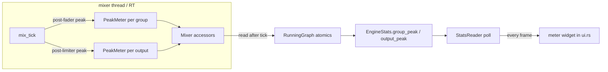

# Level Meters

> Per-group and per-output level meters in the mixer window — the "it's alive"
> visual feedback every competitor has and Splitstream lacks. Attaches to the
> existing RT-atomic → `EngineStats` telemetry path (same shape as
> `duck_depth_db` / `limiter_engaged`), so the engine already has both the
> samples and the publish mechanism.

## Decisions Log

<!-- Add new at bottom. Never remove. -->

| Date | Decision | Reasoning | Alternatives Considered |
|------|----------|-----------|------------------------|
| 2026-07-22 | Meter tap = **post-fader** (after group gain + DSP + duck, as the group enters the mix). | Meter moves with the fader — shows audible contribution, matches consumer expectation (Sonar/Windows). | Pre-fader (level-setting use, confuses casual users); pre/post switchable (mode overhead for v1). |
| 2026-07-22 | Ballistics = **peak bar (fast attack, smooth release) + short peak-hold dot**. | Snappy "alive" feel, cheap — per-frame peak idiom already in `mixer.rs:165`. Hold dot catches brief transients. | Peak only (misses transients); peak + RMS (more RT math + paint, defer). |
| 2026-07-22 | Scope = **per-group + per-output/master**. | Per-output near-free (headroom limiter already samples that signal); complete picture, master column not bare. | Per-group only (bare master, no device-clip visibility). |
| 2026-07-22 | Output meters render as a **device list on the master column**. | Outputs shared across groups — don't belong on one group column; master column earns its keep. | Mini meter per group's output dropdown (redundant repeat); single system-output meter (no per-device clip visibility). |
| 2026-07-22 | `PeakMeter` in **new `audio-core/meter.rs`**; peak-hold dot **UI-side only**. | Pure isolated tests, keeps `mixer.rs` from growing; hold-dot is display nicety, no domain code needed. | Inline in mixer.rs; hold-dot as domain component. |
| 2026-07-22 | Cadence via new **`StatsReader`** (Clone read handle, mirrors `RoutingReader`); UI refreshes `UiState.stats` from it each frame; continuous repaint only while window open. | Meters need ~60 fps; existing stats refresh too coarse. RoutingReader precedent. Repaint cost only when window visible → N1 idle preserved. | Reuse pump's coarse stats push (too slow for smooth meters). |
| 2026-07-22 | `PeakMeter::observe` = **block-level** (`observe(block, channels)`). | Encapsulated, one call per group/output per tick, standard for metering; transient within block still registers. | Per-frame observe (more calls, caller owns loop). |
| 2026-07-22 | Design approved at Level 4. Status set to approved — ready for implementation. | All four levels approved + persisted; drift check N/A (no requirement doc). | — |
| 2026-07-22 | **User decision (impl):** group meters stay live under global master mute; only output/device meters read silent. | Master mute is an output-stage kill at the accumulator — the group signal genuinely exists; truthful telemetry + the slashed speaker icon already signals muted. | Zero group bars on mute (would need a mute-aware group tap). |
| 2026-07-22 | **Impl:** idle/muted decay via `PeakMeter::observe_silence(frames)` (closed-form `release^frames`), fed the nominal block when a group's `valid_len==0` or an output's `filled==0`. | Block-level `observe` on a zero-length block models no elapsed time → a silenced group/output would freeze its bar. Not anticipated in the L4 contract; surfaced building the mixer taps. | Feed a synthetic silent buffer (needs a scratch alloc); special-case in the engine loop (spreads the concern). |
| 2026-07-22 | **Impl:** peak+clip published as one packed `AtomicU64` per meter (peak f32 in low 32 bits, clip in bit 32), not two atomics. | Reads the pair consistently in one atomic load (no tearing); `0` == `SILENT` so zeroed gauges are already correct; no `AtomicF32` in std. | Two parallel atomics (peak bits + clip bool) — a torn read could show a stale clip against a fresh peak. |
| 2026-07-22 | **Impl:** master-column output meters labeled via `distinct_output_devices(&snapshot.groups)` (first-seen device order), zipped positionally against `output_peak`. | Reproduces `engine::graph::resolve`'s own positional `OutputId` assignment from the snapshot — no new `OutputId→name` read model on the engine. Degraded/parked graphs can transiently shift this; degraded banner covers it, mislabel is cosmetic. | Add an `OutputId→name` map to `EngineStats`/a reader (new engine surface for a cosmetic label). |
| 2026-07-22 | **Impl:** continuous `request_repaint_after(16ms)` only inside the Mixer screen arm, not globally. | Meters need ~60 fps to animate, but only exist on the mixer screen — repainting on the group-settings/onboarding pages or when the window is closed would burn CPU for nothing (N1 idle). | Global per-frame repaint (idles CPU on pages with no meter); repaint only on stats change (egui has no such hook cheaply). |
| 2026-07-22 | **Impl:** extracted `MasterColumnCtx` when the meter/device-list params crossed clippy's `too_many_arguments` line. | Operational-learnings standing rule: extract the context struct at the threshold, right then; mirrors `GroupColumnCtx`. | `#[allow(clippy::too_many_arguments)]` (suppresses the signal the rule says to act on). |
| 2026-07-22 | Implementation complete, layer-by-layer (audio-core → engine → app). All 4 layers reviewed; full workspace tests green (audio-core 88 / engine 95 / control 48 / app 48), clippy clean. Status → complete. | Inside-out order held; every L3 flow traceable; only unplanned unit `MasterColumnCtx` (conscious clippy refactor). | — |
| 2026-07-22 | **Review fix (reverses the earlier "mislabel is cosmetic, degraded banner covers it" call):** output-meter device labels now come from a real engine `OutputId → name` map (`GraphPlan.output_devices` → `RunningGraph.output_devices` → `EngineStats.output_names`), built in `graph::resolve` as each `OutputId` is assigned across *non-parked* groups. The UI looks up the name by `OutputId` instead of reproducing the order from `snapshot.groups`. | `/review` flagged that reproducing the order UI-side mislabels every device after a parked group during a device-loss episode — values were right, names were wrong, which actively misleads. The engine already knows the correct mapping; exposing it (small, contained) beats a documented wrong-label. Regression test added (`a_parked_earlier_group_does_not_shift_later_output_device_names`). | Keep the UI-side reproduction with the documented caveat (rejected on review — wrong label misleads even if only during a parked episode). |

## Grounding (2026-07-22, pre-Level-1)

Real code facts the design attaches to:

- **Telemetry pattern exists.** `EngineStats` (runtime.rs:134) is poll-based
  (`handle.stats()`), fields published from the RT thread via atomics on
  `RunningGraph`. `duck_depth_db: Vec<(GroupId, f32)>` proves per-**group**
  f32 telemetry (f32→bits AtomicU32, zip `group_ids`). `ring_fill` /
  `limiter_engaged` prove per-**output** telemetry (zip `output_ids`). A peak
  meter is the identical pattern — one more atomic per group and per output.
- **Per-frame peak idiom exists.** mixer.rs:165 already computes "peak across
  channels, one update per FRAME" in the env-follower — the sampling shape a
  meter needs is already in the codebase.
- **Mix topology.** `Mixer::mix_tick` (mixer.rs:522) runs once per tick after
  every group's `push_group` (gain·master → DspChain), doing duck → matrix →
  SRC → sum → per-output headroom limiter → ring. Two natural tap points:
  per-group (post its full processing, as it enters the sum) and per-output
  (final signal to the ring, post headroom limiter).
- **UI already polls fresh each frame.** `SettingsApp::ui` re-reads
  `routing.current_routes()` / `is_degraded()` / `all_sessions()` every frame
  via a `RoutingReader`. `UiState.stats` is present but its refresh cadence
  needs confirming — meters need ~30–60 fps, so a per-frame stats pull
  (StatsReader, mirroring RoutingReader) is the likely shape. Flagged for L2/L3.

## Design: Level 1 -- Capabilities

Approved 2026-07-22.

1. **Per-group meter** — bar beside each group's fader, that group's live
   post-fader output level (post gain + DSP + duck, as it enters the mix).
2. **Master/output meter** — level on the master column + each output device.
3. **dB-scaled** — bar mapped through dBFS, floor ~−60 dB (linear looks dead
   below ~50%).
4. **Peak ballistics + hold dot** — fast attack, smooth release, short-hold
   marker at recent max.
5. **Clip indicator** — bar tops red / clip dot at 0 dBFS; ties to the
   already-tracked headroom-limiter engagement.
6. **Zero RT cost beyond peak-track + atomic store** — no alloc, no new thread;
   rides the existing atomic → `EngineStats` → poll path.

Out of scope (v1): spectrum/FFT, per-app meters, LUFS/loudness, external meter
windows, gain-reduction meters (telemetry exists — possible fast-follow).

## Design: Level 2 -- Components

Approved 2026-07-22. Principle: extend the proven RT-atomic → `EngineStats` →
poll telemetry path; add minimal new surface. Only 3 genuinely new units; the
rest are fields on existing structs.

| Component | Home / layer | Responsibility | New/extend |
|---|---|---|---|
| `PeakMeter` | `audio-core/meter.rs` (domain, **new file**) | Pure value object: `observe(frame_peak)` fast-attack/slow-release ballistics; `level()`, `clipped()` (sticky ~1s). Same math family as env-follower (`mixer.rs:165`). Unit-testable anywhere. | New |
| `Mixer` peak state | `audio-core/mixer.rs` (domain) | Owns `Vec<PeakMeter>` per group + per output; feeds them in `mix_tick` at two taps — post-fader group signal, post-headroom-limiter output signal; accessors `group_peak`/`output_peak` mirroring `output_limiter_engaged`. | Extend |
| `RunningGraph` atomics | `engine/runtime.rs` (app) | Per-group + per-output peak atomics (f32-bits `AtomicU32`, like `duck_depth_db`); clip as sticky flag/bits. Mixer-thread loop reads accessors after `mix_tick`, stores. Domain stays transport-free. | Extend |
| `EngineStats` fields | `engine/runtime.rs` (app) | `group_peak: Vec<(GroupId, MeterLevel)>`, `output_peak: Vec<(OutputId, MeterLevel)>`; `MeterLevel { peak: f32, clipped: bool }`. | Extend |
| `StatsReader` | `engine/runtime.rs` (app) | Clone-able read-only per-frame stats handle — mirrors `RoutingReader`. Resolves poll cadence (meters need ~60 fps; `UiState.stats` refresh today too coarse). | New |
| Meter widget | `app/ui.rs` (shell) | egui custom paint: dB-scaled vertical bar, green/amber/red zones, clip cap, **UI-side peak-hold dot** (frame-time envelope, no domain code). Like `speaker_mute_button`. Wired into group columns + master-column device list. | New |



Layout decisions (L2):
- **Per-output meters** render as a **device list on the master column** (device
  name + bar each). Groups keep only their own meter beside the fader; outputs
  are shared across groups so they don't belong on one group column.
- **`PeakMeter`** lives in a **new `audio-core/meter.rs`** (pure, isolated tests;
  keeps `mixer.rs` from growing).
- **Peak-hold dot** is UI-side only — no domain component; the widget remembers
  recent max in frame time.

## Design: Level 3 -- Interactions

Approved 2026-07-22. Established telemetry pattern extended — no new fork.

**A — RT peak sampling (per tick, in `mix_tick`).** Two taps: group peak sampled
post-duck / pre-matrix (group's fully-faded own signal — gain·master·DSP·duck
applied, before channel remap/resample); output peak sampled
post-headroom-limiter (final ring signal). Frame-peak across channels →
`PeakMeter::observe`. Ballistics advance **per frame** (heeds logged P5 review
finding on per-interleaved-sample smoothers); `observe` alloc-free.

**B — RT → atomic publish (per tick, mixer thread).** After `mix_tick`, the
mixer-thread loop reads `mixer.group_peak`/`output_peak` accessors and stores to
`RunningGraph` atomics (f32→bits, `Relaxed`) — same spot/style it reads `xruns` /
stores `duck_depth_db`. No locks. Store every tick; atomic carries the smoothed
decaying envelope.

**C — UI poll + render (per frame).** `SettingsApp::ui` → `stats_reader.stats()`
→ `group_peak`/`output_peak`. Group column: lookup by `GroupId`, meter beside
fader. Master column: iterate `output_peak` → device-name + bar list. Widget maps
linear peak → dBFS (floor −60) → bar height, zone colors, clip cap on `clipped`,
advances UI-side hold-dot via frame `stable_dt`.

**D — Continuous repaint while visible.** `ui()` calls
`ctx.request_repaint_after(~16ms)` while window open so meters animate (egui
idles otherwise). **Cost exists only when window open** — closed/tray-only stays
zero (N1 idle footprint untouched). Transient-catching is in RT ballistics, so
UI fps is tunable (30 fps wouldn't miss peaks).

**E — StatsReader handoff.** Built from engine like `RoutingReader`; added to the
existing background→main-thread startup handoff in `main.rs`, passed into
`SettingsApp::new`.

**F — Structural rebuild + empty states.** Rebuild rebuilds mixer `PeakMeter`
vecs + `RunningGraph` atomics to new counts; positional `GroupId`/`OutputId`
keep lookups consistent. Missing id → no meter (like routes). Engine not running
→ `stats()` empty → meters at floor. No special-casing.

Constraints: no alloc/lock on RT path; per-frame ballistics; `Relaxed` atomics;
UI never touches win-audio; meters are read-only telemetry (no config, no
`ShellAction`, no new edit path).

## Design: Level 4 -- Contracts

Approved 2026-07-22. Signatures only; deltas on existing contracts.
`MeterLevel` defined once in `audio-core`, reused in `EngineStats` (as
`GroupId`/`Gain` already are).

### `audio-core` — new `meter.rs`
```rust
pub struct MeterLevel { pub peak: f32, pub clipped: bool }  // peak: smoothed linear, >= 0
impl MeterLevel { pub const SILENT: MeterLevel = MeterLevel { peak: 0.0, clipped: false }; }

pub struct PeakMeter { /* envelope, clip-hold counter, per-frame coeffs */ }
impl PeakMeter {
    pub fn new(sample_rate: u32) -> PeakMeter;                  // derives attack/release/clip-hold coeffs
    pub fn observe(&mut self, block: &[f32], channels: usize);  // block-level: attack to block peak, release over block frames; alloc-free
    pub fn sample(&self) -> MeterLevel;
    pub fn reset(&mut self);
}
```

### `audio-core` — `Mixer` (extend)
```rust
impl Mixer {
    // internal: group_meters: Vec<PeakMeter>, output_meters: Vec<PeakMeter>; fed in mix_tick
    pub fn group_peak(&self, group: GroupId) -> MeterLevel;    // unknown id → SILENT (matches output_limiter_engaged convention)
    pub fn output_peak(&self, output: OutputId) -> MeterLevel;
}
```

### `engine` — `runtime.rs` (extend)
```rust
pub struct EngineStats {
    // … existing: xruns, ring_fill, applied_ratio, group_faults, limiter_engaged, duck_depth_db …
    pub group_peak:  Vec<(GroupId, MeterLevel)>,
    pub output_peak: Vec<(OutputId, MeterLevel)>,
}
// RunningGraph (internal): per-group + per-output peak atomics — AtomicU32 (f32 bits)
// + sticky clip; mixer-thread loop stores after mix_tick, same site it reads xruns.

pub struct StatsReader { /* Clone; Arc to the same running-graph cell as stats() */ }
impl StatsReader { pub fn stats(&self) -> EngineStats; }       // empty vecs when not running
impl EngineHandle { pub fn stats_reader(&self) -> StatsReader; }
```

### `app` — `ui.rs` (extend)
```rust
struct HoldDot { value: f32 }                                  // UI-side peak-hold, decays in frame time

pub struct SettingsApp {
    // … existing …
    stats: StatsReader,                                        // new — polled every frame
    holds: HashMap<String, HoldDot>,                           // keyed by group / device name
}
impl SettingsApp { pub fn new(ui: Arc<Mutex<UiState>>, routing: RoutingReader,
                              stats: StatsReader, actions: Sender<ShellAction>) -> SettingsApp; }

fn level_meter(ui: &mut egui::Ui, level: MeterLevel, height: f32, hold: &mut HoldDot);  // custom paint, like speaker_mute_button
```
- Top of `ui()`: `state.stats = self.stats.stats();` — mirrors the existing
  `state.routes = self.routing.current_routes();` refresh; whole UI (footer +
  meters) reads fresh stats from one place.
- `main.rs` startup handoff gains `StatsReader` alongside `RoutingReader`/`UiState`.

`observe` granularity = **block-level** (user decision) — one call per
group/output per tick, meter computes block peak + releases over block frames.

## Design Summary

- **Components/layers:** `PeakMeter` + `MeterLevel` (new `audio-core/meter.rs`,
  domain, pure); `Mixer` peak state + `group_peak`/`output_peak` accessors
  (audio-core); `RunningGraph` atomics + `EngineStats.group_peak`/`output_peak`
  + `StatsReader` (engine, app layer); `level_meter` widget + `holds` +
  per-frame `StatsReader` poll (app/ui.rs, shell).
- **Key contracts:** `PeakMeter::{new, observe(block,channels), sample, reset}`;
  `MeterLevel { peak, clipped }`; `Mixer::{group_peak, output_peak}`;
  `EngineStats.{group_peak, output_peak}`; `StatsReader::stats` +
  `EngineHandle::stats_reader`; `SettingsApp::new` gains `StatsReader`;
  `level_meter` widget fn.
- **Decisions:** post-fader tap (post-duck/pre-matrix for group,
  post-headroom-limiter for output); peak + hold-dot ballistics (hold-dot
  UI-side); per-group + per-output scope; output meters as a master-column
  device list; `PeakMeter` in own file; block-level `observe`; continuous
  repaint only while window visible (N1 idle preserved).
- **Constraints:** no alloc/lock on RT path; per-frame ballistics (heeds P5
  review finding); `Relaxed` atomics; read-only telemetry (no new edit path);
  UI never touches win-audio.
- **Drift check:** `requirement_doc: null` (roadmap-originated) — no spec to
  check against; skipped.
- Rides the existing RT-atomic → `EngineStats` → poll telemetry path
  (`duck_depth_db` / `limiter_engaged` precedent); minimal new surface.

## Key Files

| Path | Role |
|---|---|
| .lattice/ux-gap-roadmap.md | Origin (Priority 1) |
| crates/audio-core/src/meter.rs | **New** — `PeakMeter`, `MeterLevel` |
| crates/audio-core/src/mixer.rs | Peak state + `group_peak`/`output_peak`; `mix_tick` taps (env-follower at :165 = ballistics precedent) |
| crates/audio-core/src/lib.rs | Export `meter` module |
| crates/engine/src/runtime.rs | `RunningGraph` peak atomics; `EngineStats` fields; `StatsReader`; `EngineHandle::stats_reader` |
| crates/app/src/ui.rs | `level_meter` widget, `holds`, per-frame `StatsReader` poll, master-column device meter list |
| crates/app/src/event_pump.rs | `UiState` test builders gain new `EngineStats` fields |
| crates/app/src/main.rs | `StatsReader` in startup handoff |

## Open Questions

None — all L1–L4 forks resolved (tap point, ballistics, scope, output-meter
placement, PeakMeter home, observe granularity).
