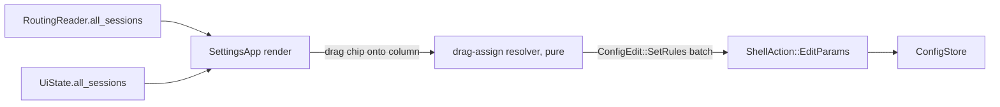

# Mixer UI Redesign

> Refresh app-shell's settings window (`crates/app/src/ui.rs`) to match `RoughAppUI.png`: master + per-group fader columns, dropdown-sourced fields instead of free text where a valid-options source exists, and drag-and-drop assignment of live audio sessions onto group columns. Layout + input-method refresh — no new mixing/DSP/routing capability.

## Decisions Log

<!-- Add new at bottom. Never remove. -->

| Date | Decision | Reasoning | Alternatives Considered |
|------|----------|-----------|------------------------|
| 2026-07-21 | "Recently producing audio" (draggable session scope) = **all live WASAPI sessions**, active or inactive playback state, no separate history/timeout tracking. | Matches WASAPI's own session lifecycle for free (session persists until process closes it) — no new tracking code needed. | Active-only with lingering timeout (needs new per-pid last-active tracking, no such state exists today). |
| 2026-07-21 | Mockup's minimal column (fader, output dropdown, routed apps) is the always-visible view; follow-master, spatial, DSP, duck, match-rules text, remove-group move behind the gear icon as a popup panel. | Matches mockup's actual column height; current inline layout is far taller than the mockup shows. | Keep everything inline, restyle only (rejected — contradicts the mockup being followed). |
| 2026-07-21 | Unassigned-session pool = **Master's own "Routed Apps" footer** (already present in the mockup), not a new synthetic strip. | User's initial pick ("no separate pool, drag only between group footers") assumed an implicit catch-all group that isn't guaranteed to exist; Master's footer is already in the mockup and always renders regardless of group config. | Dedicated "Unassigned" strip above the columns (also viable, not chosen — extra UI element the mockup doesn't show). |
| 2026-07-21 | Output-device and duck-trigger fields drop their draft-then-commit text pattern entirely once dropdown-backed — a selection is a discrete commit, no in-progress-typing to protect. **Reverses app-shell.md's 2026-07-20 decision** ("plain text fields... UiState's L4 contract shape has no device-enumeration read model to back a picker") — that blocker is resolved by this feature's `available_devices`/group-name read models. | Root cause of the old decision (no read model to back a picker) no longer holds; keeping draft state around a dropdown would be unnecessary complexity. | Keep drafts + explicit "Set" button even for dropdowns (rejected — no in-progress state a dropdown selection could conflict with). |
| 2026-07-21 | Design approved at Level 4. Status set to approved — ready for implementation. | All four levels approved and persisted; drift check vs spec complete (pure elaboration, no divergence). | — |
| 2026-07-22 | Enabling a duck sidechain with no trigger picked yet seeds `DuckSpecConfig.trigger` with the first other group's name in config order (empty string if none) — the trigger dropdown then lets the user change it immediately, same commit path as the amount/threshold sliders. | User decision at implementation time (L4 didn't pin this edge case: `GroupDraft.duck_trigger` removal meant there was no longer any per-frame state to hold a pre-enable pick). | Seed with empty string, force an explicit pick before the duck does anything meaningful — rejected, more clicks for a default that's usually right. |
| 2026-07-22 | Two small `SettingsApp` fields beyond L4's listed `advanced_open`: `master_advanced_open: bool` (Master's own gear icon — Master isn't a group, so it can't share the `HashMap<String, bool>`) and `show_new_group_panel: bool` (floating "+" toggles the create panel's visibility, matching the mockup's literal "floating button" rather than today's always-inline row). | Both directly implied by L1 capability 1 ("floating '+' → panel") and the mockup's Master gear icon — not scope creep, flagged during implementation rather than added silently. | Keep the create panel always inline (drops the "floating" framing); fold Master's mute behind `advanced_open["__master__"]` (string-key collision risk with an actual group named that, however unlikely — a dedicated bool is simpler and collision-proof). |
| 2026-07-22 | `group_column`'s parameter list crossed clippy's `too_many_arguments` (8/7) — extracted `GroupColumnCtx<'a>` (routes/all_sessions/all_groups/devices, all borrows, `Copy`) rather than adding a 9th param or restructuring the call site. | Same idiom this codebase already uses (`engine::runtime::CaptureFaultCtx`/`RenderFaultCtx`) — operational learnings: extract right at the threshold, not later. | — |
| 2026-07-22 | Implementation complete; all 3 components (engine `all_sessions()`, `UiState.all_sessions`, `ui.rs` column/dnd rewrite) built layer-by-layer, each compiled clean and tests green before moving to the next. Removed `routed_app_names` (superseded by `routed_sessions`, which chip-rendering needs the full `SessionInfo` for, not just names) — no remaining callers, no dead code left behind. egui 0.35's `dnd_drag_source`/`dnd_drop_zone`/`Slider::vertical`/`ComboBox::from_id_salt` all verified against the real crate source in the local cargo registry cache before writing any call (this project's own "verify fast-moving GUI crate APIs, don't guess" learning) — compiled clean on the first attempt for every layer. Full workspace suite (236 tests) green throughout. | — | — |

## Design: Level 1 -- Capabilities

Approved 2026-07-21.

1. **Layout matches mockup** — master column + one column per group, side-by-side; each column: name/gear icon header, vertical fader, routed-apps area at bottom; floating "+" → "Create New Audio Source" panel.
2. **Dropdown-sourced fields** — group output device and duck-trigger group become pickers from live valid options (device list / other group names), not free-text.
3. **Draggable session objects** — every live WASAPI audio session (all, not just currently-audible) renders as a draggable chip; drop onto a group column assigns that process to the group.
4. **New-group creation** gets the same dropdown-backed output picker as existing groups.
5. Existing DSP/duck/spatial controls, gain sliders, mute, remove-group stay functionally as-is — this is layout + input-method, not new mixing capability.

Out of scope: pixel-perfect visual skin (mockup is wireframe-level); glob-pattern match-rule text editor stays as fallback alongside drag-assign (drag assigns exact-process match, text stays for wildcard rules); no new DSP/routing capability.

## Design: Level 2 -- Components

Approved 2026-07-21.

| Component | Home / layer | Responsibility |
|---|---|---|
| All-sessions read model | `engine/routing.rs` (`RoutingHandle`/`RoutingReader`) | New `all_sessions()` accessor mirroring existing `current_routes()`/`is_degraded()` — every live session (matched + unmatched), refreshed once per reconcile tick via a new `Arc<Mutex<Vec<SessionInfo>>>` field |
| `UiState.all_sessions` | `app/event_pump.rs` | New field, populated the same per-frame way `routes`/`routing_degraded` already are (polled from `RoutingReader` inside `ui.rs`'s `fn ui()`, not via `EventPump`) |
| Drag-assign resolver | `app/ui.rs` (pure fn, same spot as existing `routed_app_names`/`split_rules`) | Given a session's file name + target group (or none, for unassign) + all groups' current `match_rules`: returns the `ConfigEdit::SetRules` batch that adds an `ExactName` entry to the target group and strips any equivalent `ExactName` from every other group. Reuses `engine::rules::MatchRule::parse` for comparison — no new parsing logic. |
| Settings column layout | `app/ui.rs` (`SettingsApp`) | Master + one column per group, side-by-side: header, output dropdown, fader, routed-apps footer as a dnd drop zone. Master's footer = unassigned-sessions pool. |
| Group advanced panel | `app/ui.rs` (gear-icon popup) | Follow-master, spatial toggle, DSP chain, duck sidechain, match-rules text fallback, remove-group — moved out of the always-visible column |
| Output-device dropdown | `app/ui.rs` (reusable widget fn) | Replaces `text_edit_singleline` for group output + new-group output; sourced from `UiState.available_devices` |
| Duck-trigger dropdown | `app/ui.rs` (reusable widget fn) | Replaces free-text trigger field; sourced from other group names in `snapshot.groups` |



No new domain type — `SessionInfo`/`MatchRule` reused as-is; `all_sessions()` mirrors the existing `current_routes()` pattern exactly.

Known v1 limitation: dragging a session back to Master's footer only "sticks" if it was exact-name-assigned — a session still covered by a glob rule elsewhere re-matches instantly on the next reconcile tick.

## Design: Level 3 -- Interactions

Approved 2026-07-21.

**A — Frame render:** every frame, `SettingsApp::ui` polls `RoutingReader::current_routes()`/`is_degraded()`/`all_sessions()` (short-lock-then-release, no blocking call under the `UiState` mutex). Master column footer = `all_sessions()` minus every pid appearing in any `current_routes()` entry. Each group column footer = its `current_routes()` entry.

**B — Drag-assign (chip → group column):** drop resolves session's `file_name` via the pure resolver against `snapshot.groups` → `ConfigEdit::SetRules` batch (target gets `ExactName` appended if absent; every other group loses any equivalent `ExactName`) → `ShellAction::EditParams` (same fast path "Save rules" already uses).

**C — Drag-unassign (chip → Master footer):** resolver called with target `None` → strips the session's `ExactName` from whichever group holds it → same `EditParams` path. No-op visually next frame if a glob rule elsewhere still matches (documented limitation).

**D — Output dropdown (existing or new group):** selecting a device fires immediately via `ConfigEdit::SetGroupOutput`/`AddGroup`'s output field → `EditStructure` (unchanged funnel-only path). No draft state, no "Set" button.

**E — Duck-trigger dropdown:** selecting a group name updates local (non-text) draft choice; commits via existing `SetDuck`/`EditParams` path exactly like today's Amount/Threshold/Attack/Release sliders — only the trigger's input widget changes from text to dropdown.

**F — Gear icon:** click toggles that group's advanced-panel visibility (per-group bool in `SettingsApp`, independent of other groups).

**G — New-group creation:** floating "+" opens the "Create New Audio Source" panel (name field + output dropdown); submit → `ConfigEdit::AddGroup` via `EditStructure`, unchanged from today except output is dropdown-sourced.

## Design: Level 4 -- Contracts

Approved 2026-07-21.

```rust
// engine/routing.rs — RoutingHandle + RoutingReader gain a third read accessor,
// same shape as current_routes()/is_degraded(). New field mirrors `routes`
// (Arc<Mutex<Vec<SessionInfo>>>), populated in coordinator_loop alongside
// compute_routes() and once in start_routing's synchronous initial reconcile.
impl RoutingHandle {
    pub fn all_sessions(&self) -> Vec<SessionInfo>; // sorted by pid, deterministic
}
impl RoutingReader {
    pub fn all_sessions(&self) -> Vec<SessionInfo>;
}

/// Every live session, matched or not — the settings window's unassigned-pool
/// source. Pure, sorted by pid.
fn compute_all_sessions(state: &State) -> Vec<SessionInfo>;
```

```rust
// app/event_pump.rs — UiState gains one field, populated the same per-frame
// way routes/routing_degraded already are (polled in ui.rs, not EventPump).
pub struct UiState {
    // …existing fields…
    pub all_sessions: Vec<SessionInfo>,
}
```

```rust
// app/ui.rs

/// Pure — resolves a drag-drop onto `target` (Some(group name) = assign,
/// None = drop on Master = unassign) into the minimal ConfigEdit::SetRules
/// batch: target gains an ExactName(session_file_name) entry if absent,
/// every other group loses any ExactName entry equal to it
/// (case-insensitive, via engine::rules::MatchRule::parse + eq_ignore_ascii_case
/// — same comparison shape match_session itself uses). Groups whose rules
/// don't actually change are omitted from the batch. Glob rules are never
/// touched — only exact assignments are drag-managed.
fn resolve_drag_assign(session_file_name: &str, target: Option<&str>, groups: &[GroupConfig]) -> Vec<ConfigEdit>;

/// Reusable device picker — replaces text_edit_singleline at both call sites
/// (group output, new-group output). Returns true on selection change.
fn output_device_combo(ui: &mut egui::Ui, id_source: &str, current: &mut String, devices: &[Endpoint]) -> bool;

/// Reusable duck-trigger picker — other group names, `exclude` omits the
/// owning group itself from its own trigger choices.
fn duck_trigger_combo(ui: &mut egui::Ui, current: &mut String, groups: &[GroupConfig], exclude: &str) -> bool;

pub struct SettingsApp {
    // …existing fields…
    /// Per-group gear-icon panel visibility — independent per group, same
    /// pattern as `drafts: HashMap<String, GroupDraft>`.
    advanced_open: HashMap<String, bool>,
}
```

Drag-and-drop mechanics (chip = drag source carrying `pid: u32` payload; column footer = drop zone) use egui 0.35's built-in dnd API — exact call names get verified against docs.rs at implementation time per this project's own "fast-moving GUI crate" learning, not guessed here. The behavior contract above is binding; the egui call shape is not.

`GroupDraft.output_device` and the duck-trigger `String` field in `GroupDraft` are removed — no longer drafted, dropdown commits directly. `match_rules` draft stays (advanced-panel text fallback, still free text).

## Open Questions

None.

## Constraints

Inherited (binding, from app-shell.md): UI never calls `win-audio` directly; UI mutates config + sends commands only; all mutations funnel through `ShellAction` → `ConfigStore`/`EngineHandle`, never direct engine/win-audio calls from `ui.rs`.

## Design Summary

- **Components/layers:** `RoutingHandle`/`RoutingReader::all_sessions()` (engine, mirrors `current_routes`); `UiState.all_sessions` (app, polled per-frame like existing routing fields); pure `resolve_drag_assign` + `output_device_combo`/`duck_trigger_combo` widgets + column-layout render (all `app/ui.rs`).
- **Key contracts:** `RoutingReader::all_sessions() -> Vec<SessionInfo>`; `resolve_drag_assign(file_name, target: Option<&str>, groups) -> Vec<ConfigEdit>`; dropdown widgets replace `GroupDraft.output_device`/duck-trigger text fields entirely.
- **Architectural constraints:** unchanged from app-shell.md — UI never calls win-audio; all mutations still funnel through `ShellAction`; match-rule edits stay on the existing param fast path (`EditParams`), output/new-group stay structural (`EditStructure`).
- **Domain decisions:** no new domain type; `SessionInfo`/`MatchRule` reused as-is. Drag-assign is exact-name-only (glob rules never auto-edited); unassign only sticks if the session was exact-name-assigned (documented v1 limitation, same class as existing mute-debounce race).
- **Resolved during design:** unassigned-pool home = Master's own footer (not a new strip); gear icon relocates DSP/duck/spatial/rules/remove behind a per-group popup; dropdowns fully replace the draft-then-commit text pattern for output/duck-trigger, reversing app-shell.md's 2026-07-20 "no read model to back a picker" decision now that one exists.
- Drift check vs `Splitstream-Engineering-Spec.md` complete — pure elaboration on approved app-shell.md contracts, no divergence. See spec `## Links`.

## Key Files

| Path | Role | Status |
|---|---|---|
| RoughAppUI.png | Layout mockup driving Level 1/2 | — |
| .lattice/context/app-shell.md | Approved P4 (`ShellAction`, `ConfigEdit`, `UiState` base contract, funnel/fast-path split) — this feature elaborates its settings-window component only | — |
| crates/engine/src/routing.rs | `RoutingHandle`/`RoutingReader::all_sessions()`, `compute_all_sessions` | done |
| crates/engine/src/rules.rs | `MatchRule`/`GlobPattern`/`match_session` — reused unchanged by the drag-assign resolver | unchanged |
| crates/app/src/event_pump.rs | `UiState.all_sessions` field | done |
| crates/app/src/ui.rs | `SettingsApp` column layout (`GroupColumnCtx`), gear-icon panels, `output_device_combo`/`duck_trigger_combo` widgets, `resolve_drag_assign`, `session_drop_zone` dnd wiring | done |
