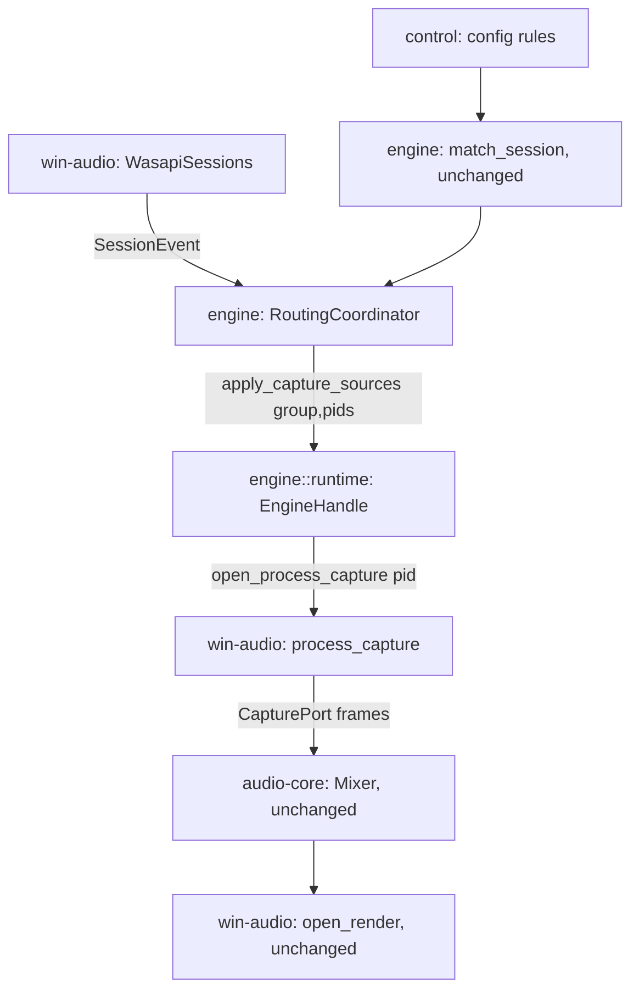

# Process Loopback Capture (architecture pivot)

> Replaces the BYOD virtual-cable + per-app WASAPI redirect model (session-routing.md P3 + engine-core.md's bus-endpoint capture) with per-process loopback capture (`ActivateAudioInterfaceAsync` + `PROCESS_LOOPBACK`, Windows 10 2004+, documented API). No virtual cable, no undocumented `IPolicyConfig`/`AudioPolicyConfig`, no endpoint hiding. Splitstream captures each matched app's audio directly by PID.

## Decisions Log

<!-- Add new at bottom. Never remove. -->

| Date | Decision | Reasoning | Alternatives Considered |
|------|----------|-----------|------------------------|
| 2026-07-21 | Pivot triggered by production instability: `SetPersistedDefaultAudioEndpoint`/`IPolicyConfig` per-app redirect + endpoint-hiding proved unstable on real hardware — bus `EndpointId` churned between reconciles, topology mapping intermittently vanished, per-app override silently failed to stick. Root cause not fully isolated before the pivot decision — user explicitly chose to stop debugging the undocumented-API path and move to a documented one instead of continuing root-cause work. | Spec §9's own risk note already flagged §9.3/§9.4 as "undocumented and can change across Windows builds" — today's instability is that exact risk materializing, not a implementation bug in the current code. | Keep debugging current design (smaller diff, but built on a foundation the spec itself flagged as fragile). |
| 2026-07-21 | Master/catch-all group reuses the existing `*` glob match rule (positioned last in config order) instead of a dedicated `is_catch_all` field. | `match_session`'s existing exact-beats-glob, config-order-tiebreak precedence already produces exactly this behavior with zero new code — `wildcard_match("*", anything)` is trivially true. | Dedicated boolean field — more explicit, doesn't require the user to understand match-rule precedence, but duplicates behavior the matcher already has. |
| 2026-07-21 | `engine::routing`'s `RoutingCoordinator` calls `EngineHandle::apply_capture_sources` directly, breaking the P3-era "control-plane only, never touches audio path" constraint. | Session-matching now directly determines what gets captured — there's no longer a `PolicyPort` indirection to keep the two sides decoupled through. `routing.rs`/`runtime.rs` are already peer modules in the same `engine` crate (application layer), so this is an intra-crate call, not a cross-layer violation. Asked the user directly (real, lasting architectural consequence); confirmed. | A desired-state channel with a separate consumer translating pid→group intent into capture actions — preserves the old boundary literally, but adds a channel/consumer with no other reason to exist. |
| 2026-07-21 | **Requirement drift, surfaced immediately (not deferred to Finalize):** spec §6 states "There is no supported per-session PCM capture" as the stated reason for Model B (one virtual endpoint per group). This is incorrect/outdated — `ActivateAudioInterfaceAsync` with `AUDIOCLIENT_ACTIVATION_TYPE_PROCESS_LOOPBACK` (Win10 2004+, `windows-rs` has native bindgen'd bindings, confirmed via docs — no hand-declared COM needed, unlike `AudioPolicyConfig`) is exactly per-session capture via a different activation path than plain endpoint loopback. §6, F5–F7, and §9.5's BYOD virtual-driver dependency are all superseded by this pivot. | Verified via WebSearch/WebFetch against Microsoft Learn + windows-rs docs before committing to this design direction (operational-learnings: verify against real docs, not memory, especially having been burned once already this project on `AudioPolicyConfig`'s undocumented vtable shape). | — |
| 2026-07-21 | Design approved at Level 4. Status set to approved — ready for implementation. Drift check against `Splitstream-Engineering-Spec.md` complete: 6 overrides + 1 alignment recorded in the spec's `## Links` section (user confirmed). | All four levels approved and persisted. | — |
| 2026-07-21 | Implementation (`engine` crate layer): multi-pid-per-group capture is *not* a thread-per-pid design feeding `Mixer` through new `MixerCommand` variants — each pid gets its own capture thread + ring (as the L4 contract's "per-pid capture threads" wording implies), but the ring `Consumer`s are wired into the mixer thread's own local `GroupSlot` list via a dedicated internal `CaptureMsg` channel, entirely inside `engine::runtime`. `audio_core`/`Mixer` needed zero changes — `Mixer::push_group` already just takes pre-summed samples, so summing N pids into one group's scratch buffer before that call is `engine::runtime`'s own concern. | `MixerCommand` is `audio_core`'s type and a shared cross-feature contract; routing a brand-new capture-management concern through it would have coupled an internal `engine::runtime` implementation detail to `audio_core`'s public command enum for no benefit — no other consumer needs to see "a pid was added to a group." | A new `MixerCommand::AddCaptureSource`/`RemoveCaptureSource` variant handled inside `Mixer` itself — rejected, `Mixer` has no reason to know about pids at all. |
| 2026-07-21 | Deviation from the L4 contract text: `CaptureControl::apply_capture_sources` returns `Result<Vec<u32>, EngineError>` (the pids that failed to open this call), not the contract's literal `Result<(), EngineError>`. | `RoutingHandle::is_degraded()`'s per-attempt (non-sticky) semantics (L3 flow E) have to be driven by *something* — `engine::routing` owns the degraded signal, but only `engine::runtime` knows which pids actually failed to activate. Threading that back through the return value is the minimal change; a separate event channel would duplicate the plumbing `EngineEvent::RoutingDegraded` already provides. | A dedicated `Receiver<u32>` of failed pids on `CaptureControl` — more machinery for the same one-shot-per-call information. |
| 2026-07-21 | `graph::resolve`'s new `capture_format: Format` param (every surviving group's `input_format`, since there's no more per-group bus to derive it from) is sourced from `sys.default_output()?.format` — matches real WASAPI behavior: `ActivateAudioInterfaceAsync` + `PROCESS_LOOPBACK` always activates against the default render device's shared-mode engine format. `open_graph` treats a `default_output()` failure as *non-fatal*, falling back to a placeholder format — a group's real `output_device` lookup independently (and correctly) fails with `EngineError::Resolve` if there's truly no usable device; the placeholder only matters when every group is parked/absent and nothing would have read it anyway. | Caught by two existing drift-and-recovery tests (`device_removal_with_no_fallback_parks_the_group...`, `device_returning_restores_a_parked_group`) failing once `default_output()` was made a hard prerequisite of every graph build — a device-removal recovery rebuild with zero remaining physical endpoints has to still succeed (with an empty topology), independent of whether a capture format could be determined. | Making `capture_format` an `Option<Format>` and threading the "nothing to resolve against" case through `graph::resolve` explicitly — more precise, but `resolve()` already treats an unused value as unused for parked groups; a placeholder is simpler and provably harmless. |
| 2026-07-21 | `EngineStats::group_faults` kept in the public struct but now always empty — the old "a group's single static capture thread faulted" concept has no equivalent once capture is N-pids-per-group and a single pid's failure is isolated by construction (L3 flow E). | Avoids an app-shell ripple (`ui.rs` only reads `.len()`, `event_pump.rs` already defaults it to `vec![]` in one construction path) for a signal that no longer has a meaningful non-empty value to report. | Removing the field entirely — more honest, but a larger, unnecessary public-API break for a field nothing meaningfully populates going forward either way. |
| 2026-07-21 | **Revision, caught by real-hardware testing** (`win-audio` layer): the earlier entry above claiming "`ActivateAudioInterfaceAsync`'s `PROCESS_LOOPBACK` activation always follows the default render device's shared-mode engine format" is **wrong** — confirmed by actually running `process_capture::open` against a real pid on this machine: the activated `IAudioClient::GetMixFormat()` returns `E_NOTIMPL`. A process-loopback client has no negotiable mix format at all; the caller must *dictate* a fixed `WAVEFORMATEX` at `Initialize` time instead (`AUDCLNT_STREAMFLAGS_AUTOCONVERTPCM` lets WASAPI's engine convert underneath it), matching Microsoft's own `Samples/ApplicationLoopback` reference, which hardcodes its format for the same reason. `graph::resolve`'s `capture_format` param is unchanged (still one fixed `Format` for every group), but its real source moved from `sys.default_output()?.format` to a plain constant (`engine::runtime::PROCESS_CAPTURE_FORMAT`, 48kHz/stereo/f32) that both `MockSystem` and the real `win-audio::process_capture` implementation independently converge on — nothing derived from the actual system device at all. | Caught in seconds by running the `#[ignore]`'d `process_capture::tests::open_and_read_a_real_process` smoke test mid-implementation against a real pid (`explorer.exe`) — exactly the "run real-hardware tests during development, don't save for later" operational learning already logged for this project, paying off immediately on the very first try. | Leaving the incorrect assumption in place until a later manual/real-hardware pass — rejected; the whole point of validating mid-implementation is catching this before it ships. |
| 2026-07-21 | **Bug caught by the same real-hardware pass, fixed before it shipped**: the initial `PROPVARIANT` construction in `process_capture.rs` crashed with `STATUS_HEAP_CORRUPTION` on first real run. Root cause: windows-rs's `PROPVARIANT` has a real `Drop` impl that calls `PropVariantClear`, which for a `VT_BLOB` variant calls `CoTaskMemFree` on `blob.pBlobData` — our blob pointed at a Rust-`Box`-owned struct, not `CoTaskMemAlloc`-allocated memory, so letting `PROPVARIANT`'s normal drop run freed foreign memory through the wrong allocator. Fix: wrap the *outer* `PROPVARIANT` itself in `ManuallyDrop` (not just the inner union field, which was already wrapped) — verified by comparing against the `wasapi-rs` crate's own working implementation of this exact activation, which double-wraps for the same reason. | Confirms this codebase's own standing caution (`router.rs`'s deleted doc comment, and the "hand-declared COM shape can be wrong even when it looks right" learning) generalizes beyond hand-declared vtables to windows-rs's own generated types when their `Drop` impls interact with a manually-constructed raw union payload — the type being "real" windows-rs codegen, not hand-declared, didn't make the memory-safety hazard any less real. | — |

## Design: Level 1 -- Capabilities

Approved 2026-07-21.

1. **Per-app routing, no driver install** — match a process by name/path, send its audio to a chosen physical output, gain/EQ/limiter/duck applied along the way. No virtual cable, no BYOD, no onboarding device picker.
2. **Master/catch-all destination** — a group with match rule `*` (positioned last in config order) captures everything not claimed by a more specific rule ahead of it; unmatched audio still gets a destination + optional processing, never silently dropped. Reuses `match_session`'s existing exact-beats-glob, config-order-tiebreak precedence — no new field.
3. **Many-apps-to-one-group** — multiple processes can share a group's capture/mix/output (e.g. Spotify + Discord both to "headphones").
4. **Live dynamic capture** — apps starting/stopping while Splitstream runs are captured/released automatically, no restart, no manual re-apply.
5. **Per-capture graceful degradation** — a process that can't be captured (permission denied, protected process) just plays through Windows normally, as if unmatched — never crashes, never blocks other groups.
6. **Clean Windows device list, for free** — no virtual endpoints created means nothing to hide; eliminates F7 and the whole undocumented `IPolicyConfig` visibility surface, not just works around it.

Out of scope: DSP/mixer internals (`audio-core`, dsp-pipeline unchanged — this pivot only changes capture INPUT, not processing); UI polish beyond removing the now-dead device-picker onboarding step; spatial audio (unchanged).

## Design: Level 2 -- Components

Approved 2026-07-21.

| Component | Layer | Change | Single responsibility |
|---|---|---|---|
| `win-audio::process_capture` | Infrastructure | NEW | `ActivateAudioInterfaceAsync` + `PROCESS_LOOPBACK` wrapper — implements existing `CapturePort` trait unchanged, so nothing downstream cares that the source is a process, not a device |
| `engine::ports::AudioSystem` | Application (port) | Gains `open_process_capture(pid, include_tree)`; loses `open_capture(EndpointId)` and `set_bus_match` | Activation surface for per-process capture; `open_render`/`default_output`/`enumerate` unchanged (physical output side untouched) |
| `engine::runtime` | Application | Extended | Per-pid capture threads (replaces per-bus, N:1 into a group allowed); new `EngineHandle::apply_capture_sources(group, pids)` — off-RT build + swap, same pattern as `apply_dsp_chains`/`apply_spatial` |
| `engine::routing` | Application | Revised | `match_session`/`GroupRules`/`MatchRule` unchanged byte-for-byte; coordinator calls `apply_capture_sources` directly (crosses the old control-plane/RT boundary — accepted, both peer modules in the same crate) instead of `PolicyPort::route`/`clear_route` |
| `engine::graph` | Application | Revised | `GroupConfig` drops `bus_endpoint`; `resolve()` only resolves `output_device` (Physical) — no more Bus resolution at all |
| `control` | Application | Revised | Config schema drops `bus_endpoint` (group) and `[app] bus_name`; TOML parse/store updated to match |
| `app` | Shell | Revised | Onboarding device-picker step removed entirely — nothing to pick; dispatcher's `PolicyPort`/`BusMatch`/`sync_bus_match` wiring removed |

**Deleted** (dead once nothing calls them): `win-audio::router.rs` (whole file — `PolicyRouter`, hand-declared `IPolicyConfigWin7`/`AudioPolicyConfig` vtables); `policy-routing` Cargo feature; `PolicyPort` trait + `MockPolicyPort`; `EndpointKind::Bus`, `BusMatch`, `enumerator.rs`'s prefix/exact classification; `win-audio::capture.rs`'s device/bus loopback capture path.

**Unchanged**: `audio-core` (Mixer/DSP/gain/EQ/duck/spatial — this pivot only changes capture INPUT, not processing); `drift-and-recovery` (output-device fallback is a separate, still-relevant concern — render side untouched); `SessionPort`/`WasapiSessions` (still needed to discover which processes are playing audio, feeds the same `match_session` call).



Deliberately NOT added: a new port trait for process capture (reuses existing `CapturePort`); a dedicated `is_catch_all` field (Level 1's `*` glob decision); a desired-state channel decoupling routing from runtime (rejected — no other consumer needs that indirection, both are peer modules in the same crate already).

## Design: Level 3 -- Interactions

Approved 2026-07-21.

**A — Startup:** `engine::graph::resolve` resolves `output_device` per group (no bus resolution at all) → `SessionPort::enumerate()` primes notifications → match existing live sessions against rules → per matched group, `apply_capture_sources(group, pids)`.

**B — New session:** `SessionEvent::New` → `match_session` → recompute that group's desired pid set (add this pid) → `apply_capture_sources`. Runtime **diffs** against currently-running capture threads: only the *newly added* pid gets a new capture thread spawned; pids already running in that group are left completely undisturbed — no full teardown/rebuild, avoiding an audible gap for unrelated apps sharing the group. (Stated behavior, binding on the Level 4 contract — not an implementation detail left to chance.)

**C — Session ends:** remove pid from its group's desired set → `apply_capture_sources` → runtime stops only that one capture thread. The old "no un-route on session end" concept (Windows-persisted per-app pref, avoid a first-samples race on relaunch) is gone entirely — nothing Windows-side is ever left in place to un-route. Relaunch is just a fresh, clean `SessionEvent::New` match.

**D — Live rule change:** re-match all live sessions against the new rules → `apply_capture_sources` for every group whose desired pid set changed (diffed as in B).

**E — Capture failure (revised posture):** a pid that fails to open (permission denied, protected process, etc.) is excluded from that swap only — no global degraded flag, no skip-all-further-calls posture. The old posture was specifically for a *shared, fragile, undocumented COM surface* where one failure signaled the whole surface was broken; per-process capture failures are isolated by construction (one process's activation failing says nothing about the next), so each match is retried independently, every time. `EngineEvent::RoutingDegraded`'s meaning changes from "everything is broken, stop trying" to a per-attempt notice (still surfaced to the UI/tray, just not a persistent "nothing works" banner).

**F — Shutdown:** stop all capture threads. Nothing Windows-side to restore — no hidden devices, no persisted redirect — simpler than the old flow (which had to leave devices hidden for the uninstaller to restore).

**Self-exclusion (safety rule, all flows):** no group's match rules — including a `*` catch-all — may ever resolve to Splitstream's own process id. Enforced once, centrally (at the matching step, not per-flow) — prevents capturing Splitstream's own render output back into itself.

## Design: Level 4 -- Contracts

Approved 2026-07-21. Struct/enum field names verified against real `windows-rs` docs (`AUDIOCLIENT_ACTIVATION_PARAMS`, `AUDIOCLIENT_PROCESS_LOOPBACK_PARAMS`, `PROCESS_LOOPBACK_MODE`, `IActivateAudioInterfaceCompletionHandler_Impl`) before writing these signatures, not from memory — properly bindgen'd (`#[implement]`-compatible, same idiom already proven in `monitor.rs`/`sessions.rs`), not hand-declared like the old `AudioPolicyConfig`.

### `win-audio::process_capture` (new file)

```rust
pub struct ProcessCapture { /* IAudioClient activated via ActivateAudioInterfaceAsync + PROCESS_LOOPBACK */ }
impl CapturePort for ProcessCapture {          // trait itself unchanged
    fn read(&mut self, buf: &mut [f32]) -> Result<usize, PortError>;
    fn format(&self) -> Format;
    fn poll_interval(&self) -> Duration;
}
pub fn open(pid: u32, include_tree: bool) -> Result<ProcessCapture, PortError>;
```

### `engine::ports` (revised)

```rust
pub struct Endpoint { pub id: EndpointId, pub name: String, pub format: Format }  // `kind` field REMOVED — only physical outputs left, nothing to classify

pub trait AudioSystem: Send + Sync {
    fn enumerate(&self) -> Result<Vec<Endpoint>, PortError>;
    fn open_render(&self, id: &EndpointId) -> Result<Box<dyn RenderPort>, PortError>;
    fn open_process_capture(&self, pid: u32, include_tree: bool) -> Result<Box<dyn CapturePort>, PortError>;  // replaces open_capture(EndpointId)
    fn promote_rt_thread(&self) -> RtGuard;
    fn default_output(&self) -> Result<Endpoint, PortError>;
    fn subscribe_device_events(&self) -> Result<Receiver<DeviceEvent>, PortError>;
    // set_bus_match REMOVED
}
```

### `engine::runtime` (extended)

```rust
/// Cloneable handle for driving capture-source changes from any thread —
/// `engine::routing`'s coordinator thread needs this independently from
/// whatever thread owns the main `EngineHandle` (app-shell's dispatcher).
/// Synchronizes through the same `Arc<Mutex<Option<RunningGraph>>>` every
/// other structural swap (`apply_dsp_chains`/`apply_spatial`/`rebuild`)
/// already goes through — same established idiom as `RoutingHandle::reader()`.
#[derive(Clone)]
pub struct CaptureControl { /* Arc<Mutex<Option<RunningGraph>>>, Arc<Persistent>, Arc<dyn AudioSystem> */ }
impl CaptureControl {
    /// Diffs against the currently-running set for `group`: newly-present
    /// pids get a capture thread opened and wired in; no-longer-present
    /// pids have theirs stopped; pids in both sets are untouched (Level 3
    /// flow B/C — binding behavior, not an implementation detail).
    pub fn apply_capture_sources(&self, group: GroupId, pids: Vec<u32>) -> Result<(), EngineError>;
}
impl EngineHandle {
    pub fn capture_control(&self) -> CaptureControl;
}
```

### `engine::routing` (revised)

```rust
// PolicyPort / PolicyError imports removed entirely.

pub fn start_routing(
    rules: Vec<GroupRules>,
    self_pid: u32,                        // NEW — self-exclusion (Level 3)
    session: Box<dyn SessionPort>,
    capture: CaptureControl,              // replaces `policy: Box<dyn PolicyPort>`
    events: Sender<EngineEvent>,
) -> Result<RoutingHandle, EngineError>;

impl RoutingHandle {
    /// Single reconcile entrypoint — merges the old `update_rules`/
    /// `update_topology` split. Neither ever needed a `buses` or
    /// `default_output` param anymore (no bus resolution, no branded
    /// default to set); both always did the identical full
    /// re-match-live-sessions-and-diff regardless of whether rules text or
    /// group structure changed, so one method covers both call sites.
    pub fn update_rules(&self, rules: Vec<GroupRules>);
    pub fn is_degraded(&self) -> bool;    // soft, per-attempt signal now (Level 3 flow E) — never sticky
    pub fn shutdown(self);
}
```

### `engine::graph` / `control` (schema)

```rust
pub struct GroupConfig {
    pub name: String,
    // bus_endpoint: String  — REMOVED
    pub output_device: String,
    pub gain: Gain,
    pub follow_master: bool,
    pub match_rules: Vec<String>,
    pub dsp: Vec<DspStageConfig>,
    pub duck: Option<DuckSpecConfig>,
    pub spatial: bool,
}
// AppConfig.bus_name: Option<String> — REMOVED
```

`control::config::parse`/`RawGroup`/`RawAppConfig` drop the corresponding TOML fields; `resolve()` only resolves `output_device` against `Endpoint` (Physical-only now).

### `app` (shell, consequences — not fully re-designed here, out of scope per Level 1)

Dispatcher's `PolicyPort`/`BusMatch`/`sync_bus_match`/`bus_name_prefix` wiring removed entirely (nothing left to reconcile). Onboarding's device-picker step (`simple-launch.md`'s `needs_onboarding`/`UiState.available_devices`/`onboarding_panel`) becomes dead weight — flagged as a downstream consequence for a follow-up pass on `simple-launch.md`, not redesigned in this blueprint (Level 1 scope boundary).

## Design Summary

- **Components/layers:** `win-audio::process_capture` (new, infra — `ActivateAudioInterfaceAsync`+`PROCESS_LOOPBACK`, implements existing `CapturePort` unchanged); `engine::ports::AudioSystem` (revised — `open_process_capture` replaces `open_capture`/`set_bus_match`, `Endpoint.kind` removed); `engine::runtime` (extended — per-pid capture threads, new cloneable `CaptureControl`/`apply_capture_sources`, diff-based swap); `engine::routing` (revised — `match_session` unchanged, drives `CaptureControl` directly instead of `PolicyPort`, `update_rules`/`update_topology` merged); `engine::graph`/`control` (schema — `GroupConfig.bus_endpoint` and `[app] bus_name` removed); `app` (dispatcher `PolicyPort`/`BusMatch` wiring removed).
- **Deleted:** `win-audio::router.rs` (whole file), `policy-routing` Cargo feature, `PolicyPort` trait + `MockPolicyPort`, `EndpointKind`, `BusMatch`, `enumerator.rs`'s prefix/exact classification, `win-audio::capture.rs`'s device/bus loopback path.
- **Key contracts:** `process_capture::open(pid, include_tree)`; `AudioSystem::open_process_capture`; `EngineHandle::capture_control() -> CaptureControl`; `CaptureControl::apply_capture_sources(group, pids)` (diffs internally — Level 3 flow B/C is binding behavior); `start_routing(rules, self_pid, session, capture, events)`; `RoutingHandle::update_rules(rules)` (single merged reconcile entrypoint).
- **Architectural constraints:** P3's "control-plane only, never touches audio path" boundary deliberately broken — `engine::routing` now drives RT capture-thread lifecycle directly via `CaptureControl` (accepted judgment call, both peer modules in the same crate). RT no-alloc/no-block constraints otherwise unchanged — capture add/remove still off-RT build + swap, same as `apply_dsp_chains`/`apply_spatial`.
- **Domain decisions:** master/catch-all group reuses the existing `*` glob match rule (no new field); self-exclusion (no group may ever match Splitstream's own pid) enforced centrally at the matching step; capture-failure degradation is per-attempt/isolated, not global-and-sticky (the old posture was specific to a single fragile shared COM surface that no longer exists).
- **Resolved during design:** catch-all mechanism; routing/RT boundary change; `CaptureControl` cloneable-handle shape; `update_rules`/`update_topology` merge; self-exclusion safety rule; degradation posture revision.
- Drift check vs `Splitstream-Engineering-Spec.md` complete — 6 overrides + 1 alignment recorded, see spec `## Links`. This is a larger-than-usual drift: §6's stated rationale for the entire prior architecture (Model B) is invalidated, not just an implementation detail overridden.

## Key Files

| Path | Role | Status |
|---|---|---|
| Splitstream-Engineering-Spec.md | Requirement spec — §6, F5–F7, §9.2–9.5, §15.2 (6 overrides + 1 alignment recorded this design) | — |
| .lattice/context/session-routing.md | Superseded capture mechanism (P3) — matching logic (`match_session`/`GroupRules`/`MatchRule`) carries forward unchanged; `PolicyPort`/hiding does not | — |
| .lattice/context/engine-core.md | Superseded capture contracts (`open_capture(EndpointId)`, `EndpointKind::Bus`) — mixer/render/RT patterns carry forward unchanged | — |
| .lattice/context/simple-launch.md | Downstream consequence flagged, not redesigned here — onboarding's device-picker step becomes dead weight | pending (app layer) |
| crates/engine/src/ports/mod.rs | `AudioSystem` revised (`open_process_capture` replaces `open_capture`/`set_bus_match`), `PolicyPort`/`PolicyError`/`EndpointKind` removed | done |
| crates/engine/src/ports/mock.rs | `MockPolicyPort` removed; `MockSystem` gains `open_process_capture` + `fail_process_capture`/`unfail_process_capture` test hooks | done |
| crates/engine/src/graph.rs | `GroupConfig.bus_endpoint` removed; `resolve()` takes a `capture_format: Format` param (every group's `input_format`), no more Bus resolution | done |
| crates/engine/src/runtime.rs | `GroupSlot`-based dynamic per-pid capture (replaces static per-bus capture threads); `CaptureControl`/`apply_capture_sources` (diffed add/remove, returns failed pids); `FaultSource::Group` and `group_faulted` removed | done |
| crates/engine/src/routing.rs | `RoutingCoordinator` revised to drive `CaptureControl` directly (no `PolicyPort`); `self_pid` exclusion; `update_rules`/`update_topology` merged into one `update_rules` | done |
| crates/engine/src/lib.rs | Exports `CaptureControl` | done |
| crates/win-audio/src/process_capture.rs | NEW — `ActivateAudioInterfaceAsync`+`PROCESS_LOOPBACK` wrapper; fixed-format `Initialize` (real hardware: `GetMixFormat` unsupported on this client) | done, real-hardware validated |
| crates/win-audio/src/system.rs | `AudioSystem` impl revise (`open_process_capture` replaces `open_capture`, no more `BusMatch`) | done |
| crates/win-audio/src/enumerator.rs | `BusMatch`/`EndpointKind`, prefix/exact classification removed entirely | done |
| crates/win-audio/src/monitor.rs | `bus_match` param removed from `NotificationSink`/`subscribe` | done |
| crates/win-audio/src/sessions.rs | `BusMatch` param removed from `WasapiSessions::new` | done |
| crates/win-audio/src/router.rs | DELETED | done |
| crates/win-audio/src/capture.rs | DELETED (device/bus loopback path superseded by `process_capture.rs`) | done |
| crates/win-audio/Cargo.toml | `policy-routing` feature removed | done |
| crates/control/src/config.rs | Schema: `bus_endpoint`, `[app] bus_name` removed | done |
| crates/control/src/store.rs | Dropped `ConfigEdit::SetBusName` | done |
| crates/app/src/main.rs | Dispatcher: dropped `PolicyPort`/`BusMatch`/`sync_bus_match`/`routing_buses`; wired `CaptureControl`, `std::process::id()` as `self_pid`; `needs_onboarding` simplified to "no groups" | done |
| crates/app/src/ui.rs | Onboarding: bus-device picker replaced with a plain output-device picker; new group defaults to `match_rules: ["*"]` (catch-all); `pick_output_device`'s bus/output collision logic deleted (nothing left to collide) | done |
| crates/app/src/event_pump.rs | Doc comments updated (no field/behavior change) | done |
