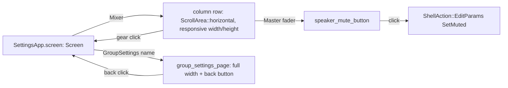

# Responsive UI Refinement

> Further refresh of the settings window (`crates/app/src/ui.rs`, mixer-ui-redesign's column layout): make master/group columns responsive to window size, turn each group's gear icon into a full-screen "Group Settings" page instead of an inline expanding panel, drop Master's now-empty gear icon, and replace Master's mute checkbox with a custom-painted speaker-icon toggle under the fader. Layout/navigation/input-widget refresh — no new mixing/DSP/routing capability.

## Decisions Log

<!-- Add new at bottom. Never remove. -->

| Date | Decision | Reasoning | Alternatives Considered |
|------|----------|-----------|------------------------|
| 2026-07-22 | Context doc created after researching comparable apps (EarTrumpet, SteelSeries Sonar, Voicemeeter, Rogue Amoeba SoundSource). | SoundSource's gear-icon-opens-separate-Settings-window pattern and EarTrumpet's icon-based (not checkbox) per-app mute directly informed Level 1. | — |
| 2026-07-22 | Group settings navigation = in-app full-screen page (single window, view swaps, back button returns), not a separate OS window/viewport. | User's explicit pick — simplest in egui, no multi-viewport lifecycle/focus-return complexity; app-shell.md already chose single-window eframe. | Separate OS window via egui multi-viewport (more native feel, real added plumbing cost) — rejected. |
| 2026-07-22 | Master's gear icon removed entirely once mute relocates to its own button — no placeholder kept. | User's explicit pick — no advanced settings exist for Master today; a dead affordance that opens to nothing is worse than no icon. | Keep gear as empty placeholder for future master-level settings — rejected, YAGNI until a real need appears. |
| 2026-07-22 | Speaker mute button is a custom-painted vector icon (`egui::Painter`: cone + volume arcs, slash overlay when muted), not a Unicode/emoji glyph. | User's explicit pick — guaranteed crisp rendering, no risk of a missing-glyph tofu box the way an emoji-range character could render in egui's default font (unlike the existing ⚙ gear, which is in a font range already confirmed working). | Unicode glyph text (simpler, same technique as ⚙) — rejected, emoji-range font-coverage risk. |
| 2026-07-22 | Overflow behavior when the window is narrower than all columns' comfortable minimum width = horizontal scroll. | User's explicit pick — matches the researched precedent (Sonar/Voicemeeter-style channel strips scroll rather than cramp or wrap). | Shrink below minimum (cramped/clipped controls); wrap to multiple rows (no precedent in researched apps) — both rejected. |
| 2026-07-22 | Design approved at Level 1. Locked in, proceeding to Level 2 (Components). | User confirmed. | — |
| 2026-07-22 | `advanced_open: HashMap<String, bool>` (per-group inline-panel toggle) replaced by a single `screen: Screen` enum field — only one page is ever visible at a time now (Mixer or one group's settings), so a map of independent per-group booleans is the wrong shape once panels become mutually-exclusive full pages. `master_advanced_open: bool` dropped outright (capability 3). | Enum makes "which page is showing" a single source of truth with no representable invalid state (e.g. two groups' panels open at once, which the old `HashMap<String, bool>` could accidentally allow mid-transition). | Keep per-group `HashMap<String, bool>` and just render full-page when true (rejected — allows an unreachable-but-representable multi-open state; enum is the same idiom this codebase already uses for other exclusive-state fields). |
| 2026-07-22 | `group_advanced_panel` is revised in place (full-width render + back button) into `group_settings_page`, not written as a new parallel function. | Same content (follow-master/spatial/DSP/duck/match-rules/remove-group), only the container changes (`ui.group()` narrow box → full available width) — a rename-and-adjust, not new logic. | Writing a separate new function and deleting the old one in two steps (no benefit, same diff either way). |
| 2026-07-22 | Speaker mute button is a single-purpose function (`speaker_mute_button`), not a generalized reusable icon-button abstraction. | Only Master gets a mute control today (capability 4 scope) — a generic widget would be speculative generality with one caller. | Generic `IconButton`/toggle-icon widget abstraction usable for future per-group mute (rejected — no second caller exists yet, matches this project's "extend before adding a second abstraction" learning in reverse: don't generalize before a second consumer exists). |
| 2026-07-22 | Drift check vs `Splitstream-Engineering-Spec.md` complete — no divergence, pure elaboration on app-shell.md's approved F9/§6.5 contracts (same posture as mixer-ui-redesign). Recorded in spec's `## Links` section. | §15.1/§6.5 say nothing about column responsiveness, gear navigation style, or mute-widget rendering — nothing to override. | — |
| 2026-07-22 | Design approved at Level 4. Status set to approved — ready for implementation. | All four levels approved and persisted; drift check complete. | — |
| 2026-07-22 | Implemented exactly as contracted, no deviations: `Screen` enum, `column_width`/`fader_height` (MIN/MAX 100/220 and 120/400 respectively — implementation-time tuning per L4's own note), `speaker_mute_button` (custom-painted via `egui::Painter`, signatures for `Shape::convex_polygon`/`Shape::line` verified against vendored egui 0.35 source before writing any call), `group_settings_page`, wiring in `master_column`/`group_column`/`SettingsApp::ui`. `main.rs` needed no change — verified `NativeOptions::default()` already resolves to resizable via egui-winit's `.with_resizable(resizable.unwrap_or(true))`. | 8 new unit tests on `column_width`/`fader_height` (both clamp bounds, pass-through, zero-column edge case); `cargo check --workspace` and `cargo clippy -p app --tests -- -D warnings` both clean; 39/39 app tests passing. | — |
| 2026-07-22 | Fixed 3 pre-existing clippy warnings while in the file (user request, not part of the design's own scope): `ShellError`'s `String` fields are read only via derived `Debug` at diagnostic call sites (`eprintln!`/`tracing`), which dead-code analysis doesn't see through — annotated `#[allow(dead_code)]` with a comment rather than dropping the fields (would destroy real diagnostic detail), same shape as `engine::ports::PortError::Backend(String)`. `logging.rs`'s `set_description(&format!(...))` dropped its needless borrow. `routed_sessions`'s `sort_by` closure became `sort_by_key(chip_label)` (passing the existing pure fn directly — same signature, no closure needed). | User asked to fix them; none were introduced by this feature's own delta. | — |

## Design: Level 1 -- Capabilities

Approved 2026-07-22.

1. **Responsive column layout** — master + group columns resize proportionally with window width/height (column width and fader height scale with available space instead of the current fixed `COLUMN_WIDTH`/default slider height). Horizontal scroll kicks in once the window is narrower than all columns' comfortable minimum.
2. **Group settings as a full-screen page** — a group's gear icon navigates the whole view to a dedicated "Group Settings: `<name>`" page (in-app, single window; back button returns to the mixer) — replacing today's inline expanding panel. Same content carries over unchanged: follow-master, spatial toggle, DSP chain, duck sidechain, match-rules fallback, remove-group.
3. **Master's gear icon removed** — no advanced settings remain on Master once mute relocates (capability 4); the icon and its now-empty panel are dropped, not kept as a placeholder.
4. **Master mute as a speaker toggle** — checkbox replaced by a custom-painted speaker icon button (cone + volume arcs, slash overlay when muted), positioned directly under Master's fader, always visible — no gear needed to reach it.
5. Everything else stays functionally as-is (DSP/duck/spatial semantics, drag-and-drop session assignment, dropdown fields, config-edit funnel) — this is layout/navigation/input-widget refresh, not new mixing capability.

Out of scope: independent per-column drag-resize handles (auto-proportional only); an app-level preferences screen for autostart/hotkeys (not requested — stays whatever gap exists today); visual re-skin beyond current style.

## Design: Level 2 -- Components

Approved 2026-07-22.

All confined to `app/ui.rs` (shell layer, egui) — no engine/control/win-audio changes needed; every mutation already funnels through existing `ShellAction`/`ConfigEdit` paths unchanged.

| Component | Change | Responsibility |
|---|---|---|
| `Screen` enum (new) | New: `enum Screen { Mixer, GroupSettings(String) }`, field on `SettingsApp` | Single source of truth for which page is showing — replaces `advanced_open: HashMap<String, bool>` and `master_advanced_open: bool` entirely (challenged and dropped: a per-group bool map can't represent "exactly one page open" as cleanly as an enum, and both fields become dead once panels are mutually-exclusive full pages) |
| `column_width`/`fader_height` (new, pure) | New pure fns in `app/ui.rs` | Given available width/height + column count, return a clamped (MIN/MAX) size — used by both the mixer row and (for height) each column's slider |
| Mixer column row (revised) | `ui.horizontal` wrapped in `egui::ScrollArea::horizontal()` | Horizontal-scroll overflow behavior once columns hit their minimum width |
| `speaker_mute_button` (new) | New fn, single-purpose (not a generic widget — challenged, no second caller exists) | Custom-painted (`egui::Painter`) speaker icon + click sense; draws cone+arcs unmuted, cone+slash muted; returns whether clicked |
| `master_column` (revised) | Drop gear/checkbox block; add `speaker_mute_button` call under the fader | Master's mute now always-visible, no gear |
| `group_column` (revised) | Gear click sets `self.screen = Screen::GroupSettings(name)` instead of toggling a map entry | Entry point into the new page, not an inline expand |
| `group_settings_page` (revised from `group_advanced_panel`) | Same content (follow-master/spatial/DSP/duck/match-rules/remove-group), full-width container + back button (`self.screen = Screen::Mixer`) instead of a narrow inline `ui.group()` | The "separate screen" itself |
| `SettingsApp::ui` (revised) | Branches on `self.screen`: `Mixer` → today's column row (now responsive+scrollable); `GroupSettings(name)` → `group_settings_page` full-width, skipping the column row entirely | Top-level page switch |

No new domain type, no DDD classification needed — `SessionInfo`/`GroupConfig`/`MatchRule` untouched, this is purely a shell-layer rendering/navigation reorganization.

## Design: Level 3 -- Interactions

Approved 2026-07-22.

**A — Frame render / screen dispatch:** every frame, before drawing anything, `SettingsApp::ui` reads `ui.available_size()` and computes `column_width`/`fader_height` from it (pure, no cached state — immediate-mode, cheap to redo every frame). Then branches on `self.screen`: `Mixer` renders today's column row (now inside `ScrollArea::horizontal`, using the computed sizes); `GroupSettings(name)` looks the group up in `snapshot.groups` by name and renders `group_settings_page` full-width instead of the column row.

**B — Gear click (Mixer → Group Settings):** `group_column`'s gear click sets `self.screen = Screen::GroupSettings(group.name.clone())`. No `ShellAction` sent — pure local navigation.

**C — Back button (Group Settings → Mixer):** `group_settings_page`'s back button sets `self.screen = Screen::Mixer`. No `ShellAction` sent.

**D — Remove Group from within its own settings page:** clicking "Remove group" both sends `ShellAction::EditStructure(RemoveGroup)` *and* sets `self.screen = Screen::Mixer` in the same click — immediate navigation, don't wait a frame. Safety net: at flow A's lookup, if `self.screen` names a group no longer in `snapshot.groups` for *any* reason (e.g. an external hand-edit to `config.toml` removes it while its page happens to be open), fall back to `Screen::Mixer` automatically rather than rendering a stale/missing panel.

**E — Master mute via speaker button:** click reads `snapshot.muted`, sends `ShellAction::EditParams(vec![ConfigEdit::SetMuted(!muted)])` — identical edit path as today's checkbox, only the trigger widget changes.

**F — Responsive layout / overflow:** `column_width(available.x, column_count)` and `fader_height(available.y)` clamp to a sane [MIN, MAX] range. When `available.x / column_count` falls below MIN, columns render at MIN and total content width exceeds the viewport — `ScrollArea::horizontal` then scrolls natively (no extra overflow-detection logic needed, egui handles it once content is wider than the scroll area).

**G — Window resizability:** `main.rs`'s `eframe::NativeOptions::default()` is assumed already resizable (eframe's default). Verified, not redesigned, at implementation time — no contract change expected here unless that assumption turns out false.

## Open Questions

None.

## Constraints

Inherited (binding, from app-shell.md / mixer-ui-redesign.md): UI never calls `win-audio` directly; UI mutates config + sends commands only, all through `ShellAction` → `ConfigStore`/`EngineHandle`; match-rule edits stay on the param fast path (`EditParams`), output/new-group stay structural (`EditStructure`); no new domain type — `SessionInfo`/`MatchRule`/`GroupConfig` reused as-is.

## Design Summary

- **Components/layers:** all confined to `app/ui.rs` (shell layer) — `Screen` enum (new, replaces `advanced_open`/`master_advanced_open`), `column_width`/`fader_height` (new, pure), `speaker_mute_button` (new, single-purpose custom-painted widget), `group_settings_page` (revised from `group_advanced_panel`), `master_column`/`group_column`/`SettingsApp::ui` (revised call sites and dispatch). No `engine`/`control`/`win-audio` changes.
- **Key contracts:** `Screen::{Mixer, GroupSettings(String)}`; `column_width(available_width, column_count) -> f32` / `fader_height(available_height) -> f32` (pure, clamped); `speaker_mute_button(ui, muted) -> bool`; `group_settings_page(&mut self, ui, group, all_groups)`.
- **Architectural constraints:** unchanged from app-shell.md/mixer-ui-redesign.md — UI never calls win-audio; all mutations still funnel through `ShellAction`; no new domain type.
- **Domain decisions:** none — no domain-folder files touched, `SessionInfo`/`GroupConfig`/`MatchRule` reused as-is.
- **Resolved during design:** navigation model = in-app page, not a separate OS window; Master's gear icon removed outright (no placeholder); mute icon = custom-painted vector (not a Unicode glyph, avoids font-coverage risk); overflow behavior = horizontal scroll (not shrink-below-minimum or wrap); `Screen` enum chosen over keeping a per-group bool map to make "exactly one page visible" a structurally enforced invariant.
- Drift check vs `Splitstream-Engineering-Spec.md` complete — pure elaboration on approved app-shell.md contracts, no divergence. See spec `## Links`.

## Key Files

| Path | Role | Status |
|---|---|---|
| .lattice/context/app-shell.md | Approved P4 (`ShellAction`, `ConfigEdit`, `UiState` base contract) — this feature elaborates its settings-window component only | — |
| .lattice/context/mixer-ui-redesign.md | Approved column-layout/drag-assign baseline this feature refines | — |
| crates/app/src/ui.rs | `SettingsApp` — `Screen`, `column_width`/`fader_height`, `speaker_mute_button`, `group_settings_page`, revised `master_column`/`group_column`/`ui` | done |
| crates/app/src/main.rs | `eframe::NativeOptions` — resizability assumption verified against vendored egui-winit source (L3 flow G) | done (no change needed) |
| crates/app/src/lifecycle.rs | `ShellError` — `#[allow(dead_code)]` annotation added (unrelated pre-existing clippy warning, fixed on request) | done |
| crates/app/src/logging.rs | `fatal_dialog` — needless-borrow clippy fix (unrelated pre-existing warning, fixed on request) | done |
