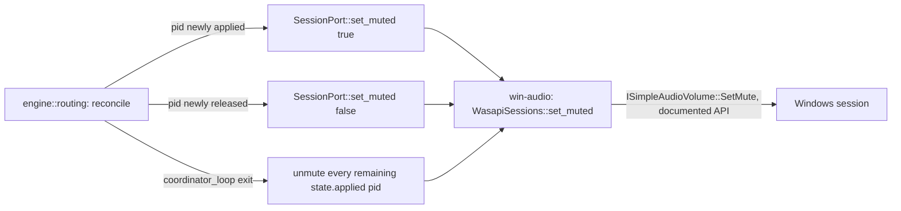

# Session Mute on Capture

> **SUPERSEDED 2026-07-26 — the code described below no longer exists.** MT1
> (measured 2026-07-25) showed that muting a captured app's session silences
> the `PROCESS_LOOPBACK` tap as well: same sample cadence, every frame zeroed
> (peak 0.0814 unmuted vs 0.0 muted). The tap sits *after* session-level
> processing, so this mechanism was void rather than merely buggy. The design
> below is sound given its premise; the premise is what was falsified. Every
> piece of it — `SessionPort::set_muted`, `WasapiSessions::set_muted`,
> routing's mute diff and shutdown sweep, the mock hooks — was deleted by
> [double-audio-prevention](double-audio-prevention.md), which removes the
> double structurally instead: one unheard sink as the Windows default, so
> apps never render anywhere audible in the first place.

> `ActivateAudioInterfaceAsync`/`PROCESS_LOOPBACK` (process-loopback-capture) taps a process's audio — it does not redirect or silence the original stream. Found live: a matched app's audio plays twice whenever the group's output device is also Windows' current default (the untouched original session + Splitstream's own processed copy), and the original copy's volume is completely unaffected by any in-app gain/DSP control. Fix: mute the source session's own Windows volume (`ISimpleAudioVolume::SetMute`) for the duration Splitstream has it captured; unmute on release (rule change, session end, Splitstream shutdown/crash-safety).

## Decisions Log

<!-- Add new at bottom. Never remove. -->

| Date | Decision | Reasoning | Alternatives Considered |
|------|----------|-----------|------------------------|
| 2026-07-22 | Context doc created. No `## Technical Constraints` section in `Splitstream-Engineering-Spec.md` (not that kind of spec) — proceeding without a formal extraction, same as every other feature in this repo. | — | — |
| 2026-07-22 | Crash/unclean-exit recovery scope: clean-shutdown-only. No persisted "sessions I muted" state file. | User decision. Persisted-state recovery closes the crash gap completely but adds a state file + startup reconciliation step; least-machinery-first for a bounded edge case (Volume Mixer is the manual escape hatch; restarting the app or Splitstream re-captures and re-mutes correctly either way — the crash-then-never-restart case is the only genuinely stuck one). | Clean-shutdown + persisted startup recovery (rejected — more machinery than the edge case's frequency/severity justifies for v1). |
| 2026-07-22 | Design approved at Level 4. Status set to approved — ready for implementation. | All four levels approved and persisted; drift check vs spec complete (1 design addition, no overrides, recorded in spec's Links section). | — |
| 2026-07-22 | Implemented exactly as contracted, no deviations: `SessionPort::set_muted` (engine::ports), `WasapiSessions::set_muted` (win-audio::sessions, `ISimpleAudioVolume` via `IAudioSessionControl2::cast`), `reconcile`'s before/after applied-pid diff + `coordinator_loop`'s post-loop unmute sweep (engine::routing), `MockSessionPort::set_muted`/`muted_pids`/`fail_mute` (engine::ports::mock). Status set to complete. | All 4 capabilities verified by unit test (mute-on-capture, unmute-on-release, shutdown sweep, no-mute-on-failed-capture, mute-failure isolation from `RoutingDegraded`) plus one `#[ignore]`d real-hardware smoke test (`mute_and_unmute_a_real_session`). `cargo build --workspace --tests` and `cargo clippy -p engine -p win-audio --tests` both clean. | — |

## Design: Level 1 -- Capabilities

Approved 2026-07-22.

1. **No double-audio** — while Splitstream captures a process's audio into a group, that process's own Windows session output is silenced; only Splitstream's processed copy is audible.
2. **Automatic release on unmatch** — the moment a pid drops out of every group's desired set (rule change, session ends), its Windows session mute is cleared immediately, not just on shutdown.
3. **Clean-shutdown safety** — quitting Splitstream (tray Quit, normal exit) unmutes every currently-captured session before the process exits.
4. **No other side effects** — only the boolean mute flag is touched, only for sessions actively captured; a session Splitstream isn't managing is never touched, even if the same reconcile pass runs repeatedly.

Out of scope: volume-level sync/ducking of the original session (mute is binary — Splitstream's own gain remains the only volume control for the audible copy); persisted crash recovery (declined, see Decisions Log).

## Design: Level 2 -- Components

Approved 2026-07-22.

| Component | Layer | Change | Responsibility |
|---|---|---|---|
| `engine::ports::SessionPort` | Application (port) | Gains `set_muted(&self, pid, muted) -> Result<(), PortError>` | Extends the existing facade (not a new trait — matches operational-learnings' "extend before adding a second abstraction" rule) |
| `win-audio::sessions::WasapiSessions` | Infrastructure | Implements `set_muted` | Finds `pid`'s live session across all endpoints (reuses the enumerator's existing multi-endpoint scan `WasapiSessions` already does), casts to `ISimpleAudioVolume`, calls `SetMute`. Best-effort — pid already gone is a no-op, not an error |
| `engine::routing` (`reconcile`/`coordinator_loop`) | Application | Revised | Owns the mute lifecycle: diffs `state.applied`'s full pid set before/after each reconcile — newly-applied pids get muted, newly-released pids get unmuted (capability 1 & 2). `coordinator_loop` does one final unmute-everything sweep right after its loop exits, before the thread returns (capability 3 — `RoutingHandle::shutdown()`'s existing thread-join makes this synchronous automatically, no new API) |
| `engine::ports::mock::MockSessionPort` | Test infra | Gains `set_muted` + `muted_pids()`/`fail_set_muted(pid)` hooks | Same shape as `MockSystem`'s existing test hooks |

No new component, no new port trait, no new file. `win-audio::process_capture.rs` is untouched — mute is a session-manager concept (already `sessions.rs`'s domain), unrelated to the separate `ActivateAudioInterfaceAsync` activation path.



## Design: Level 3 -- Interactions

Approved 2026-07-22.

**A — pid newly captured:** `reconcile()` runs `apply_capture_sources` per group as today (unchanged), then diffs the *full* pid set in `state.applied` (across every group) against the pre-reconcile set. Pids present now but not before → `session.set_muted(pid, true)`. Mute only ever follows a *confirmed* capture success (`state.applied` already excludes anything `apply_capture_sources` returned as `failed`) — a pid that fails to open is never muted (capability 4).

**B — pid released** (rule change, session ends): same diff, opposite direction — pids present before but not now → `session.set_muted(pid, false)`. Runs every reconcile tick (~100ms), so release is near-immediate, not just-on-shutdown (capability 2).

**C — Live rule change:** the existing `Command::UpdateRules` handling already re-runs `reconcile()` unchanged — flows A/B fall out of the same diff automatically, no special-casing.

**D — Clean shutdown:** `RoutingHandle::shutdown()` signals `stop`; once `coordinator_loop`'s `while` exits, before the function returns, it unmutes every pid still in `state.applied` (covers apps still running when Splitstream quits — `SessionEvent::Ended` never fired for them). `shutdown()`'s existing thread-join blocks until this finishes — synchronous for free, no new API.

**E — A `set_muted` call fails:** best-effort, same isolation posture as capture failures — logged (`tracing::warn!`), does not block the rest of the reconcile pass, and does **not** feed `EngineEvent::RoutingDegraded`. Reasoning: `RoutingDegraded` means audio isn't being routed at all (functional break); a failed mute means "might briefly double-play" (cosmetic) — different severity, kept separate.

**F — App relaunches with a new pid:** no special-casing — `SessionEvent::New(new_pid)` → next reconcile matches it fresh → flow A mutes the new pid same as any other capture. Mirrors process-loopback-capture's existing "relaunch is just a clean fresh match" behavior.

## Design: Level 4 -- Contracts

Approved 2026-07-22.

```rust
// engine::ports (revised)
pub trait SessionPort: Send {
    fn enumerate(&mut self) -> Result<Vec<SessionInfo>, PortError>;
    fn take_events(&mut self) -> Receiver<SessionEvent>;
    /// Best-effort — pid not currently found among live sessions (already
    /// exited) is `Ok(())`, not an error (L3 flow E: failures are isolated,
    /// caller logs and moves on, never blocks reconcile). `&self`, not
    /// `&mut self` — same "this is really an OS RPC call" reasoning as
    /// `AudioSystem`'s methods; no persistent state needed.
    fn set_muted(&self, pid: u32, muted: bool) -> Result<(), PortError>;
}
```

```rust
// win-audio::sessions (revised)
impl SessionPort for WasapiSessions {
    // ...enumerate/take_events unchanged...

    /// Scans every render endpoint's session manager (same multi-endpoint
    /// reasoning already documented on this impl's enumerate()), finds the
    /// session whose IAudioSessionControl2::GetProcessId() == pid, casts to
    /// ISimpleAudioVolume, calls SetMute. Documented WASAPI interface — no
    /// hand-declared vtable, no undocumented-surface risk class.
    fn set_muted(&self, pid: u32, muted: bool) -> Result<(), PortError>;
}
```

```rust
// engine::routing (revised, internal — no public API change)
fn reconcile(
    state: &mut State,
    capture: &CaptureControl,
    session: &dyn SessionPort,   // NEW param
    events: &Sender<EngineEvent>,
) -> bool;

struct CoordinatorCtx {
    /// Renamed from `_session` — no longer "kept alive but never read
    /// after construction"; now actively called every reconcile (mute
    /// diff) and once more after the loop exits (shutdown sweep).
    session: Box<dyn SessionPort>,
    // ...unchanged fields...
}
```

`RoutingHandle`/`RoutingReader`'s public methods are unchanged — mute plumbing is entirely internal to the coordinator thread, invisible to `main.rs`/`ui.rs`.

```rust
// engine::ports::mock (revised)
struct SessionPortState {
    sessions: Mutex<Vec<SessionInfo>>,
    events: Mutex<Option<mpsc::Sender<SessionEvent>>>,
    muted: Mutex<HashSet<u32>>,          // NEW
    failing_mute: Mutex<HashSet<u32>>,   // NEW
}

impl MockSessionPort {
    /// Test hook: pids currently muted per this mock's own bookkeeping.
    pub fn muted_pids(&self) -> HashSet<u32>;
    /// Test hook: make `set_muted(pid, _)` fail until cleared (L3 flow E).
    pub fn fail_mute(&self, pid: u32);
}
```

## Design Summary

- **Components/layers:** `engine::ports::SessionPort` (application port, gains `set_muted`); `win-audio::sessions::WasapiSessions` (infrastructure, implements it via `ISimpleAudioVolume`); `engine::routing` (application, owns the mute lifecycle via a before/after diff of `state.applied` each reconcile, plus a post-loop unmute sweep for clean shutdown); `engine::ports::mock::MockSessionPort` (test infra, `set_muted`/`muted_pids`/`fail_mute`).
- **Key contracts:** `SessionPort::set_muted(&self, pid, muted) -> Result<(), PortError>`; `reconcile`'s new `session: &dyn SessionPort` param; `CoordinatorCtx._session` renamed to `session` (now actively used, not just kept alive).
- **Architectural constraints:** no new port trait (extends `SessionPort`, matches the "extend before adding a second abstraction" learning); `win-audio::process_capture.rs` untouched (mute is `sessions.rs`'s domain, unrelated to the `ActivateAudioInterfaceAsync` activation path); `RoutingHandle`/`RoutingReader`'s public API unchanged — entirely internal to the coordinator thread.
- **Domain decisions:** mute only ever follows a *confirmed* capture success, never a failed/pending one; a mute-call failure is isolated/logged, never a `RoutingDegraded` condition (cosmetic, not a routing break); crash/unclean-exit recovery explicitly out of scope for v1 (clean-shutdown-only — see Decisions Log).
- **Resolved during design:** crash-recovery scope (clean-shutdown-only, no persisted state); mute/unmute ordering relative to capture success/failure; where mute lifecycle lives (routing, not runtime or process_capture); `RoutingDegraded` severity boundary.
- Drift check vs `Splitstream-Engineering-Spec.md` complete — 1 design addition (§9.3 gains the mute behavior, §10 gains an error-table row), no overrides. Recorded in the spec's own `## Links` section (user confirmed).

## Open Questions

None yet — surfaced during design if they come up.

## Constraints

Inherited (binding, from process-loopback-capture.md / app-shell.md): `win-audio` is the only crate touching `windows-rs`/COM; `engine` depends on `win-audio` traits, never the reverse; RT no-alloc/no-block rule on the mixer/capture threads; UI never calls `win-audio` directly.
