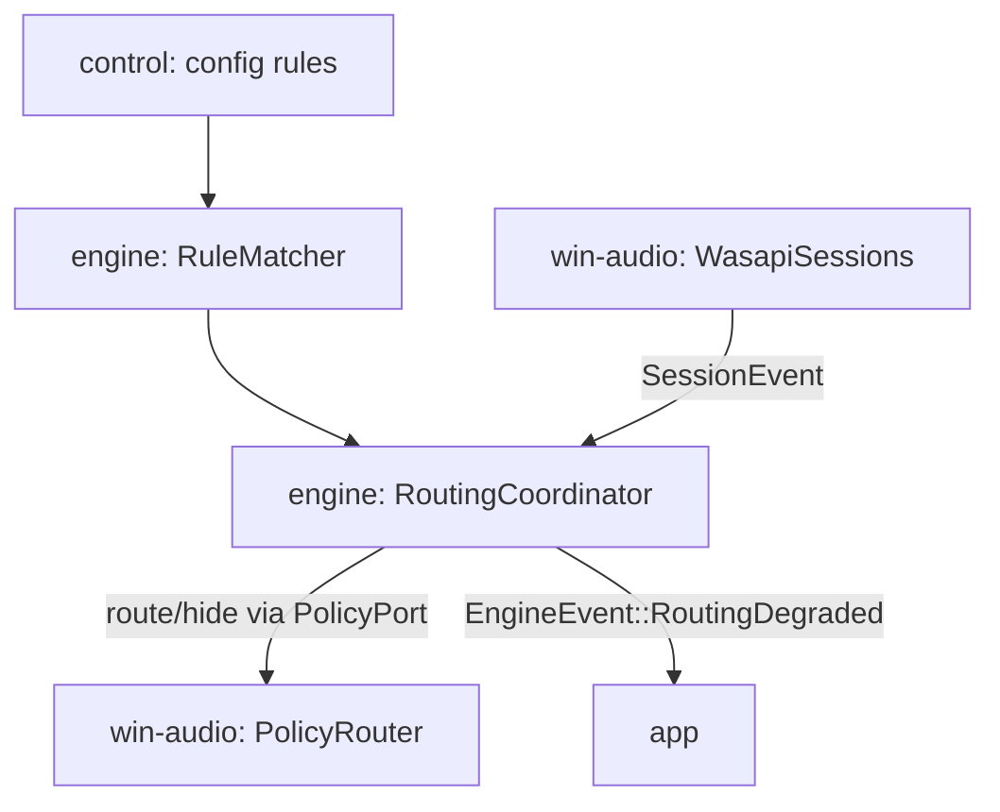

# Session Routing (P3)

> P3 — session enumeration, per-app→bus routing via undocumented APIs, endpoint hiding. Exit criteria: apps auto-assign to groups by rule; extra devices hidden; graceful fallback verified (spec §13).

## Decisions Log

<!-- Add new at bottom. Never remove. -->

| Date | Decision | Reasoning | Alternatives Considered |
|------|----------|-----------|------------------------|
| 2026-07-18 | Blueprint scope = P3: session enumeration (F5), per-app→bus routing (F6), endpoint hiding/default (F7). Builds on approved engine-core + drift-and-recovery. | Spec §13 phase order; P0–P2 designs approved. | P4 shell; P5 DSP. |
| 2026-07-18 | Separate `SessionPort`/`PolicyPort` traits in engine::ports — not grown onto `AudioSystem`. Deliberate exception to grow-facade learning. | Distinct concern cluster: best-effort, feature-gated, may fail without killing audio. Keeps AudioSystem cohesive; mocks simulate policy failure independently. | Growing AudioSystem (blurs must-work vs may-fail degradation posture). |
| 2026-07-18 | Match rules: process image name + full path, glob syntax. Precedence: exact name > glob; ties → first group in config order. Window title dropped. **Resolves spec §15.5.** | Spec config example already glob-shaped. Titles volatile — rematch churn on retitle, extra Win32 surface. Specific-first prevents early catch-all swallowing exact rules. | Config-order-only (catch-all foot-gun); including window title (churn + surface). |
| 2026-07-18 | No un-route on session end; persisted Windows prefs left in place. Un-route (`clear_route`) only when rules change makes an app unmatched. | Re-launch races new-session notification — first seconds of audio would hit wrong device. Windows-persisted pref gives correct routing from first sample. | Clearing route on every session end (cleaner Windows state, audible race). |
| 2026-07-18 | Degradation: first PolicyPort failure sets degraded flag + one `RoutingDegraded` notice; further policy calls skipped; retry only on config reload. | N4 graceful degradation without retry storms; reload = deliberate user action. | Periodic auto-retry (storm risk on permanently-broken API); fail-hard (violates N4). |
| 2026-07-18 | `ConfigDelta` gains `Rules` variant — control-plane change class, distinct from Params/Structural. | Rule edits must not rebuild audio graph nor touch mixer; they re-run reconciliation only. | Treating rule change as Structural (needless audio gap). |
| 2026-07-18 | PolicyRouter behind cargo feature `policy-routing`; unavailable/disabled surfaces as `PolicyError::Unavailable` → immediate degraded mode. | Spec §9 risk note: isolate + feature-gate undocumented surfaces; single code path for "feature off" and "API broke". | Runtime-only detection without build-time gate (can't ship a build with the surface fully absent). |
| 2026-07-18 | Design approved at Level 4. Status set to approved — ready for implementation. | All four levels approved and persisted; drift check vs spec complete. | — |
| 2026-07-18 | **Revision (cross-blueprint review):** new flow + contract `RoutingHandle::update_topology(buses, rules)` — called after every structural rebuild. Coordinator re-enumerates sessions and reconciles desired state against the fresh (possibly re-numbered) GroupIds; applied-routes map rebuilt. | L3 only handled rules changes; group add/remove/rename never reached the coordinator — stale `buses` map and applied-map keyed by shifted positional GroupIds. Desired-state reconcile pattern already in place makes this cheap. | Restarting the coordinator on structural change (loses degraded flag + notification dedup state); persistent group ids (rejected in P4). |
| 2026-07-18 | **Revision (cross-blueprint review):** `SessionPort::events(&self)` becomes `take_events(&mut self) -> Receiver<SessionEvent>` — single-consume, same fix as EngineHandle. | Same single-consumer Receiver issue found in the seam review. | — |
| 2026-07-20 | **Implementation-time decision (code-forge):** `MatchRule`, `GroupRules`, `SessionInfo`, `match_session` live in `engine` (`engine::rules`), not `control` as the L4 text literally implied. `control` depends on `engine`, not the reverse — `engine::routing::RoutingCoordinator`'s own contract takes `GroupRules` as a parameter, so the type must live where `engine` can use it without a reverse/cyclic dependency. Identical shape and identical fix to the `ConfigSnapshot`/`GroupConfig` "Config type home" decision in `.lattice/context/engine-core.md`. Asked the user directly (real fork, lasting API-shape consequence); confirmed. | Fully decoupling with mirrored types converted at the app boundary (more boilerplate, no other consumer needs the separation; P4/app not built yet to host the conversion). | 
| 2026-07-20 | **Implementation-time decision (code-forge):** `start_routing`/`RoutingHandle::update_topology` gain an added `default_output: Option<EndpointId>` parameter — L4's signature had no way to supply the physical endpoint flow A's "sets branded default" step needs; coordinator no-ops `PolicyPort::set_default` when `None`. `app` (P4, not yet built) will supply it from `AudioSystem::default_output()`. Asked the user directly; confirmed. | Dropping "sets branded default" from P3 scope entirely (defers a designed L3 flow to P4 for no structural reason — the param is cheap and optional). | 
| 2026-07-20 | **Implementation-time decision (code-forge):** `ConfigDelta` restructured from a flat enum (`Params \| Rules \| Structural \| Unchanged`) to a struct (`structural: bool, params: Vec<MixerCommand>, rules: Option<Vec<GroupRules>>`) so one `diff()` call can deliver a simultaneous gain+rule edit without silently dropping one half. Deviates from L4's literal enum text. Asked the user directly; confirmed. | Keeping the flat enum with either precedence order (Params-over-Rules or Rules-over-Params) — both silently drop one class of change on a simultaneous edit; nothing consumes `ConfigDelta` yet (P4/app not built) so the blast radius of restructuring now is minimal. |
| 2026-07-20 | **Implementation-time decision (code-forge):** `WasapiSessions` activates `IAudioSessionManager2` (enumeration + new-session notification) on *every* bus and physical endpoint the enumerator reports, not just the default output, merging by pid. | `IAudioSessionManager2` is per-endpoint. An app already redirected to a Splitstream bus in a prior run (Windows persists the pref — see the earlier "no un-route" decision) gets WASAPI-redirected straight to that bus on relaunch, before its session would ever appear in the *default* device's session list. Scanning only the default endpoint would silently miss every already-routed app on relaunch — recurring, not an edge case, given P3's own persistence design. Asked the user directly; confirmed. | Scanning only the default output endpoint — simpler (one manager, one registration) but reintroduces the exact gap the "no un-route on session end" decision was designed around. |
| 2026-07-20 | **Implementation-time discovery (code-forge):** `IPolicyConfigWin7`/`AudioPolicyConfig` vtable shapes verified against EarTrumpet's live source (`github.com/File-New-Project/EarTrumpet/Interop/MMDeviceAPI/`) via WebFetch, not from memory — implementation-notes.md's own hand-written pattern sketch for `IPolicyConfig` undercounted the real vtable by several slots (8 unused + GetPropertyValue + SetPropertyValue + SetDefaultEndpoint + SetEndpointVisibility = 12 own slots, not the sketch's 2). Using the sketch as written would have corrupted memory, not just returned an error. | Confirms the notes' own warning was correct and necessary — the sketch was illustrative shorthand, never meant to be trusted verbatim. | — |
| 2026-07-20 | **Implementation-time discovery (code-forge):** `AudioPolicyConfigFactory*` interfaces are `IInspectable`-derived (WinRT) in the real ABI, but windows-core 0.62's `#[interface]` macro has no generated `IInspectable_Impl` trait to satisfy the parent-trait bound it requires for any non-`IUnknown` parent. Worked around by declaring `: IUnknown` and manually placeholder-slotting `IInspectable`'s own 3 methods (`GetIids`/`GetRuntimeClassName`/`GetTrustLevel`) ahead of the interface's real slots — produces an identical vtable layout since ABI correctness depends on memory layout, not which Rust trait hierarchy describes it. | `windows-core`/`windows-interface` crate version limitation (0.62.2), not a project design choice — worth knowing if a future `windows`/`windows-core` upgrade adds `IInspectable_Impl` and this workaround can be simplified back to `: IInspectable`. | — |

## Design: Level 1 -- Capabilities

Approved 2026-07-18.

1. **Apps auto-assign to groups** — app starts playing → routed to matching group's bus; applies to running and new sessions.
2. **Unmatched apps stay normal** — no rule match → branded default, no surprise routing.
3. **Clean Windows device list** — bus endpoints hidden from sound UI; branded default set.
4. **Graceful degradation** — undocumented surfaces fail → audio keeps flowing, polish lost, user told once; no crash, no retry storm.
5. **Live rule updates** — config rule edits re-route affected apps without restart.

Out of scope: rule-editing UI (P4), DSP (P5), capture-device exposure (§15.6).

## Design: Level 2 -- Components

Approved 2026-07-18. Control-plane only; audio path untouched.

| Component | Home / layer | Single responsibility |
|---|---|---|
| RuleMatcher | `engine/rules.rs` (application, pure — relocated from `control/rules.rs`, see 2026-07-20 decision) | `(pid, process_path, display_name) × rules → Option<GroupId>` |
| SessionPort + PolicyPort | `engine::ports` | Session enumeration/notifications; route-session + visibility/default (separate trait — best-effort concern) |
| RoutingCoordinator | `engine/routing.rs` (application) | Desired-state reconciliation; re-apply on rule/session change; degradation posture (one notice, no retry storm); bus hiding at startup |
| WasapiSessions + PolicyRouter | `win-audio` (infrastructure) | IAudioSessionManager2 + priming (§9.2); hand-declared AudioPolicyConfig/IPolicyConfig vtables, feature-gated (§9.3–9.4) |



Endpoint-visibility manager folded into RoutingCoordinator (single caller). RuleMatcher = pure function, no service.

## Design: Level 3 -- Interactions

Approved 2026-07-18.

**A — Startup reconcile:** coordinator hides non-default buses + sets branded default (failure → E) → `SessionPort::enumerate()` (primes notifications §9.2) → match each session → `route(pid, bus)` for matched; unmatched untouched. Applied-routes map avoids rewriting persisted prefs.

**B — New session:** notification → match → route if matched and not already applied.

**C — Session ended:** drop from map; no un-route (Windows persists per-app pref; same group next launch).

**D — Live rule change:** `ConfigDelta::Rules` (new variant — control-plane, neither param nor structural) → re-match all live sessions → route newly-matched, re-route changed, `clear_route(pid)` for now-unmatched (back to default).

**E — Degradation:** first PolicyPort failure → degraded flag, `EngineEvent::RoutingDegraded{reason}` once, skip all further policy calls; retry only on config reload. Audio path never affected.

**F — Shutdown:** endpoints stay hidden (Windows persists; uninstaller restores). No un-routing.

## Design: Level 4 -- Contracts

Approved 2026-07-18. Deltas on approved P0–P2 contracts; signatures only.

### `engine::rules` (relocated from `control` — see 2026-07-20 decision above)

```rust
pub enum MatchRule { ExactName(String), Glob(GlobPattern) }
pub struct GroupRules { pub group: GroupId, pub rules: Vec<MatchRule> }
pub struct SessionInfo { pub pid: u32, pub process_path: PathBuf, pub display_name: String }

/// Exact name > glob; ties broken by config order. None → leave on default.
pub fn match_session(info: &SessionInfo, rules: &[GroupRules]) -> Option<GroupId>;
```

### `control`

```rust
/// Restructured from a flat enum (2026-07-20 decision above) so one `diff()` call
/// can carry a simultaneous params+rules edit without dropping either half.
pub struct ConfigDelta {
    pub structural: bool,
    pub params: Vec<MixerCommand>,
    pub rules: Option<Vec<engine::GroupRules>>,
}
```

### `engine::ports` additions (win-audio implements)

```rust
pub enum SessionEvent { New(SessionInfo), Ended(u32) }

pub trait SessionPort: Send {
    fn enumerate(&mut self) -> Result<Vec<SessionInfo>, PortError>;   // must prime notifications (§9.2)
    fn events(&self) -> Receiver<SessionEvent>;
}

pub enum PolicyError { Unavailable(String), Failed(String) }

pub trait PolicyPort: Send {                                          // all best-effort (§9.3–9.4)
    fn route(&mut self, pid: u32, bus: &EndpointId) -> Result<(), PolicyError>;
    fn clear_route(&mut self, pid: u32) -> Result<(), PolicyError>;
    fn set_visibility(&mut self, endpoint: &EndpointId, visible: bool) -> Result<(), PolicyError>;
    fn set_default(&mut self, endpoint: &EndpointId) -> Result<(), PolicyError>;
}
```

### `engine/routing.rs`

```rust
/// `default_output` (2026-07-20 decision above): physical endpoint for the
/// "sets branded default" step of flow A. `None` no-ops that PolicyPort call
/// — bus hiding still proceeds. `app` (P4) supplies it from
/// `AudioSystem::default_output()`.
pub fn start_routing(rules: Vec<GroupRules>, buses: HashMap<GroupId, EndpointId>,
                     default_output: Option<EndpointId>,
                     session: Box<dyn SessionPort>, policy: Box<dyn PolicyPort>,
                     events: Sender<EngineEvent>) -> Result<RoutingHandle, EngineError>;

impl RoutingHandle {
    pub fn update_rules(&self, rules: Vec<GroupRules>);
    pub fn update_topology(&self, buses: HashMap<GroupId, EndpointId>, rules: Vec<GroupRules>,
                            default_output: Option<EndpointId>);
    pub fn is_degraded(&self) -> bool;
    pub fn shutdown(self);
}

pub enum EngineEvent { /* P2 variants… */ RoutingDegraded { reason: String } }
```

### `win-audio`

`WasapiSessions: SessionPort`; `PolicyRouter: PolicyPort` behind cargo feature `policy-routing` — hand-declared vtables; feature off or activation failure → `PolicyError::Unavailable` → degraded at startup, audio unaffected.

## Open Questions

None — §15.5 rule precedence resolved (see Decisions Log).

## Constraints

Inherited (binding): COM in win-audio only; port traits in engine (interface-at-consumer); no exclusive mode; RT constraints unchanged (session routing is control-plane only — never touches audio path).

P3-specific (spec §9.2–9.4, N4):
- §9.3 `AudioPolicyConfig`/`SetPersistedDefaultAudioEndpoint` and §9.4 `IPolicyConfig` are **undocumented** — hand-declared vtables, best-effort with fallback + logging; app must keep routing audio (less polish) if they fail.
- Feature-gate + isolate both undocumented surfaces.
- New-session notifications require priming: call `GetSessionEnumerator` at least once on the manager during init (§9.2 gotcha).
- No elevation — undocumented COM runs in user context (§12).

## Design Revisions (2026-07-18 cross-blueprint review)

```rust
impl RoutingHandle {
    /// Call after every structural rebuild: fresh bus map + rules; coordinator
    /// re-enumerates sessions and reconciles (applied-map rebuilt, degraded flag preserved).
    pub fn update_topology(&self, buses: HashMap<GroupId, EndpointId>, rules: Vec<GroupRules>);
}
pub trait SessionPort: Send {
    fn enumerate(&mut self) -> Result<Vec<SessionInfo>, PortError>;
    fn take_events(&mut self) -> Receiver<SessionEvent>;   // replaces events(&self); single-consume
}
```

New flow **H — Structural rebuild:** engine completes rebuild → app calls `update_topology` with new buses/rules → coordinator reconciles as in flow A (idempotent; already-correct persisted routes untouched).

## Design Summary

- **Components/layers:** `RuleMatcher` pure fn (`engine/rules.rs` — relocated from `control/rules.rs`, see 2026-07-20 decision); `SessionPort` + `PolicyPort` traits (`engine::ports`); `RoutingCoordinator` (`engine/routing.rs`, desired-state reconciliation + degradation + bus hiding); `WasapiSessions` + `PolicyRouter` (`win-audio`, feature-gated).
- **Key contracts:** `match_session(info, rules) -> Option<GroupId>`; `SessionPort::{enumerate, take_events}`; `PolicyPort::{route, clear_route, set_visibility, set_default}` (all best-effort, `PolicyError`); `start_routing`/`RoutingHandle::{update_rules, update_topology, is_degraded}` (both take `default_output: Option<EndpointId>`, see 2026-07-20 decision); `ConfigDelta` (struct: `structural`/`params`/`rules`, see 2026-07-20 decision); `EngineEvent::RoutingDegraded`.
- **Architectural constraints:** control-plane only — audio path untouched; undocumented surfaces isolated in win-audio behind `policy-routing` feature; one degradation notice, retry only on config reload; no elevation.
- **Domain decisions:** `MatchRule` value objects (validated globs); exact > glob > config-order precedence (resolves spec §15.5); persisted routes left in place on session end.
- **Resolved during design:** §15.5 rule precedence; port shape (separate PolicyPort — deliberate exception to grow-facade learning); un-route semantics; degradation/retry policy; feature gate.
- Drift check vs `Splitstream-Engineering-Spec.md` complete — see spec `## Links`.

## Key Files

| Path | Role |
|---|---|
| Splitstream-Engineering-Spec.md | Requirement spec (§9.2–9.4, F5–F7, N4, §15.5) |
| .lattice/context/engine-core.md | Approved P0–P1 design (ports facade, control plane, ConfigSnapshot.match_rules) |
| .lattice/context/drift-and-recovery.md | Approved P2 design (EngineEvent channel, supervisor patterns) |
| crates/engine/src/rules.rs | `GlobPattern`/`MatchRule`/`GroupRules`/`SessionInfo`/`match_session` — pure, relocated from `control` (application layer) |
| crates/engine/src/ports/mod.rs | `SessionEvent`/`SessionPort`, `PolicyError`/`PolicyPort` additions |
| crates/engine/src/ports/mock.rs | `MockSessionPort`/`MockPolicyPort` — `Arc`-backed state + `Clone` so a test keeps an observer handle after the mock moves into `Box<dyn _>` |
| crates/engine/src/routing.rs | `RoutingCoordinator` (`start_routing`/`RoutingHandle`) — flows A–H against the mocks above; not yet wired to real `win-audio` ports |
| crates/engine/src/runtime.rs | `EngineEvent::RoutingDegraded` variant added |
| crates/control/src/config.rs | `ConfigDelta` restructured to struct; `group_rules(snapshot)` builder (positional `GroupId`, same convention as `diff`) |
| crates/app/src/main.rs | Updated for `ConfigDelta` struct shape; `delta.rules` intentionally unhandled — RoutingCoordinator wiring is P4/app-shell scope |
| crates/win-audio/src/sessions.rs | `WasapiSessions: SessionPort` — scans every bus+physical endpoint's `IAudioSessionManager2` (2026-07-20 decision), not just the default; per-session `IAudioSessionEvents` for ended-detection |
| crates/win-audio/src/router.rs | `PolicyRouter: PolicyPort`, behind `policy-routing` feature — `IPolicyConfigWin7` (classic COM) for visibility/default, `AudioPolicyConfig` (WinRT, two IIDs w/ fallback) for per-app routing; every GUID/slot verified against EarTrumpet's real source, not memory |
