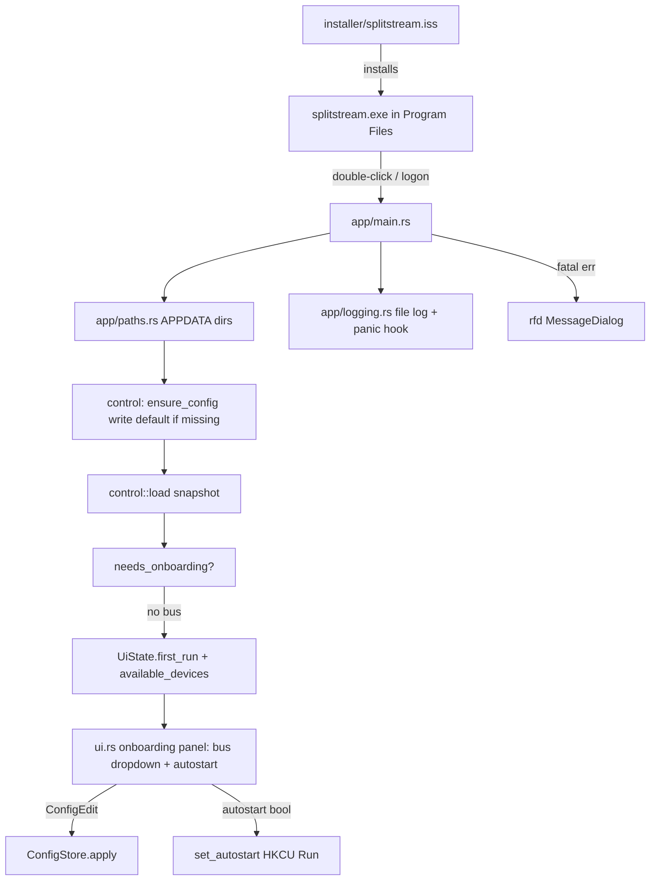

# Simple Launch (Installer + First-Run + Seamless Startup)

> Goal: turn Splitstream from a `cargo run` dev binary into a double-click desktop app. An Inno Setup installer places the app machine-wide (Program Files, UAC on install), a Start Menu shortcut launches it, and the app self-bootstraps its per-user config, onboards the BYOD virtual bus, registers per-user autostart, and never flashes a console or dies to an invisible `eprintln`. Closes the packaging concern deferred in app-shell.md (N6, spec §13).

## Decisions Log

<!-- Add new at bottom. Never remove. -->

| Date | Decision | Reasoning | Alternatives Considered |
|------|----------|-----------|------------------------|
| 2026-07-20 | Installer = **Inno Setup** single `.exe`. | Ubiquitous for free/OSS Windows apps; simple scriptable Start Menu shortcut + uninstaller + "launch now"; no build-time COM authoring. | WiX MSI (GPO-friendly, heavier authoring, per-user MSI quirks); portable zip (no uninstaller, no Start Menu). |
| 2026-07-20 | Install scope = **machine-wide, Program Files, elevated (UAC)**. | "Installed app" feel; single copy for all users; Start Menu shortcut in All Users. | Per-user %LOCALAPPDATA% (no UAC) — rejected by user in favor of standard Program Files install. |
| 2026-07-20 | Config + autostart stay **per-user, owned by the app's first-run, not the installer**. Installer only installs binary/assets/shortcut and optionally launches. | Installer runs elevated (admin), config lives in the *end user's* `%APPDATA%` and autostart is the *end user's* HKCU Run key — the elevated installer is the wrong actor for both. App already reconciles `set_autostart(snapshot.app.autostart)` every startup (main.rs) and resolves its own user paths. | Installer writes seed config to APPDATA + adds HKCU Run key (wrong user context under elevation; duplicates the app's existing autostart reconcile). |
| 2026-07-20 | First launch with no virtual bus detected = **onboarding window**: explain BYOD, link VB-CABLE, live device-picker dropdown to choose the bus endpoint, write choice to config. | Non-technical users can't set an env var or hand-edit TOML; current `SPLITSTREAM_BUS_PREFIX` env-only path is invisible on double-click. Turns the silent-degrade failure into a guided setup. | Tray notice only (relies on user finding settings); auto-pick default output (app "runs" but does nothing useful). |
| 2026-07-20 | Autostart offered in first-run onboarding, **checkbox default ON**. | Matches the user's core goal — "restart shouldn't need a manual relaunch." | Default OFF (safer but defeats the stated goal); no prompt / always-on (removes user control, F11 says autostart is user-controllable). |
| 2026-07-20 | Config bootstrap lives in `control::ensure_config`; onboarding is a panel in `SettingsApp`, not a separate window. | Config schema/serialization is control's domain; reusing the egui app avoids a speculative wizard framework. | Bootstrap in app shell; standalone onboarding window. |
| 2026-07-20 | Default config ships **group-less**; onboarding creates the first group with the picked bus. Empty-groups = first-run trigger. | Avoids baking machine-specific device names into a shipped template; sidesteps an engine "empty output_device = default" special case. | Template with one placeholder group (needs empty-output-device resolve rule). |
| 2026-07-20 | Uninstall runs `--uninstall-cleanup` (deregister HKCU autostart) and **keeps** `%APPDATA%` config. | Clean Run-key removal vs a harmless-but-untidy dangling entry; user data/config survives reinstall (standard app behavior). | Accept dangling Run key (no code); delete config on uninstall (loses user setup). |
| 2026-07-20 | Design approved at Level 4. Status set to approved — ready for implementation. | All four levels approved and persisted; drift check vs spec complete (one signing override, pending spec record). | — |

## Key Files

| File | Purpose |
|---|---|
| `crates/control/src/config.rs` | `ensure_config`, `DEFAULT_CONFIG_TEMPLATE` — create-if-missing seed + load. |
| `crates/control/src/store.rs` | `ConfigEdit::SetAutostart(bool)` + `apply_edit` arm, `[app]` table auto-vivify. |
| `crates/app/src/paths.rs` | `config_path`/`log_dir` via `directories::BaseDirs` — `%APPDATA%\Splitstream\...`. |
| `crates/app/src/logging.rs` | `init` (file logger + panic hook -> `rfd` dialog), `fatal_dialog` for graceful startup failures. |
| `crates/app/src/main.rs` | GUI subsystem attr (release-only), `mod paths`/`mod logging`. |
| `crates/app/src/ui.rs` | Onboarding panel (`onboarding_panel`, `pick_output_device`), gated on `UiState.first_run`. |
| `crates/engine/src/ports/mod.rs` | `AudioSystem::set_bus_match` (default no-op, dyn-compatible). |
| `crates/engine/src/graph.rs` | `AppConfig.bus_name: Option<String>`. |
| `crates/win-audio/src/enumerator.rs` | `BusMatch{prefix,exact}`, shared `Arc<Mutex<BusMatch>>` classification. |
| `crates/win-audio/src/{monitor,system,sessions}.rs` | Threaded `BusMatch` through `DeviceMonitor`/`WasapiSystem`/`WasapiSessions`; `WasapiSystem::set_bus_match`. |
| `installer/splitstream.iss` | Inno Setup script — Program Files install (elevated), Start Menu shortcut + uninstaller. **Now compile-verified** (Inno Setup 6.7.3 installed + `iscc` run 2026-07-21, produces `target\installer\SplitstreamSetup.exe`). Compile caught a real bug the earlier docs-only review missed: `runasoriginaluser` doesn't exist for `[UninstallRun]` (Windows/UAC platform limitation, not Inno syntax) — uninstall cleanup uses `runascurrentuser` instead, with a documented accepted-tradeoff edge case (standard user elevating with different admin credentials under-cleans HKCU). |

Icon embedding (`build.rs`/`embed-resource`) dropped from scope this pass — no `.ico` asset in repo (2026-07-20, user confirmed). Add later once real art exists.

`crates/app/src/main.rs` main-thread now: `--uninstall-cleanup` check -> `logging::init` -> instance guard -> ... -> `ensure_config` -> `needs_onboarding`/`available_devices` (one shared `sys.enumerate()` call) -> `UiState`. All prior fatal `eprintln!`+`exit(1)` startup paths now go through `logging::fatal_dialog`; non-fatal ones (autostart, hotkeys, routing-buses resolve) unchanged. `Dispatcher::set_current` reconciles `lifecycle::set_autostart` on every snapshot change and re-checks `first_run` (only while still `true`, to skip a redundant enumerate() once onboarding is done) — small signature deviation from L4's literal `needs_onboarding(sys: &dyn AudioSystem, ...)`: implemented as `needs_onboarding(endpoints: &[Endpoint], ...)` instead, to reuse one enumeration rather than calling it twice per the "don't reconstruct a value already computed" review learning. `event_pump.rs::UiState` gained `first_run: bool` + `available_devices: Vec<engine::ports::Endpoint>` + `default_output_name: Option<String>`.

**Bus classification made runtime-mutable (2026-07-21, real gap found building the onboarding picker, user confirmed the fix).** The onboarding device picker can't be filtered to already-`Kind::Bus`-classified devices — classification was name-*prefix*-only (`SPLITSTREAM_BUS_PREFIX`, default `"Splitstream Bus"`), so a real user's VB-CABLE endpoint (e.g. `"CABLE Input (VB-Audio Virtual Cable)"`) would never show up unclassified, making onboarding non-functional out of the box. Fix, chosen over "unfiltered picker + still-broken resolve" and "ship broken, requires env var" alternatives:
- `engine::AppConfig` gained `bus_name: Option<String>`; `control` config/store round-trip it (`RawAppConfig.bus_name`, new `ConfigEdit::SetBusName(String)` writing `[app] bus_name`).
- `win-audio` introduces `BusMatch { prefix, exact }` (`enumerator.rs`, `pub use`d from the crate root) — `exact` always wins over `prefix`. `EndpointEnumerator`/`DeviceMonitor`/`WasapiSystem` now share one `Arc<Mutex<BusMatch>>` so classification is live-updatable without a restart; `WasapiSessions` gets its own unshared copy (never reads `.kind`, confirmed by grep — no live-update path needed there).
- `engine::ports::AudioSystem` gained `fn set_bus_match(&self, prefix: &str, exact: Option<&str>)` with a default no-op body (dyn-compatible, `MockSystem` needs no change).
- `app/main.rs`: `Dispatcher` gained `bus_prefix: String` (read once from env at startup) and `sync_bus_match(&new_snapshot)`, called *before* `handle.rebuild`/`routing_buses` in both `apply_structural` and `handle_watcher_snapshot` (ordering matters — classification must be current before `engine::graph::resolve` runs, `set_current`'s reconcile point is too late since it runs after rebuild).
- `ui.rs`'s onboarding panel picks from *every* enumerated device (not filtered by kind) and sends `SetBusName` + `AddGroup` + `SetAutostart` as one `EditStructure` batch.
- Enumerator lock discipline: `bus_match` is locked-and-cloned before entering any unsafe COM block, never held across one — same shape as the review-fixed `Dispatcher::set_current` bug, applied proactively here.

## Open Questions (resolved)

- **Code signing (Authenticode).** Resolved (a): ships unsigned for v1, documented in `installer/splitstream.iss`'s header comment and the SmartScreen "More info → Run anyway" step still needs a README mention (not yet written — implementation is Rust/config only this session).
- **Bus-prefix vs explicit device.** Resolved 2026-07-21, bigger than the original lean: classification became runtime-mutable (`win_audio::BusMatch{prefix,exact}`, `engine::AudioSystem::set_bus_match`) rather than "prefix becomes legacy" — a real gap found building the picker (see Key Files / operational-learnings) required the picked device to take effect live, no restart. Prefix scheme kept as the power-user/env-var fallback, `exact` always wins.

## Design: Level 1 -- Capabilities

Approved 2026-07-20.

1. **Installable double-click app** — Inno Setup `.exe` installs to Program Files (elevated), All-Users Start Menu shortcut + uninstaller + "launch now"; no cargo, console, or manual copy.
2. **Silent GUI launch** — release binary built Windows GUI subsystem (no console flash on double-click or logon); diagnostics to a rotating log file under `%APPDATA%\Splitstream\logs`, not `eprintln`.
3. **Self-bootstrapping per-user config** — config resolved at `%APPDATA%\Splitstream\splitstream.toml` regardless of working directory; missing → write a generic machine-neutral default (system default output, no hardcoded device names) instead of hard-exit.
4. **First-run BYOD onboarding** — no-bus first launch shows a window explaining BYOD, linking VB-CABLE, with a live device-picker to assign the bus endpoint written to config; replaces the invisible `SPLITSTREAM_BUS_PREFIX` env var.
5. **User-controlled autostart at logon** — onboarding "Run at logon" (default ON) persists to config, reconciles to per-user HKCU Run key every startup (existing `set_autostart`); survives reboot with no manual relaunch.
6. **Graceful failure surface** — config/engine/device errors that previously `exit(1)` into an unseen console now surface as a native dialog or tray notice; app stays alive (degraded) where safe.

Out of scope: code signing (open question — likely unsigned v1 w/ documented SmartScreen step), auto-update, bundling a virtual driver (BYOD stays — [[p6_driver_dropped]]), non-Windows packaging.

## Design: Level 2 -- Components

Approved 2026-07-20.

| Component | Home / layer | Single responsibility |
|---|---|---|
| Installer script | `installer/splitstream.iss` (build artifact, no code layer) | Inno Setup: install exe+assets to Program Files (elevated/UAC), All-Users Start Menu shortcut, uninstaller, optional launch-now. Touches no config, no autostart (per-user, wrong actor under elevation). |
| Config path resolver | `app/paths.rs` (shell) | Resolve per-user `%APPDATA%\Splitstream\` for config + `\logs` via `directories` crate. Replaces CWD-relative `config_path()`. No windows-rs. |
| Config bootstrap | `control` (application) — function, not new type | `ensure_config(path)`: if file absent, atomically write an embedded machine-neutral default template (commented, system-default output, no hardcoded device names), then load. Config is control's domain. |
| Onboarding state + panel | `app/ui.rs` + `UiState` (shell) — reuse `SettingsApp` | New read model `UiState.available_devices` (`sys.enumerate()`) + `first_run` flag. `SettingsApp` renders a first-run panel: BYOD explainer, VB-CABLE link, bus device dropdown, autostart checkbox. No separate wizard window. |
| First-run detector | `app/main.rs` startup (shell) — function | `needs_onboarding(sys, snapshot)`: true when no group's `bus_endpoint` resolves to a real device. Sets the UiState flag. |
| Logging + panic surface | `app/logging.rs` (shell) | Init file logger (`tracing` + `tracing-appender`) to `%APPDATA%\Splitstream\logs`; panic hook → log + `rfd` dialog. Replaces app `eprintln!` (invisible under GUI subsystem). |
| Startup error surface | `app/main.rs` + `rfd` (shell) | Fatal startup errors → `rfd::MessageDialog` instead of silent `exit(1)`; degrade-and-stay-alive where safe. |
| GUI subsystem + icon | `app/main.rs` attribute + build script (shell) | `#![cfg_attr(not(debug_assertions), windows_subsystem="windows")]` (console stays in dev); embed `.ico` via `embed-resource`. |

Deliberately NOT added: separate onboarding-wizard framework (reuse `SettingsApp` panel); config-location abstraction/trait (one platform, one function); device read-model type beyond `Vec<DeviceInfo>`.

Dependency check: new deps `directories`, `tracing`/`tracing-appender`, `rfd`, `embed-resource` — all wrapper crates, none import windows-rs directly → app-shell bright-line constraint holds. `control` gains only a config-bootstrap function (its own domain); no layer inversion.



Decisions logged: config bootstrap lives in `control` (config is its domain); onboarding is a panel inside `SettingsApp`, not a distinct window (less scope, reuses egui app).

## Design: Level 3 -- Interactions

Approved 2026-07-20.

**Flow 1 — Install (Inno Setup):** run `SplitstreamSetup.exe` → UAC elevate → copy exe + `.ico` + assets to `Program Files\Splitstream` → All-Users Start Menu shortcut + uninstaller entry → optional "Launch now" checkbox → finish launches exe **as the original non-elevated user** (Inno `runasoriginaluser nowait postinstall`), so per-user config + HKCU autostart land in the user's hive, not admin's.

**Flow 2 — First launch (no config, no bus) → onboarding:** `main` (GUI subsystem) → init `logging` + panic hook → `paths` resolve `%APPDATA%\Splitstream\` → `control::ensure_config` writes commented default template (atomic) → `control::load` → start engine/routing (existing) → `needs_onboarding(sys, snapshot)` = true → `UiState { first_run: true, available_devices: enumerate() }` → `SettingsApp` onboarding panel → user picks bus device + "Run at logon" (checked) + Continue → `ShellAction::EditStructure([SetGroupOutput(bus), SetAutostart(true)])` → `ConfigStore.apply` → watcher → dispatcher rebuild + `set_autostart(true)` reconcile → `first_run` cleared → tray-resident.

**Flow 3 — Normal launch (config + bus present):** `main` → logging → paths → `ensure_config` no-op → load → engine/routing → `needs_onboarding` = false → tray-resident; settings window unchanged. No onboarding panel.

**Flow 4 — Autostart at logon:** Windows fires per-user HKCU Run → exe (Program Files path, no args) → identical to Flow 3; single-instance guard blocks duplicates; silent (GUI subsystem, config already at `%APPDATA%`).

**Flow 5 — Fatal vs graceful errors:** missing config → auto-create (Flow 2); corrupt/unreadable config or engine-can't-start → log + `rfd::MessageDialog` → exit (never silently overwrite a corrupt user file); already-non-fatal device/routing failures stay non-fatal → existing `EngineEvent` → tray notice (degraded), app alive.

**Flow 6 — Uninstall:** Add/Remove Programs → Inno uninstaller runs `splitstream.exe --uninstall-cleanup` **as the user** (deregisters HKCU autostart) → removes `Program Files\Splitstream` + shortcut. `%APPDATA%` config **kept** (user data survives reinstall) — confirmed.

Contract seams surfaced: `ConfigEdit::SetAutostart(bool)` (autostart funnels through `ConfigStore`; dispatcher reconciles `set_autostart` on `app.autostart` change); `--uninstall-cleanup` CLI arg; `UiState.first_run` + `available_devices` read model.

## Design: Level 4 -- Contracts

Approved 2026-07-20. Signatures only; deltas on approved P0–P5 contracts.

### `control` (application)
```rust
// config.rs — create-if-missing then load.
pub fn ensure_config(path: &Path) -> Result<ConfigSnapshot, ConfigError>;
// Embedded seed: schema_version=2, master=1.0, muted=false, [app] autostart=true, NO [[group]].
const DEFAULT_CONFIG_TEMPLATE: &str = /* commented TOML */;
// store.rs
pub enum ConfigEdit { /* …existing… */ SetAutostart(bool) }
```

### `app` (shell)
```rust
#![cfg_attr(not(debug_assertions), windows_subsystem = "windows")]   // main.rs

// main.rs: `--uninstall-cleanup` arg (before eframe/COM) => lifecycle::set_autostart(false); exit(0)
fn needs_onboarding(sys: &dyn AudioSystem, snapshot: &ConfigSnapshot) -> bool;  // empty groups OR no bus resolves

// paths.rs (directories crate, no windows-rs)
pub fn config_path() -> PathBuf;   // %APPDATA%\Splitstream\splitstream.toml
pub fn log_dir()     -> PathBuf;   // %APPDATA%\Splitstream\logs

// logging.rs — file logger + panic hook (log then rfd dialog); guard held for process life.
pub fn init(log_dir: &Path) -> tracing_appender::non_blocking::WorkerGuard;

// event_pump.rs — UiState read-model additions
pub struct UiState { /* …existing… */ pub first_run: bool, pub available_devices: Vec<engine::ports::Endpoint> }
```

Dispatcher (main.rs, no new type): `SetAutostart` rides the `EditParams`/`ConfigStore.apply` path (no mixer command — `edits_to_mixer_commands` returns `None`); `set_current` reconciles `lifecycle::set_autostart(new.app.autostart)` when it differs from `current.app.autostart` (centralizes what today is a one-shot startup call, so onboarding/hand-edit/uninstall all reconcile the HKCU Run key). Onboarding Continue emits `EditStructure([AddGroup(GroupConfig{ bus_endpoint: picked, output_device: default_or_picked, … }), SetAutostart(checkbox)])`.

### `installer/splitstream.iss` (Inno Setup, build artifact)
```ini
[Setup]  PrivilegesRequired=admin  DefaultDirName={autopf}\Splitstream
[Files]  splitstream.exe, splitstream.ico, assets
[Icons]  {autoprograms}\Splitstream -> splitstream.exe
[Run]           Filename:{app}\splitstream.exe; Flags: nowait postinstall skipifsilent runasoriginaluser
[UninstallRun]  Filename:{app}\splitstream.exe; Parameters:"--uninstall-cleanup"; RunOnceId:"deautostart"; Flags: runasoriginaluser
```

### `crates/app/build.rs` (new)
`embed-resource`: set exe icon (release). No behavioral code.

No engine/audio-core/win-audio contract changes — engine consumes the resolved config via the existing watcher/rebuild path.

## Design Summary

- **Components / layers:** installer script (`installer/splitstream.iss`, build artifact); `app/paths.rs`, `app/logging.rs`, `app/build.rs`, onboarding panel in `app/ui.rs`, subsystem attr + `needs_onboarding` + `--uninstall-cleanup` + autostart-reconcile in `app/main.rs` (all shell); `control::ensure_config` + `ConfigEdit::SetAutostart` + default template (application). No new domain layer — this is packaging/shell/config infra.
- **Key contracts:** `ensure_config(path)`; `ConfigEdit::SetAutostart(bool)`; `UiState.{first_run, available_devices}`; `paths::{config_path, log_dir}`; `logging::init`; `needs_onboarding`; Inno `.iss` install/launch/uninstall-cleanup.
- **Architectural constraints held:** no direct windows-rs in `app` (new deps `directories`/`tracing`/`rfd`/`embed-resource` are wrapper crates); config = single source of truth (autostart/bus edits funnel through `ConfigStore` → watcher → dispatcher); RT path untouched; installer never writes per-user config/autostart (elevation actor mismatch).
- **Domain decisions:** default config ships group-less (no baked device names); onboarding creates the first group; empty-groups is the first-run trigger.
- **Resolved during design:** installer = Inno; scope = machine-wide/Program Files/UAC; config + autostart owned by app first-run not installer; no-bus → onboarding panel w/ device picker; autostart default ON; uninstall runs cleanup + keeps config.
- **Open (carried):** code signing — deferred (see drift note + Open Questions); bus-prefix classifier becomes optional now that onboarding writes exact `bus_endpoint` names.

## Requirement Drift vs `Splitstream-Engineering-Spec.md`

- **Design override — N6 / §13 line 323 (Authenticode signing):** spec requires shipping the binary Authenticode-signed (EV/OV cert) to avoid SmartScreen. This design ships **unsigned for v1**, documenting the SmartScreen "More info → Run anyway" step in onboarding/README. Reason: OV/EV cert cost + recurring renewal is the same class of overhead that permanently killed the P6 own-driver ([[p6_driver_dropped]]) for a free, no-revenue OSS project. Revisit if the project gains funding. **Recorded in `Splitstream-Engineering-Spec.md` override log 2026-07-20 (user confirmed).**
- **Alignment:** installer + autostart-at-logon + single-instance realize spec §13 P4 exit criteria ("launches at logon") and the packaging concern app-shell.md deferred; config-location (`%APPDATA%`) and first-run bootstrap are new detail, no spec conflict. `[app] autostart` schema already recorded as a P4 override (spec line 465).
