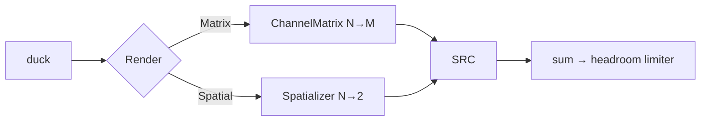

# Spatial Audio / Virtual Surround

> Post-v1 feature: render a group's multichannel (or stereo) signal binaurally to stereo headphones via fixed-virtual-speaker HRTF convolution — Sonar/HeSuVi-style virtual surround. Fills the "surround on headphones" gap identified in the Sonar comparison (2026-07-20). Was explicitly out-of-scope in channel-mixdown ("no HRTF/virtualization") — this feature adds it as an *alternative* N→2 rendering stage beside `ChannelMatrix`, not a change to it.

## Research (2026-07-20)

- **Commercial model (Sonar / Dolby Headphone / Windows Sonic / HeSuVi):** each source channel = fixed virtual speaker at its standard angle; per position a measured HRIR pair (left-ear + right-ear impulse response, dummy-head recorded). Convolve each channel with its pair, sum all → binaural stereo. HeSuVi does exactly this through Equalizer APO's convolution engine with 7-position × 2-ear HRIR wavs.
- **Key simplification vs game spatializers:** speaker positions are static — no interpolation, no head tracking, no 3D object machinery. HRIR set fixed at graph build → convolution state pre-allocatable → RT-safe.
- **Rust ecosystem:** `hrtf` crate = moving-source sphere interpolation, self-described heavy, click artifacts — wrong fit for static positions. `sofar` = SOFA reading via libmysofa C binding — violates pure-Rust audio-core (N5). Conclusion: own overlap-save partitioned FFT convolution on `rustfft` (`process_with_scratch` = alloc-free after planning).
- **Cost:** 7.1 → binaural = 7 positions × 2 ears = 14 convolutions (LFE handled separately). 128-tap anechoic @48k ≈ 86M MAC/s even time-domain; FFT overlap-save far less. Well inside N1 budget.
- **HRIR data:** MIT KEMAR (free, 128-tap compact @44.1k), SADIE II (CC). HeSuVi profiles exist for later user-loadable support. Resample HRIRs to bus rate off-RT at graph build.
- **Latency:** anechoic HRIR adds ~2.7 ms — fine vs spec's 10–30 ms shared-mode target.
- Sources: equalizerapo.com/hesuvi.html, github.com/ShanonPearce/ASH-Toolset, docs.rs/hrtf, lib.rs/crates/sofar.

## Decisions Log

<!-- Add new at bottom. Never remove. -->

| Date | Decision | Reasoning | Alternatives Considered |
|------|----------|-----------|------------------------|
| 2026-07-20 | Scope = fixed virtual-speaker virtualization (Sonar/HeSuVi model), not full 3D object spatialization. | Matches product's group model; static positions → RT-simple, no interpolation/head-tracking machinery. User confirmed. | Full 3D spatializer (no current use case, much heavier). |
| 2026-07-20 | v1 HRIR source = one embedded public-domain set compiled in; no file loading. | Zero config, deterministic, no file I/O surface. User-loadable profiles (HeSuVi wav/SOFA) retrofittable. User confirmed. | Embedded + user-loadable now (file parsing/validation/config surface; SOFA needs C binding or own reader). |
| 2026-07-20 | Convolution engine = partitioned FFT overlap-save (length-agnostic) from day one; v1 ships short anechoic set. | BRIR/room profiles (100 ms+) drop in later without engine rework; engine cost flat either way. User confirmed. | Time-domain FIR (locks out room profiles); ship BRIR now (licensing/curation effort). |
| 2026-07-20 | LFE under virtualization: equal mix into both ears at fixed −6 dB (no HRIR position). | HeSuVi/Sonar practice; spatial mode is the immersive mode, game rumble lives in LFE; downstream headroom limiter guards summing. Deliberate divergence from channel-mixdown's BS.775 LFE-drop (that decision stands for the plain matrix path). User confirmed. | Drop LFE (consistent with matrix path, loses LFE-only game content). |
| 2026-07-20 | Stereo groups widen too: spatial toggle on → stereo renders on virtual FL/FR at ±30°. One toggle, one meaning. | Same engine, 2 positions, zero extra machinery; avoids a toggle that silently no-ops on stereo buses. User confirmed. | Multichannel-only (confusing UX). |
| 2026-07-20 | `Render` = enum `Matrix(ChannelMatrix) \| Spatial(Spatializer)`, not a trait. New dep `rustfft` in audio-core. No profile abstraction, no separate hrir crate, uniform partitioning only. | Two known variants, one consumer (single-consumer rule); rustfft = pure Rust, alloc-free after planning; 7 KB static data doesn't justify a crate; non-uniform partitioning is a latency optimization with no need at tick-sized blocks. | Render trait (speculative); libmysofa binding (C dep, violates N5). |
| 2026-07-20 | **Revision of L3 sketch:** `SwapRender` carries no epoch field. | Epoch mechanism guards DSP *stage-index* commands racing chain swaps; render swap touches no stage indices; supervisor is sole producer — last-write-wins, stale swap harmless. | Epoch field as L3 prose sketched (dead weight, implies a race that can't occur). |
| 2026-07-20 | `Mixer::apply` return widens to `Option<Retired>` (`Chain(Box<DspChain>) \| Render(Box<Render>)`) — breaking, engine-internal. Mixer owns the stereo-output fallback rule (`build_group`); graph passes `spatial` flag through untouched. | One uniform retire-for-off-RT-drop path for every swap kind; domain owns domain rules (fallback = rendering concern, not graph plumbing). | Separate `apply_render` method (two drain paths); fallback decided in `graph::resolve` (splits rendering rule across layers). |
| 2026-07-20 | Design approved at Level 4. Status set to approved — ready for implementation. | All four levels approved and persisted; drift check vs spec complete. | — |
| 2026-07-20 | **Implementation-time deviation:** `HrirSet::embedded(rate)` procedurally synthesizes each of the 7 positions' L/R impulse pairs directly at `rate` (Woodworth-model ITD delay + azimuth-scaled ILD gain + a short decay kernel approximating head-shadow HF rolloff on the far ear) — no embedded 44.1 kHz measured tables, no `Src` resample step. Resolves the L1 "embedded public-domain HRIR set" decision's open question (MIT KEMAR vs SADIE II) differently than planned. | This sandbox has no network access — real measured HRIR data (KEMAR/SADIE) can't be fetched or verified this session. User chose procedural synthesis over pausing the feature or supplying data externally. Public API (`HrirSet::embedded(sample_rate) -> HrirSet`) and every downstream contract (`Spatializer`, `Render`, `SwapRender`, etc.) are unchanged — the deviation is fully contained inside `HrirSet::embedded`'s construction. Gives real ITD/ILD spatial cues (left-right, front-back-ish via the ±90°-peak folding); no pinna spectral notches or elevation cues, consistent with the design's own "no interpolation/head-tracking" simplicity. Swappable for a real measured set later behind the same API. | Pause the feature until real data is available; have the user fetch/supply KEMAR or SADIE II data for parsing. Both rejected — see AskUserQuestion in the code-forge session that made this call. |
| 2026-07-20 | **Implementation-time refinement:** the spatial-vs-matrix fallback decision (`spatial && output stereo`) lives in a shared `Render::build(spatial, from, to, max_block_frames) -> Render` associated function in `audio-core`, called by both `Mixer::build_group` (initial construction) and `engine::EngineHandle::apply_spatial` (live toggle, off-thread rebuild). | The blueprint's L4 prose put the fallback rule inside `build_group` specifically; `apply_spatial` needs to make the identical decision off-thread without duplicating it or reaching into a private mixer function across the crate boundary. One function, two callers, still audio-core-owned (satisfies "mixer owns the fallback rule" — `Render` is the mixer's own type). | Duplicate the decision logic in `engine`; make `build_group` `pub(crate)`-visible to `engine` (crosses the audio-core/engine boundary awkwardly, `engine` would need to know matrix/spatializer construction details). |

## Design: Level 1 -- Capabilities

Approved 2026-07-20.

1. **Virtual surround on stereo outputs** — multichannel group (5.1/7.1/quad) + virtualization enabled renders binaurally: each source channel convolved through its fixed-position HRIR pair, summed to stereo.
2. **Stereo widening** — stereo groups virtualize onto virtual FL/FR at ±30° (same engine, 2 positions) for out-of-head externalization.
3. **Per-group opt-in, zero-regression default** — `spatial = true` per group (TOML + settings UI toggle). Off = existing `ChannelMatrix` path untouched. On + non-stereo output → automatic fallback to matrix.
4. **Live, click-free toggle** — enable/disable mid-stream without gap (pre-build off-thread, swap via command — same pattern as DspChain swap).
5. **RT-safe, length-agnostic convolution** — partitioned FFT overlap-save, plans + scratch pre-allocated at graph build; any impulse length so future BRIR profiles need zero engine rework.
6. **Embedded HRIR set** — one public-domain set compiled in, resampled to bus rate off-RT at build.

Out of scope: head tracking, moving 3D sources, user-loadable profiles (HeSuVi/SOFA — retrofittable), room BRIR shipping (engine-ready, data later), per-channel angle customization, crossfeed-only cheap mode.

## Design: Level 2 -- Components

Approved 2026-07-20.

| Component | Home / layer | Single responsibility |
|---|---|---|
| `PartitionedConvolver` | `audio-core/spatial.rs` (new, domain) | One channel → one ear: uniformly-partitioned overlap-save FFT convolution (impulse in tick-sized blocks, frequency-delay-line accumulation). Pre-planned `rustfft` FFTs + pre-allocated scratch; `process` alloc-free; length-agnostic (BRIR-ready). |
| `Spatializer` | `audio-core/spatial.rs` (domain) | N→2 binaural renderer: per positioned channel a convolver pair (2·N convolvers), LFE → both ears −6 dB flat, sum to stereo. Same `process(&[f32], &mut [f32]) -> usize` shape as `ChannelMatrix`. |
| `HrirSet` | `audio-core/spatial.rs` (domain, value object) | Immutable per-position impulse pairs at a sample rate. `HrirSet::embedded(rate)` — decodes compiled-in set, resamples 44.1k→bus rate off-RT via existing `Src`. Lookup by `ChannelLayout` speaker bit; missing position → nearest standard position's pair. |
| Embedded HRIR data | `audio-core/spatial/hrir_data.rs` | ~7 KB f32 static arrays (7 positions × 2 ears × 128 taps @44.1k), public-domain set. Pure data, no I/O — N5 holds. |
| `Render` enum | `audio-core/mixer.rs` | `Matrix(ChannelMatrix) \| Spatial(Spatializer)` replacing `GroupState.matrix`. `mix_tick` phase 3 calls active variant. |
| Swap plumbing | `audio-core/mixer.rs` | `MixerCommand::SwapRender` — supervisor pre-builds `Render` off-thread, pointer swap on RT, retired variant returned via `Mixer::apply` for off-RT drop. Same pattern + epoch check as `SwapChain`. |
| Config | `control/config.rs`, `store.rs` | `GroupConfig.spatial: bool` (default false); diff → delta field; `toml_edit` mutation helper (inline-shape-safe per learnings). |
| Graph build / supervisor | `engine/graph.rs`, `runtime.rs` | Build choice: `spatial && output stereo` → `Spatializer`, else `ChannelMatrix`. Runtime toggle → pre-build + `SwapRender`. Logs `"group X: 8ch → binaural"`. |
| UI toggle | `app/ui.rs` | Per-group "Spatial audio" checkbox → `ShellAction` → config store (watcher path; no fast path — not latency-critical). |



DDD: `HrirSet` immutable value object; `Spatializer`/`PartitionedConvolver` pure domain computation; no new trait. New dep: `rustfft` (audio-core). `win-audio` untouched; downstream of render slot untouched.

## Design: Level 3 -- Interactions

Approved 2026-07-20.

**A — Graph build (supervisor, off-RT):** `GroupSpec.spatial: bool` from config. `Mixer::new` per group: `spatial && output.layout == STEREO` → `HrirSet::embedded(bus_rate)` (decode static tables, resample 44.1k→bus rate via `Src`, off-RT) → `Spatializer::new(in_layout, &hrirs, max_block_frames)` → `Render::Spatial`; else `Render::Matrix` (today's path untouched). Both paths: SRC input side = output channel count.

**B — Steady state (RT, `mix_tick` phase 3):** scratch (source layout, post gain/chain/duck) → active `Render` variant. Spatial: each positioned channel through convolver pair (FDL multiply-accumulate, pre-planned FFTs), LFE flat −6 dB both ears, sum → stereo → SRC → sum → headroom limiter. Zero alloc.

**Latency (binding):** partitioned convolution adds one partition (~5–10 ms; power-of-two chosen at build from tick size) + ~3 ms HRIR intrinsic — inside spec's 10–30 ms target. `Spatializer::process` accepts arbitrary frame counts (internal ring), returns same count per call after priming — same call contract as `ChannelMatrix::process`.

**C — Live toggle:** UI checkbox → `ShellAction` → `ConfigStore` (toml_edit, echo-suppressed) → watcher → diff → `ConfigDelta.spatial` → supervisor pre-builds `Render` off-thread → `MixerCommand::SwapRender { group, epoch, render }` → RT pointer-swap, retired variant returned via `Mixer::apply` → off-RT drop. Stale epoch → dropped (harmless; rebuild re-reads config). Exact `SwapChain` semantics.

**D — Structural rebuild:** existing path; build reconstructs `Render` per current config + topology. No new events/commands.

**E — Spatial-on, non-stereo output:** build falls back to `Render::Matrix`, logs once `"group X: spatial ignored (output not stereo)"`. Config persists; becomes effective on re-route to stereo. No tray notice — deliberate fallback, not a fault.

**F — Build logging:** `"group X: 8ch → binaural (partition 512, hrir 128 taps @48000)"`.

## Design: Level 4 -- Contracts

Approved 2026-07-20. Deltas on approved contracts; signatures only.

### `audio-core` — spatial.rs (new)

```rust
/// Immutable value object: per standard speaker position an impulse pair
/// (left ear, right ear), equal tap count, at `sample_rate`.
pub struct HrirSet { /* taps, rate, per-position [Vec<f32>; 2] */ }
impl HrirSet {
    /// Decodes embedded 44.1 kHz tables (spatial/hrir_data.rs, ~7 KB static
    /// f32 arrays); resamples to `sample_rate` via `Src`. Off-RT only.
    pub fn embedded(sample_rate: u32) -> HrirSet;
    pub fn sample_rate(&self) -> u32;
    pub fn taps(&self) -> usize;
}

/// One channel → one ear. Uniformly-partitioned overlap-save convolution:
/// impulse padded into `partition`-sized blocks, frequency-delay line,
/// pre-planned rustfft FFTs + pre-allocated scratch. Alloc-free process.
pub struct PartitionedConvolver { /* … */ }
impl PartitionedConvolver {
    /// `partition`: power of two. Impulse any length (BRIR-ready).
    pub fn new(impulse: &[f32], partition: usize) -> PartitionedConvolver;
    /// Mono, in/out same length; internal block buffering — output delayed
    /// one partition (primed with silence, never shortens the stream).
    pub fn process(&mut self, input: &[f32], output: &mut [f32]);
}

pub struct Spatializer { /* 2 convolvers per positioned channel, lfe slot,
                            deinterleave + stereo scratch — all pre-allocated */ }
impl Spatializer {
    /// Infallible. Positioned channels → nearest-standard-position HRIR pair;
    /// LFE → both ears flat −6 dB (no convolver). Partition = next power of
    /// two ≥ max_block_frames.
    pub fn new(from: ChannelLayout, hrirs: &HrirSet, max_block_frames: usize) -> Spatializer;
    /// `input`: whole frames at N ch → `output`: same frame count at 2 ch.
    /// Returns samples written. Same call contract as ChannelMatrix::process.
    pub fn process(&mut self, input: &[f32], output: &mut [f32]) -> usize;
}
```

### `audio-core` — mixer.rs

```rust
pub enum Render { Matrix(ChannelMatrix), Spatial(Spatializer) }
impl Render {
    pub fn is_identity(&self) -> bool;   // Matrix-identity only; Spatial never
    pub fn process(&mut self, input: &[f32], output: &mut [f32]) -> usize;
}

// GroupState: matrix: ChannelMatrix → render: Box<Render>  (swap = pointer move)
// build_group: spatial && out_layout == STEREO → Render::Spatial, else Render::Matrix
//              (mixer owns fallback rule — graph passes the flag through)

pub enum MixerCommand { /* existing… */ SwapRender { group: GroupId, render: Box<Render> } }

/// WIDENED (breaking, engine-internal): was Option<Box<DspChain>>.
pub enum Retired { Chain(Box<DspChain>), Render(Box<Render>) }
pub fn apply(&mut self, cmd: MixerCommand) -> Option<Retired>;
```

### `audio-core` — sample.rs

```rust
pub struct GroupSpec { /* existing… */ pub spatial: bool }   // default false
```

### `control` — config.rs / store.rs

```rust
// RawGroup: #[serde(default)] spatial: bool          (TOML: spatial = true)
// GroupConfig gains: pub spatial: bool
pub struct ConfigDelta { /* existing… */ pub spatial: Option<Vec<(GroupId, bool)>> }
// is_unchanged() extended; diff: o.spatial != n.spatial → spatial entry (NOT structural)
// store.rs: ConfigEdit::SetSpatial { group: usize, on: bool } — toml_edit
//           format-preserving, inline-shape-safe (StoreError::Validation, no expect)
```

### `engine`

```rust
// graph::resolve: GroupSpec.spatial = group config flag (pass-through)
// EngineHandle::apply_spatial(&self, changes: &[(GroupId, bool)]) —
//   mirrors apply_dsp_chains: pre-builds Render off-thread from current
//   topology snapshot (HrirSet::embedded(bus_rate) when spatial=true),
//   sends SwapRender; drain loop drops Retired::* off-RT uniformly.
// log_channel_conversions extended: "group X: 8ch → binaural (partition P,
//   hrir T taps @R)" + fallback line "spatial ignored (output not stereo)".
```

### `app`

```rust
// ShellAction::SetSpatial { group: usize, on: bool } → dispatcher → ConfigStore
// ui.rs: per-group "Spatial audio" checkbox (watcher path, no fast path)
```

`win-audio`: zero changes.

## Open Questions

- ~~Which embedded HRIR set: MIT KEMAR compact vs SADIE II subject~~ — resolved 2026-07-20: neither. No network access at implementation time to fetch either; `HrirSet::embedded` synthesizes procedurally instead (Decisions Log). A real measured set can still be swapped in later behind the same `HrirSet::embedded(sample_rate)` signature.

## Design Summary

- **Components/layers:** `PartitionedConvolver` + `Spatializer` + `HrirSet` + embedded HRIR tables (`audio-core/spatial.rs` + `spatial/hrir_data.rs`, pure domain); `Render` enum + `SwapRender` + `Retired` widening (`audio-core/mixer.rs`); `spatial: bool` through `GroupSpec`/`GroupConfig`/`ConfigDelta`/`ConfigEdit` (`control`); `EngineHandle::apply_spatial` + build logging (`engine`); `ShellAction::SetSpatial` + UI checkbox (`app`). `win-audio` untouched.
- **Key contracts:** `HrirSet::embedded(rate)` (off-RT, resamples via `Src`); `PartitionedConvolver::{new, process}` (length-agnostic, alloc-free, one-partition latency); `Spatializer::{new (infallible), process}` (same call contract as `ChannelMatrix::process`); `Render::{is_identity, process}`; `MixerCommand::SwapRender` (no epoch — sole-producer last-write-wins); `Mixer::apply → Option<Retired>` (breaking, engine-internal).
- **Architectural constraints:** all convolution state pre-allocated at build (N2); HRIR data enters as static arrays, no I/O in audio-core (N5); toggle via pre-build + swap-and-retire (SwapChain pattern); fallback rule (non-stereo output → matrix) owned by mixer `build_group`; latency +1 partition + ~3 ms, inside 10–30 ms target.
- **Domain decisions:** fixed virtual speakers (Sonar/HeSuVi model), no interpolation/head-tracking; embedded public-domain HRIR set, 44.1k→bus-rate resample at build; LFE → both ears −6 dB (deliberate divergence from matrix path's BS.775 drop); stereo groups widen onto virtual FL/FR ±30°; missing positions → nearest standard position.
- **Resolved during design:** scope (fixed-speaker), HRIR source (embedded), engine (partitioned FFT, BRIR-ready), LFE policy, stereo widening, Render-as-enum, no-epoch SwapRender, Retired widening, fallback ownership.
- Drift check vs `Splitstream-Engineering-Spec.md` complete — 2 additions + 1 override recorded in spec `## Links` (DSP-scope addition, channel-mixdown no-HRTF boundary superseded, `spatial` config key).

## Key Files

| Path | Role |
|---|---|
| crates/audio-core/src/spatial.rs | `HrirSet`, `PartitionedConvolver`, `Spatializer` — new |
| crates/audio-core/src/spatial/hrir_data.rs | 7-position azimuth table + procedural-synthesis constants (not embedded measured tables — see Decisions Log) — new |
| crates/audio-core/src/mixer.rs | `Render` enum, `SwapRender`, `Retired`, `build_group` fallback rule |
| crates/audio-core/src/sample.rs | `GroupSpec.spatial` |
| crates/control/src/config.rs | `RawGroup`/`GroupConfig.spatial`, `ConfigDelta.spatial`, diff |
| crates/control/src/store.rs | `ConfigEdit::SetSpatial` |
| crates/engine/src/graph.rs, runtime.rs | flag pass-through, `apply_spatial`, `Retired` drain, logging |
| crates/app/src/ui.rs, dispatcher | checkbox, `ShellAction::SetSpatial` |

## Constraints

Inherited (binding): pure DSP in `audio-core` — HRIR data enters as plain arrays, no OS/file deps (N5); RT threads never alloc/lock/block — FFT plans + scratch pre-allocated at graph build (N2); f32 interleaved; structural changes via supervisor rebuild, param changes via lock-free commands; COM/WASAPI confined to `win-audio`; spatializer occupies the existing `ChannelMatrix` slot in `mix_tick` (duck → render-to-output → SRC → sum → headroom limiter), downstream unchanged.
